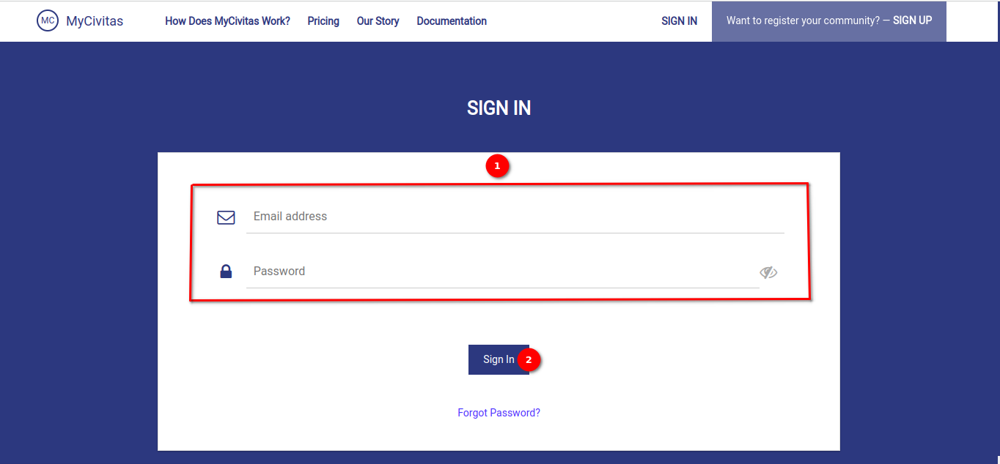
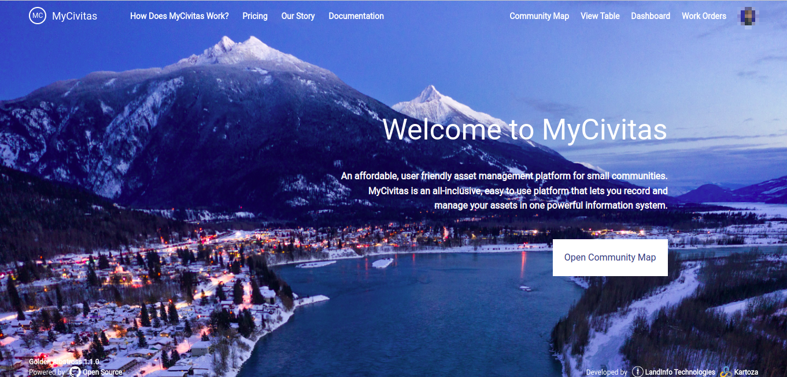
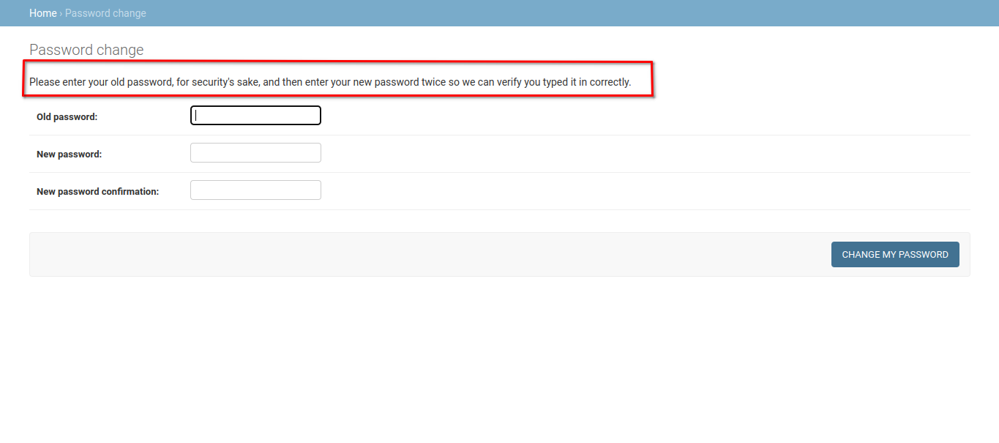
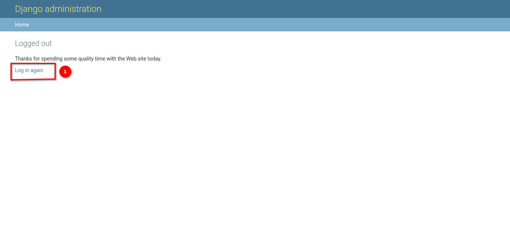

# Accessing MyCivitas Administration

As a super user of `MyCivitas`, you have access to the administrative features that allow you to manage various aspects of the platform. Follow the steps below to access the administration panel.

## Login to MyCivitas

Visit the MyCivitas website and navigate to the login page. Enter your superuser credentials (username and password) in the 1️⃣ provided fields. Click on 2️⃣ the `Sign In` button to proceed.

## Accessing the Administration Panel

Once you have successfully logged in as a super user, you can access the administration panel:

After logging in, you will be directed to the community page of MyCivitas. Click on the 1️⃣ profile menu dropdown available at the top-right corner of the page to reveal additional options. From the dropdown menu, select the 2️⃣ `Admin` to access the administration page.

## Exploring the Administration Panel

Upon accessing the administration panel, you will encounter various features and options for managing MyCivitas. Here's a brief overview:

1️⃣ Dashboard: The landing page of the administration panel displays a summary of recent actions and important information.

2️⃣ Navigation Bar: Located at the top of the page, the navigation bar provides quick access to essential functions such as viewing the site, changing passwords, and logging out.

## Navigation bar links

### View Site

Clicking this link redirects you to the main MyCivitas website.

### Change Password

This link allows you to update your super user password following the specified criteria.

### Log Out

Logging out ends your current session and redirects you to the logout page. You'll need to log in again to access the administration panel. Click on the 1️⃣ `Log in again` button to log in.

## What's Next?

Now that you have gained access to the administration panel, you can proceed with managing various aspects of MyCivitas, including:

Managing Users, Organisations and other tables. Click [here](../manual/admin.md) for detailed information on managing the table's data.
