# Managing Organisations

This documentation guides administrators through managing organisations on the MyCivitas platform. Management of organisations includes (but is not limited to) adding/removing members from organisations, managing organisation data, and inviting the users to the organisation.

## Where to Manage Organisations?

After you have logged into the administration site, scroll down on the landing page until you see 1️⃣ the **ORGANISATIONS** section. In this section you will see the 2️⃣ organisation link, click on this link to manage organisations.

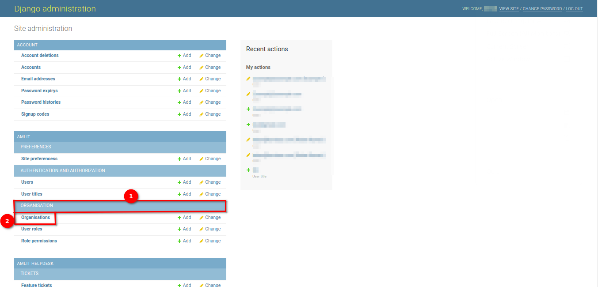

## Organisations

If you click on the `Organisations` link on the landing page, you will be redirected to a page that has 1️⃣ a list of the platform's organisation and their respective owners.

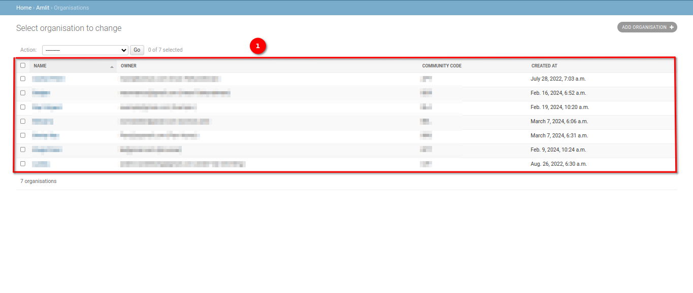

### Add Organisation(s)

If you would like to add another organisation, you can click on 1️⃣ the `ADD ORGANISATION` button.

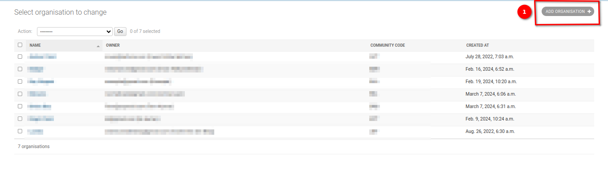

When you click on the `ADD ORGANISATION` button, you will be redirected to the `Add Organisation` page. You can then specify the details of the new organisation. These main details you need to include are:

- `Name`: This will be the name of the new organisation. If you do not provide the name, it will default to Keep the same name with the community.

- `Description`: Add the description of the organisation in this field.

- `Owner`: You can choose the owner of the new organisation from the dropdown menu. If there are no owners listed, click on the 1️⃣ `Plus` icon, to create a new owner.

    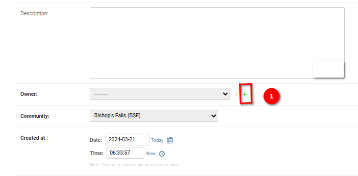

    Upon clicking the plus icon, the add owner popup will open fill in the details in the fields and click on the 1️⃣ `Save` button to save the owner.

    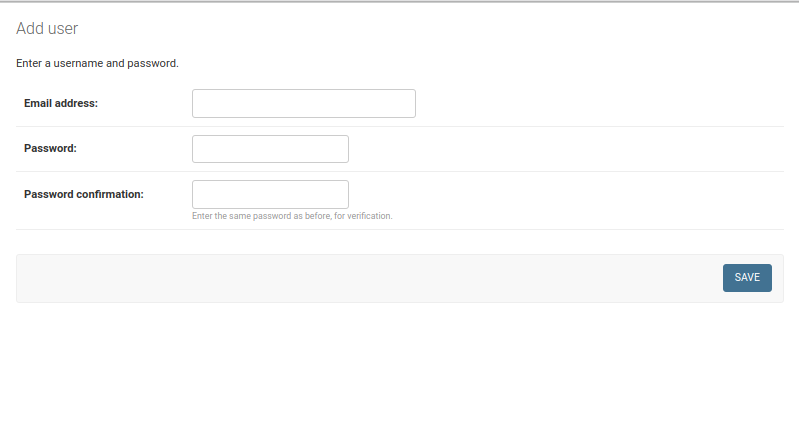

- `Community`: Choose the community from the dropdown.

- `Created at`: You can choose the specific date and time for this field by entering the date and time in the respective fields or by using the calendar and clock to select the date and time.

    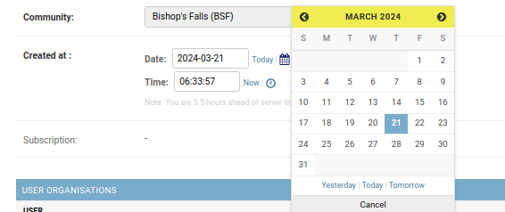
    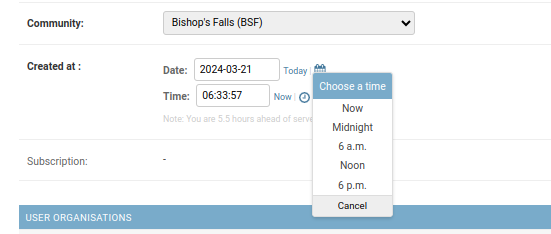

### User Organisation (Add user to the organisation)

You can add the existing users to the organisation by selecting the user from the 1️⃣ user dropdown, if the user is not registered on the site you can add the user by clicking on the `plus` icon. Upon clicking the plus icon, the add user popup will open fill in the details in the fields and click on the `Save` button to save the user. You can select the user role from the 2️⃣ user role dropdown, if the user role is not available in the dropdown you can add the user role by clicking on the `plus` icon. Upon clicking the plus icon, the add user role popup will open fill in the details in the fields and click on the `Save` button to save the user role. If you want to add more users to the organisation click on the 3️⃣ `Add another User organisation` link.

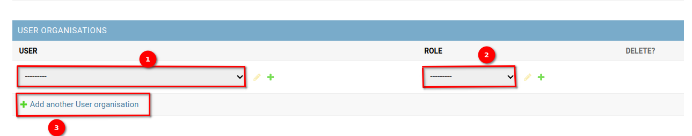

Upon clicking on the link the new row will be added to this section.

### User Organisation Invitations (Invite users to join an organisation)

1️⃣ The `UUID` field is filled by default. To invite the user to the organisation enter the email address of the user in the 2️⃣ email field and select the user role from the 2️⃣ user role dropdown, if the user role is not available in the dropdown you can add the user role by clicking on the `plus` icon. Upon clicking the plus icon, the add user role popup will open fill in the details in the fields and click on the `Save` button to save the user role. If you want to send more user invites, click on the 3️⃣ `Add another User organisation invitation` link.

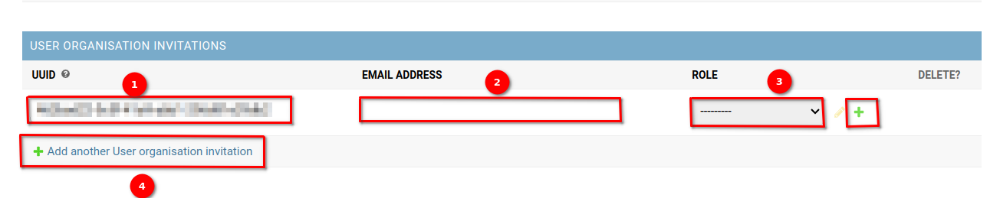

Upon clicking on the link the new row will be added to this section.

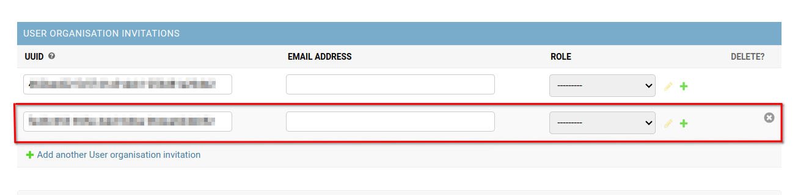

Once you have provided the details for your organisation you have three options to move forward:

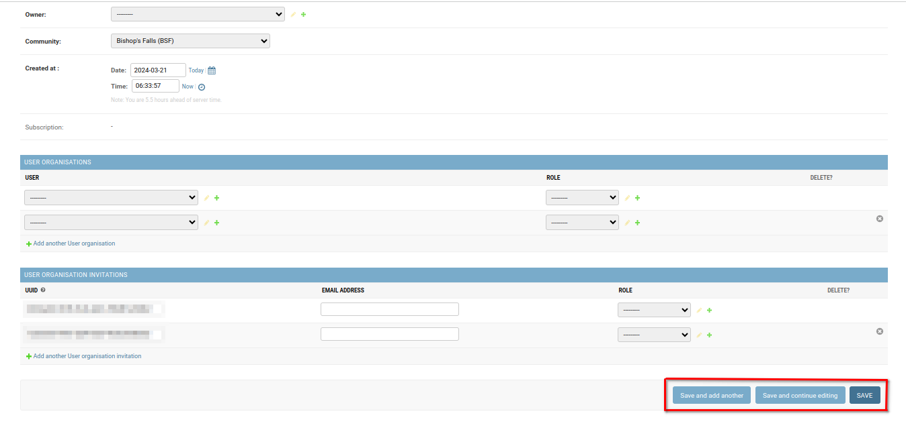

- `Save and add another`: Which will allow you to save the current organisation and move forward with adding a new one.
- `Save and continue editing`: Which will allow you to save the current organisation and then edit the current organisation.
- `SAVE`: Allows you to save and then redirects you back to the `Organisation` page and displays a success message.
        
    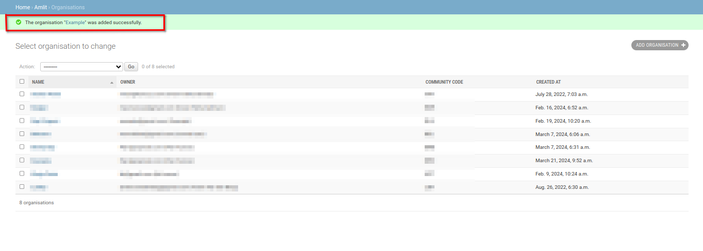

### Managing Organisation(s)

To make changes to an existing organisation, you can click on 1️⃣ the name of the organisation.

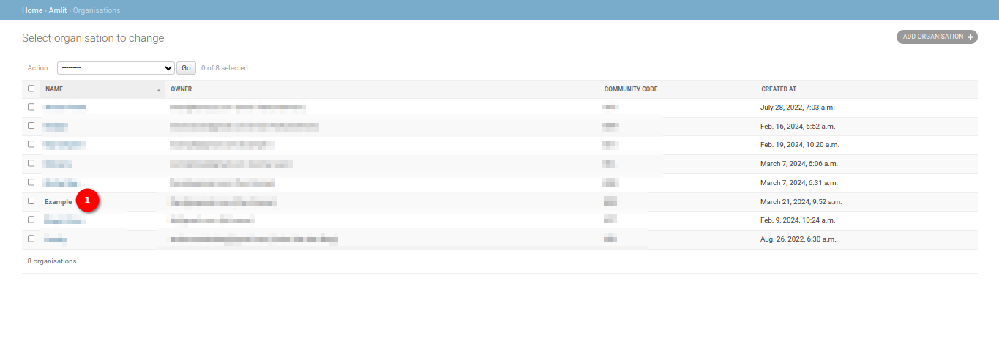

This will redirect you to a `Change Organisation` page where you can edit the information previously used to populate the invitation, or you can delete the invitation.

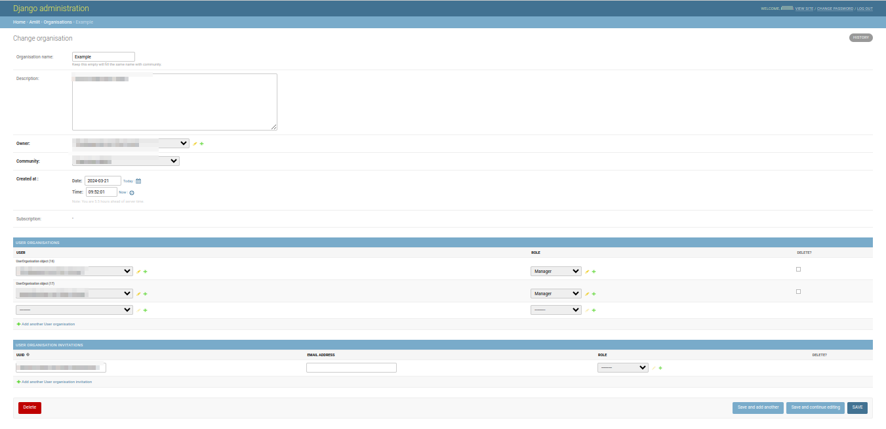

Once you have made your necessary changes you can click on 1️⃣ any one of the three save options or click on 2️⃣ the `Delete` button to remove the Organisation invitation.

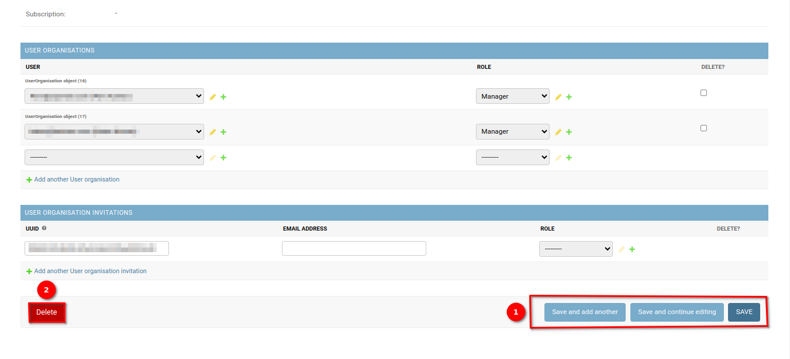

The three save options will have different actions:

- `Save and add another`: Which will allow you to save the current organisation invitation and move forward with adding a new one.
- `Save and continue editing`: Which will allow you to save the current organisation invitation and then edit the current invitation.
- `SAVE`: Allows you to save and then redirects you back to the `Organisations` page and displays a success message.
    
    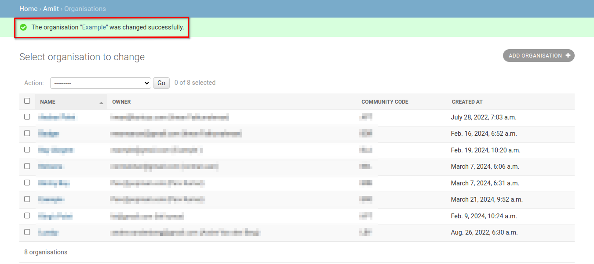

If you click on the `Delete` button, you will be redirected to a page where you can either 1️⃣ confirm deleting the invitation or 2️⃣ cancel and return to the list of invitations.

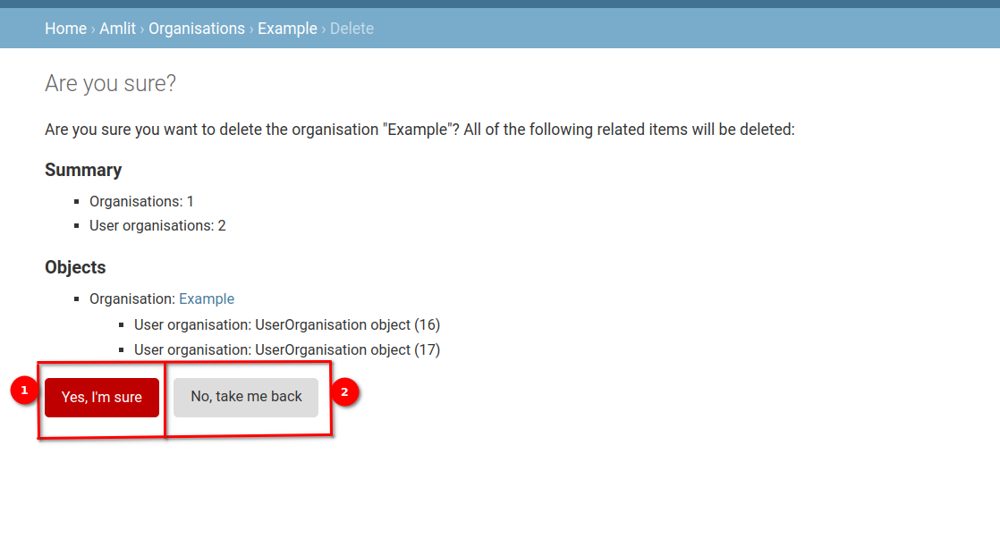

If you confirm the deletion of the invitation then you will be redirected back to the `Organisations` page and shown a success message.

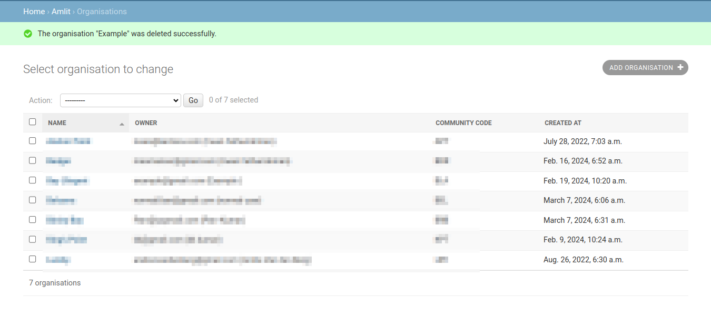

### Removing Organisation(s)

If you would like to delete an organisation, or multiple organisations, you can do so from the `Organisations` page. First, you select the organisation(s) you would like to remove by checking 1️⃣ the boxes next to the organisation(s) name(s).

> **Note:** Clicking on the topmost checkbox will select all of the organisations.

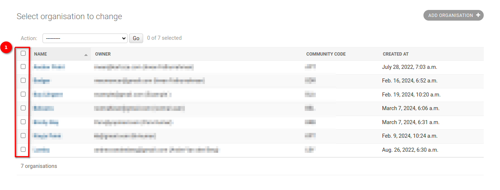

Then you click on the 1️⃣ `Action` dropdown menu, select 2️⃣ the `Delete selected Organisations` option, and then click on 3️⃣ the `Go` button.

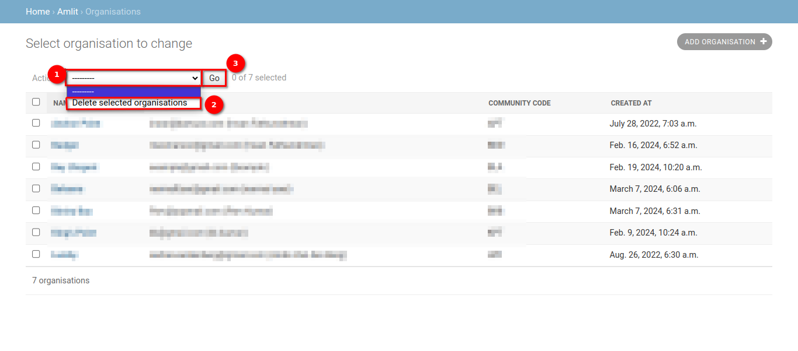

This will redirect you to a page where you can either 1️⃣ confirm deleting the organisation(s) or 2️⃣ cancel and return to the list of organisations. Depending on the number of organisations you are deleting the **Summary** and **Objects** will automatically be updated.

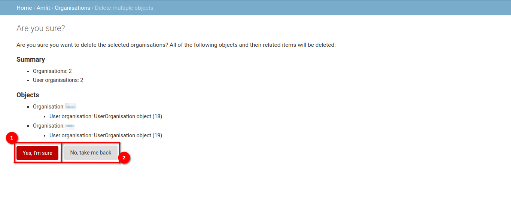

If you confirm the deletion of the organisation(s) then you will be redirected back to the `Organisations` page and shown a success message.

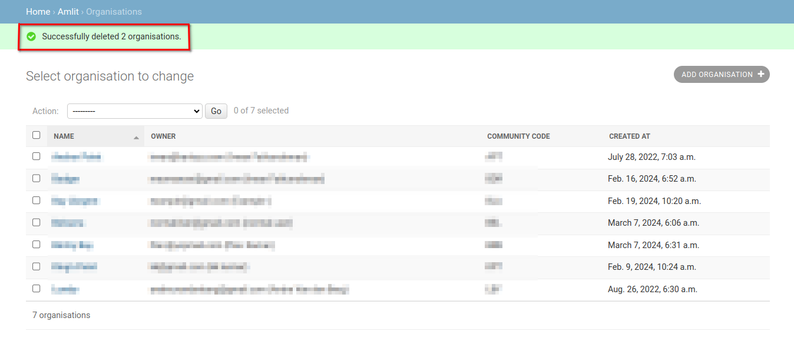
