# Managing Users in MyCivitas

This guide outlines the steps for administrators to manage users on the MyCivitas platform. Administrators can perform various actions such as viewing, filtering, searching, adding, editing, and deleting users.

## Where to Manage Users

After you have logged into the administration site, you should be able to see 1️⃣ the **AUTHENTICATION AND AUTHORIZATION** section. In this section, you will see 2️⃣ the links to the `Users` management page.

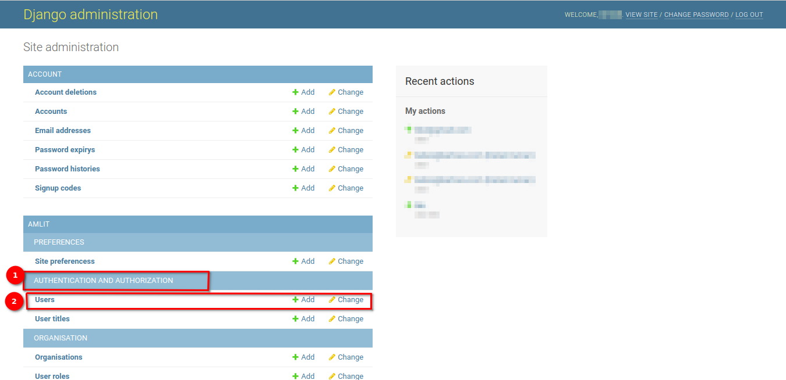

## Users Page

Once you click on the `Users` link, you will be redirected to a page that has 1️⃣ a list of all the registered users on the MyCivitas platform.

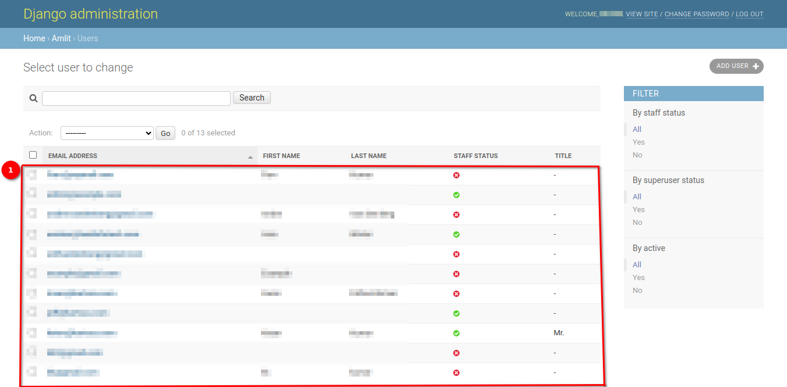

### Filter List of Users

On the right-hand side of the `Users` page, you will see a panel titled `FILTER`.

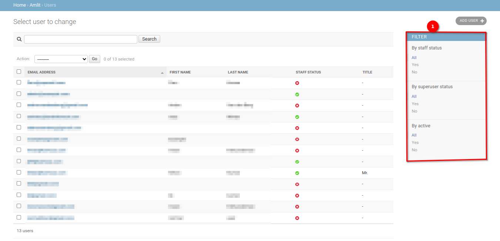

The various options in the `FILTER` panel allow you to change the number of users you can see in the list. You can also set more than one filter at a time to ensure you only see the specific users you would like to see (the filters applied in this example resulted in only 9 of the 13 total users being displayed).

Available filters are as follows:

    - By staff status
    - By superuser status
    - By active

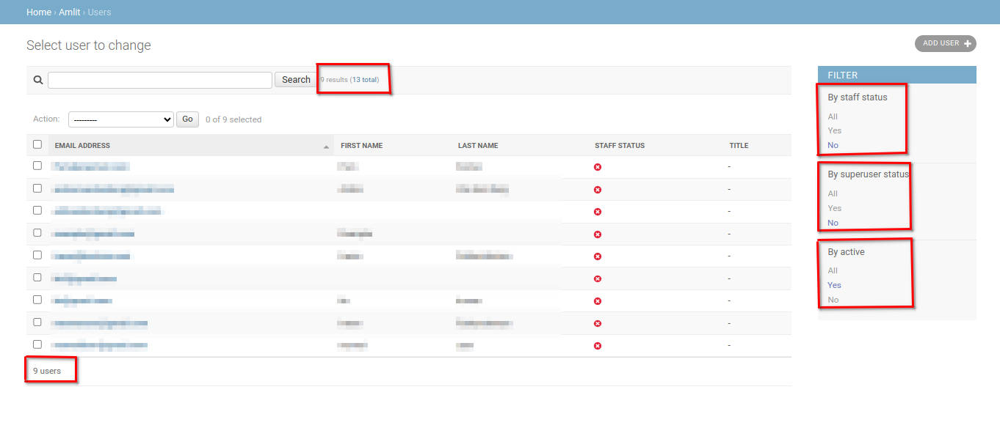

If you would like to reset the list to a point where no filters have been applied, you can simply choose the `All` option available in the filters.

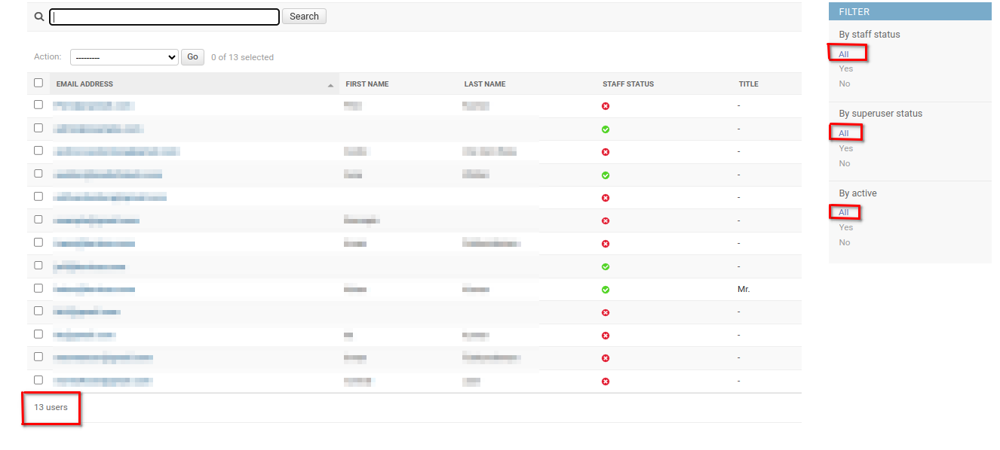

### Search for User(s)

If you do not see the user you would like to see in the list after filtering (or due to the length of the list), you can utilise the `Search` functionality. To do so, click on the 1️⃣ `Search` field and type a few characters (i.e. letters in the user's name), and then click on 2️⃣ the `Search` button to filter the list of users. Ensure that you have cleared any of the filters you have applied otherwise your search will only search through the filtered list of users and not all of the users.

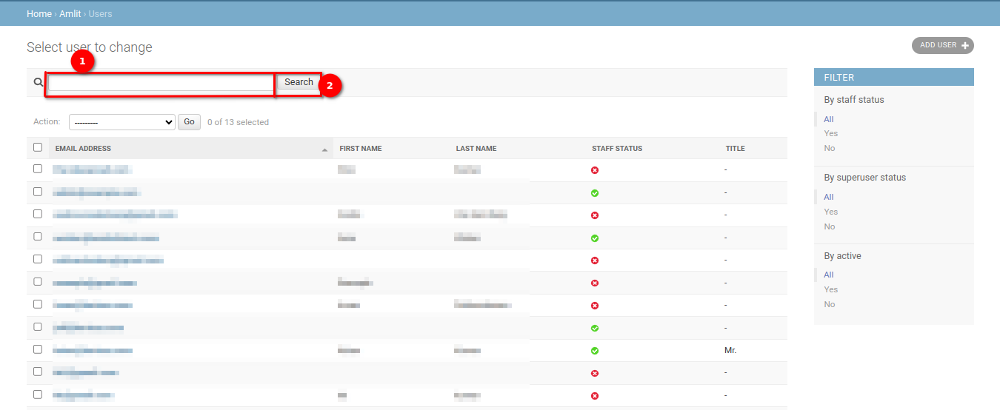

If the representative you are looking for is still not there, then you will need to follow the steps below to add them.

### Add User(s)

If you would like to add a user, you can click on 1️⃣ the `ADD USER` button.

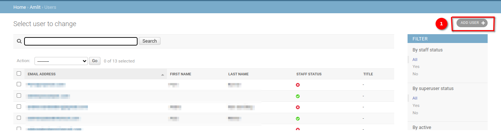

When you click on the `ADD USER` button, you will be redirected to the `Add User` page. You should fill in 1️⃣ the user's email address and 2️⃣ the password to secure the account. you must then re-enter the password in 3️⃣ the `Password confirmation` field.

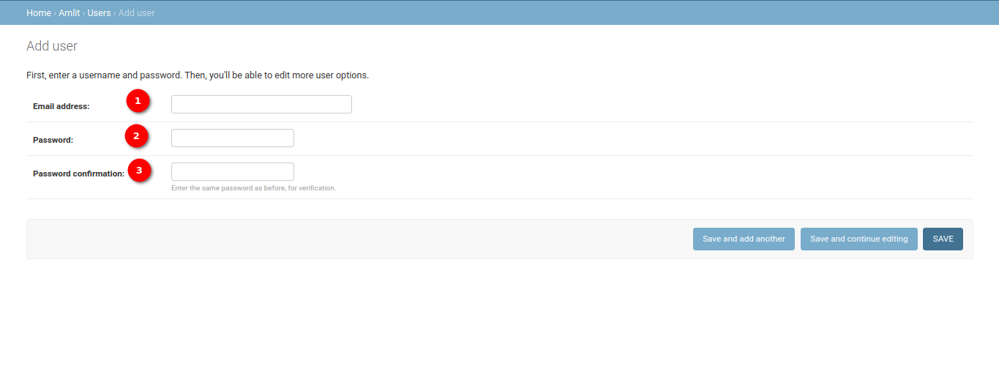

Once you have filled in the necessary information, you have three options to proceed forward:

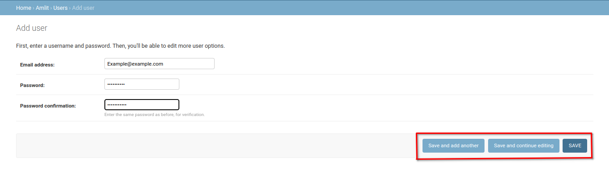

- `Save and add another`: This will allow you to save the current user and move forward with adding a new one.
- `Save and continue editing`: This will allow you to save the current user and proceed with editing the current user.
- `SAVE`: Allows you to save the user and then redirects you to the `Change User` page where you need to specify 1️⃣ the user's first name, last name, phone number, extension and title and choose the avatar for the user.

    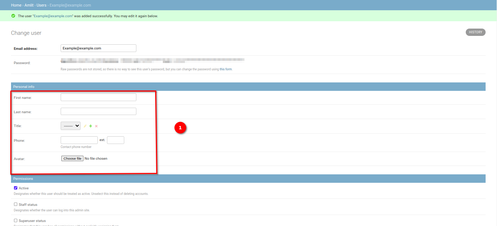

    You can also set 2️⃣ the user's permissions if you know what their user role will be.

    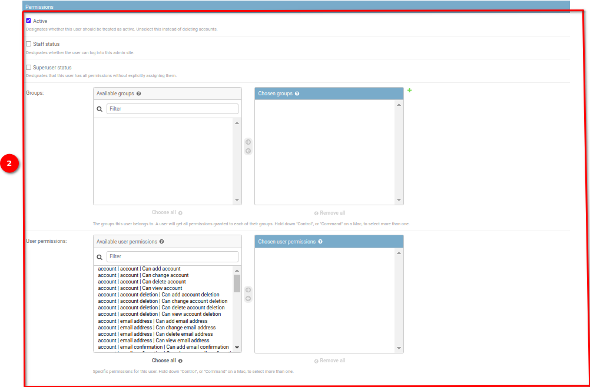

    Once you have filled in the necessary information, scroll down and then you can click on 1️⃣ any one of the three save options or click on 2️⃣ the `Delete` button to remove the user.

    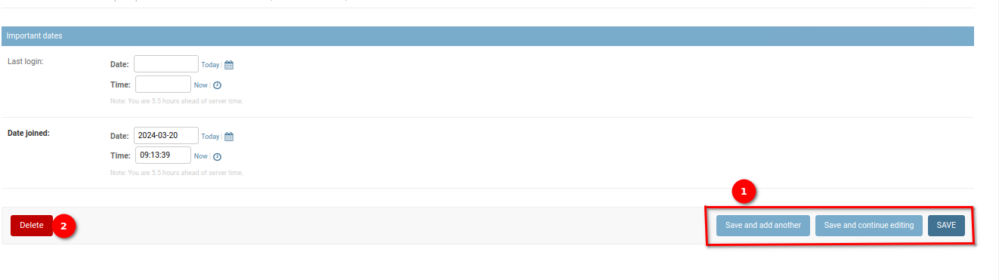

    The three save options will have different actions:

  - `Save and add another`: This will allow you to save the current user and then redirect you back to the `Add User` page.
  - `Save and continue editing`: This will allow you to save the current user and continue with editing the current user.
  - `SAVE`: Allows you to save the user and then redirects you back to the `Users` page and displays a success message.

    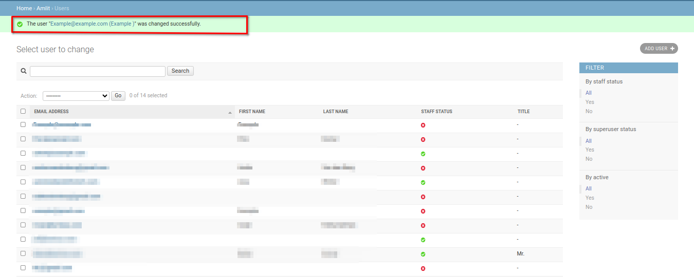

    If you click on the `Delete` button, you will be redirected to a page where you can either 1️⃣ confirm deleting the user or 2️⃣ cancel and return to the list of users.

    

    If you confirm the deletion of the invitation then you will be redirected back to the `Users` page and shown a success message.

    

### Delete User(s)

If you would like to delete a user or multiple users, you can do so from the `Users` page. First, you select the user(s) you would like to remove by checking 1️⃣ the boxes next to the user(s) name(s).

> **Note:** Clicking on the topmost checkbox will select all of the users.

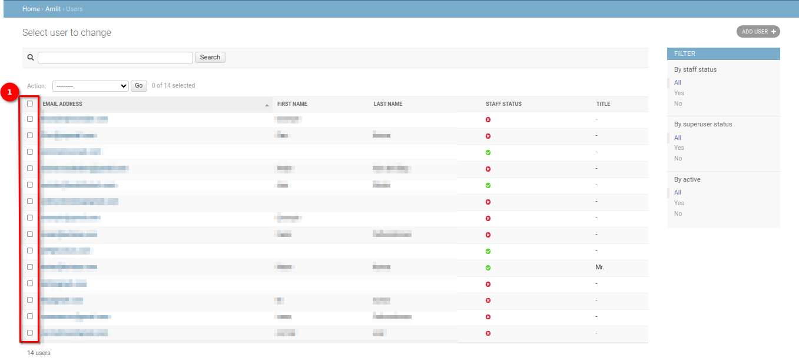

Then you click on the 1️⃣ `Action` dropdown menu, select 2️⃣ the `Delete selected user` option, and then click on 3️⃣ the `Go` button.

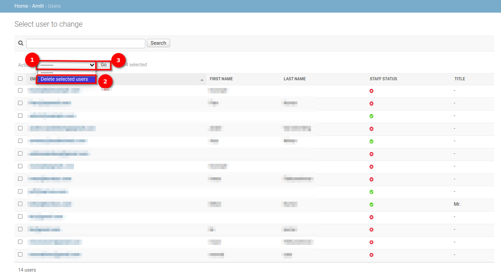

This will redirect you to a page where you can either 1️⃣ confirm deleting the user(s) or 2️⃣ cancel and return to the list of users. Depending on the number of users you are deleting the **Summary** and **Objects** will automatically be updated.

If you confirm the deletion of the user(s) then you will be redirected back to the `User` page and shown a success message.

