# User Manual Django Administration Site

This site is the administration site for the MyCivitas platform, and only specific superusers can access it.

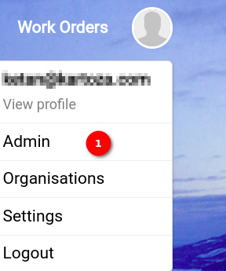

## Important Tables to Manage

There are a variety of tables to manage on the Django Admin site but the two key ones are the [Users Table](#users-table) and the [Organisation Table](#organisation-table).

### Users Table

The Django admin user table is a central component within the Django admin interface, providing a comprehensive view of user-related data for the application. This table serves as a management hub for user accounts, offering essential information about each user in a tabular format.

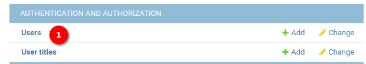

1. **User:** Click on the `Users` to view the users table.

    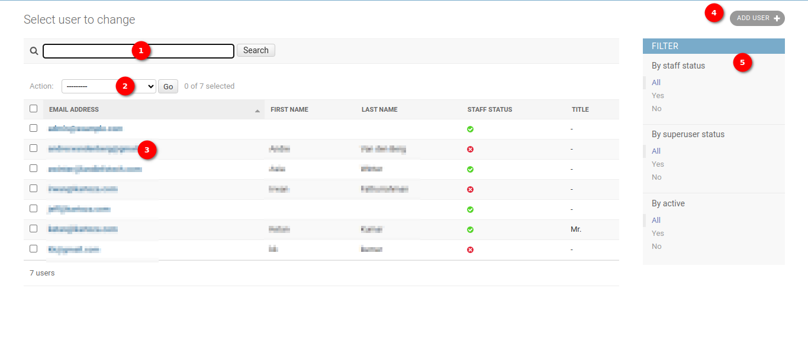

    1. **Search Functionality:** The User Table provides a powerful search functionality allowing the administrators to search user records based on various criteria. To perform a search, locate the search bar at the top left corner of the User Table.
    The administrators can search by:
        - Email Address
        - First Name
        - Last Name
    
    Simply enter the relevant information into the search bar and hit enter to display matching records.

    2. **Action Dropdown:** Administrators can perform batch actions on selected user records using the `Action Dropdown`. To select multiple records, use the checkbox in front of each user record. Once selected, open the Action Dropdown and choose the desired action, e.g., Delete selected users. Confirm the action and the selected records will be processed accordingly. This feature streamlines bulk user management tasks, enhancing efficiency for administrators.

    3. **User Name:** Clicking on the username of a user opens a detailed view of that user's record. A new page will open, providing comprehensive information about the selected user.

        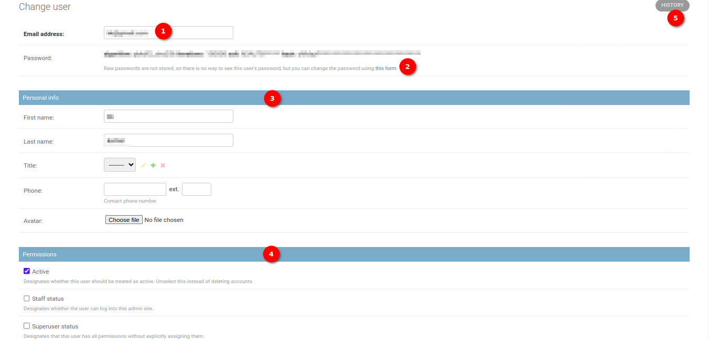

        1. **Username:** The administrator can see the user's email address here.

        2. **Change Password Form** The administrator can click on `this form` link, to change the user password. When the administrator clicks on this link opens the change password page.

            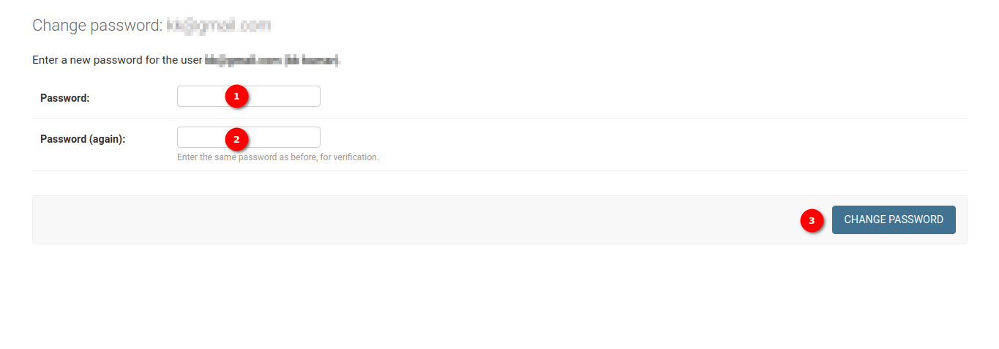

            1. **Password:** The administrators are required to provide the new password here.
            
            2. **Password (again):** The administrators are required to re-enter the new password for confirmation. This field ensures accuracy and helps prevent input errors.

            3. **Change Password Button:** After entering the new password and confirmation, users can click the `CHANGE PASSWORD` button to submit the form. Upon successful submission, the system will update the user's password, enhancing the security of their account.
        
        3. **Personal Information Section:** The Personal Info section of the User Table contains essential information about each user, facilitating easy identification and management.

            - **First Name:** Displays the first name of the user. Administrators can view and edit this field to update user details.

            - **Last Name:** Displays the last name of the user. Administrators can view and edit this field to update user details.

            - **Title:** Displays the user's title, such as `Mr.`, providing a formal address. Administrators can view and edit this field to update user details.

            - **Phone and Ext:** Displays the user's phone number along with an extension field side by side. Administrators can view and edit these fields to update user contact details.

            - **Avatar:** Displays the user's profile picture or avatar. Administrators can view and edit this field to update the user's profile image.

        4. **Permission Section:** The `Permission Section` allows administrators to assign specific permissions to users, tailoring their access and roles within the application.

            - **Active:** Checkbox indicating whether the user account is active or inactive. Administrators can toggle this checkbox to control user account status.

            - **Staff Status:** Checkbox granting staff status to the user. Staff status provides additional privileges within the application. Administrators can manage staff status by checking or unchecking the checkbox.

            - **Superuser Status:** Checkbox granting superuser status to the user. Superusers have elevated privileges, often including full control over the application. Administrators can assign or remove superuser status by checking or unchecking the checkbox.
        
        5. **History Button:** The History button allows administrators to access the history log of the user, providing insights into changes and activities related to the user account.

        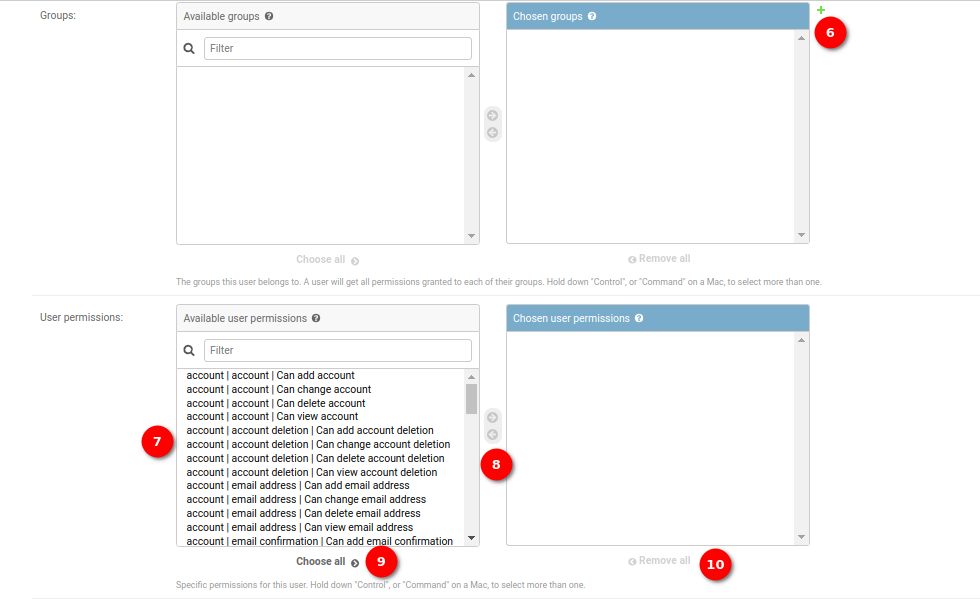

        6. **Group (+):** Administrators can create user groups by clicking on the plus icon. Upon clicking the plus icon, a popup window will open, allowing administrators to define the group's details. In the popup, administrators can specify:

            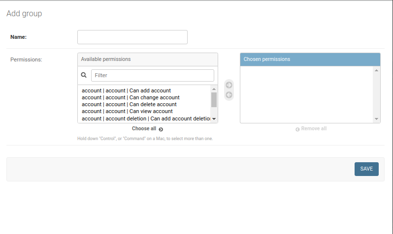

            - **Group Name:** A unique identifier for the group.
            - **Permissions:** Assign specific permissions to the group, determining the access levels for members.
            
            After providing the necessary information, administrators can save the group.
        
        7. **Permissions:** Available permissions for the group. Administrators can choose permissions from the list and assign them to the user.

        8. **Arrow:** Using these arrows, administrators can add or remove the permissions to the user.

        9. **Choose All:** The button to choose all of the permissions and assign them to the user.

        10. **Remove All:** The button to choose all of the permissions and remove them from the user.

        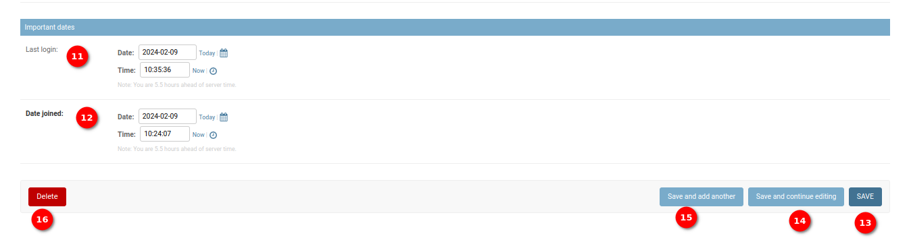

        11. **Last Login Date:** The administrators can view or update the last login date of the user.
        
        12. **Date Joined:** The administrators can view or update the joining date of the user.

        13. **Save:** Save the current record and then get redirected to the Django Admin Table/record list.
        
        14. **Save and add another:** Save the current record and then be redirected to a new page to add a new record.

        15. **Save and continue editing:** Save the current record while still showing the current record.

        16. **Delete button:** Delete the currently opened record. It will take administrators to a confirmation page.

    4. **Adding a New User:** The administrators can create a new user by clicking on the `add user` button, when the administrators click on this button a new page opens for adding the user record.

        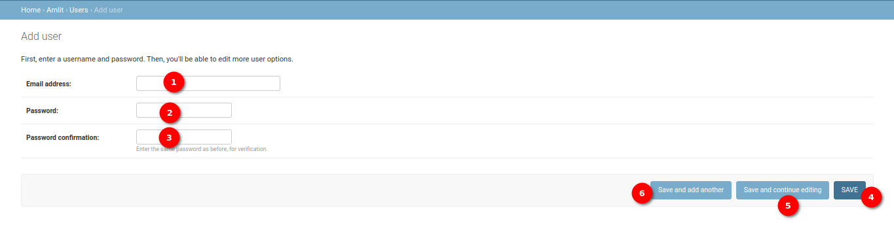

        1. **Email Address:** Administrators should enter a unique email address for the new user.

        2. **Password:** Administrators should create a strong password for the user.

        3. **Confirm Password:** Re-enter the same password in the confirmation field to verify accuracy.

        4. **Save:** Save the current record and then get redirected to the Django Admin Table/record list.

            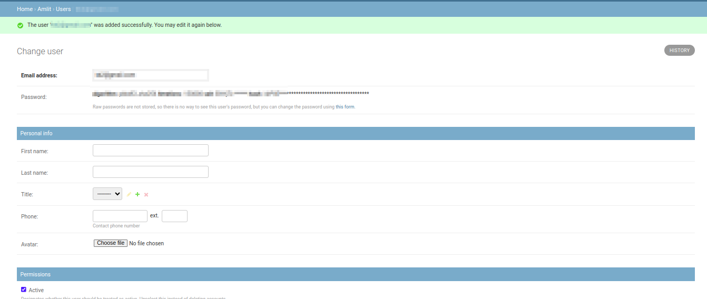

        5. **Save and add another:** Save the current record and then be redirected to a new page to add a new record.

        6. **Save and continue editing:** Save the current record while still showing the current record.

    5. **Filters:** The administrators can filter the user table using the available filters on the right side of the tables. 

        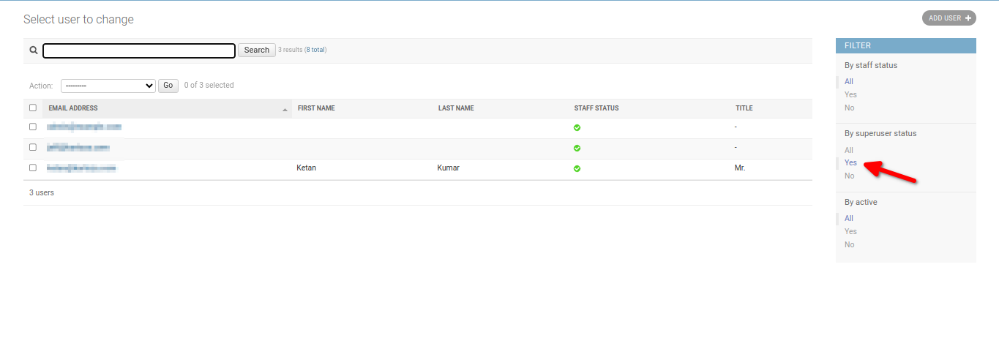

### Organisation Table

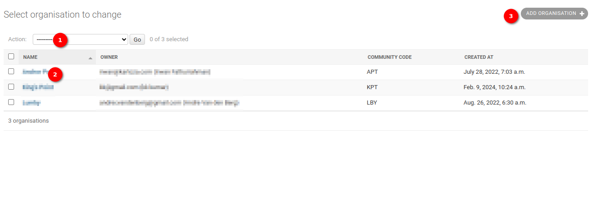

1. **Action Dropdown:** The `Action Dropdown` offers the option to perform batch actions on selected organisation records.

    - **Delete selected Organisation:** Permanently remove the selected organisation records.

2. **Username:** Clicking on the username in the Organisation Table redirects administrators to a detailed page containing specific user organisation data.

    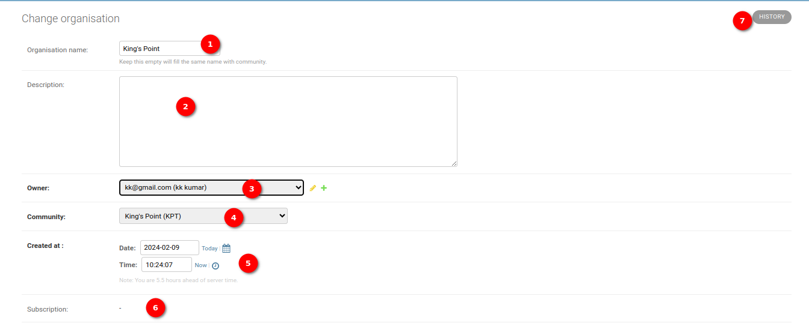

    1. **Organisation Name:** Select a user from the dropdown menu to associate the organisation with a specific user. Include an option to keep it empty, if the administrators did not provide the organisation name it automatically fills with the community name.

    2. **Description:** Provide a field where the administrator can input a description for the organisation.
    
    3. **Owner Dropdown:** Include a dropdown menu for selecting the owner of the organisation. Populate the dropdown with a list of owners for selection.

        - **Edit Icon:** Allows administrators to edit owner details.
        - **Plus Icon:** Opens a form for adding a new owner.

    4. **Community Dropdown:** Implement a dropdown menu for selecting the community associated with the organisation. Populate the dropdown with a list of available communities.

    5. **Created at Date:** Display the date and time when the organisation was created. This field is automatically populated on the creation of an organisation.

    6. **Subscription:** This shows the name of the subscription associated with the organisation.

    7. **History Button:** The History button allows administrators to access the history log of the organisation, providing insights into changes and activities related to the organisation.

    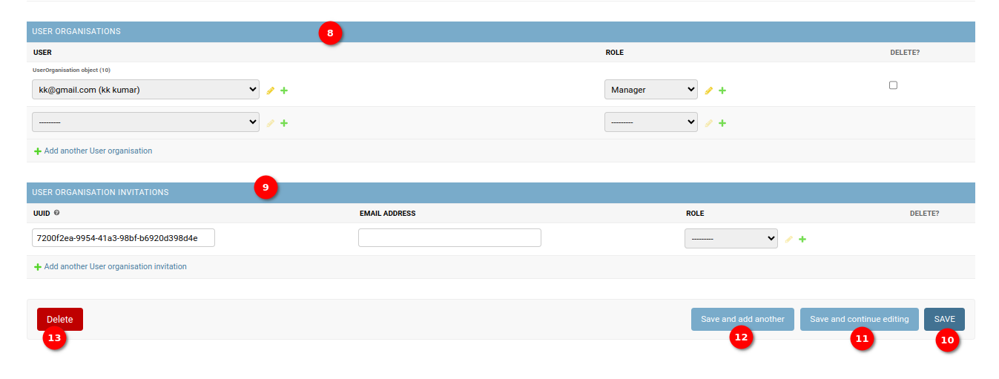

    8. **User Organisation Section:** Administrators can efficiently manage users within the organisation using the User Organisation section.

        - **User Email Dropdown:** Administrators can select the email of the user to be added to the organisation from the dropdown list.

        - **Role:** Choose the role or position the user will have within the organisation, such as `Manager` or `Operations Admin`.

        - **Delete Checkbox:** Mark the checkbox next to a user to delete them from the organisation.

        - **Add Another User Organisation:** Click on this link to add another user to the organisation, facilitating a streamlined user management process.

    9. **User Organisation Invitations Section:** Administrators can invite users to join the organisation using the User Organisation Invitations section.

        - **UUID:** Automatically generated UUID (Universally Unique Identifier) for each user invitation.

        - **Email Address:** Administrators need to provide the email of the user to be invited to the organisation.

        - **Role:** Choose the role the user will have within the organisation upon accepting the invitation.

        - **Delete Checkbox:** Mark the checkbox next to an invitation to delete it.

        - **Add Another User Organisation Invitation:** Click on this link to add another user invitation, simplifying the process of inviting multiple users to join the organisation.

    10. **Save:** Save the current record and then get redirected to the Django Admin Table/record list.
        
    11. **Save and add another:** Save the current record and then be redirected to a new page to add a new record.

    12. **Save and continue editing:** Save the current record while still showing the current record.

    13. **Delete button:** Delete the currently opened record. It will take administrators to a confirmation page.

3. **Adding Organisation:** The `ADD ORGANISATION` button allows administrators to create new observation records directly from the `Observation Table`. To add a new organisation to the system, the administrators can follow the steps outlined below.

    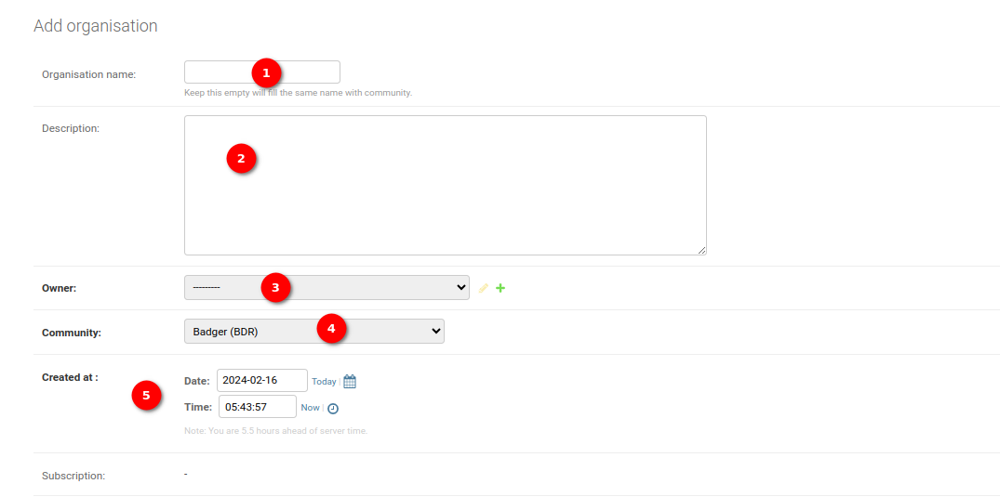

    1. **Organisation Name:** Select a user from the dropdown menu to associate the organisation with a specific user. Optionally, administrators can leave it empty if the organisation is not directly associated with a user.

    2. **Description:** Provide a brief description of the organisation in the designated field.

    3. **Owner Dropdown:** Choose the owner of the organisation from the dropdown menu. Use the `Edit` icon to modify existing owner details or the `Plus` icon to add a new owner.

    4. **Community Dropdown:** Select the community associated with the organisation from the dropdown menu. Populate the dropdown with a list of available communities.

    5. **Created At:** This field is automatically populated on the creation of an organisation.

    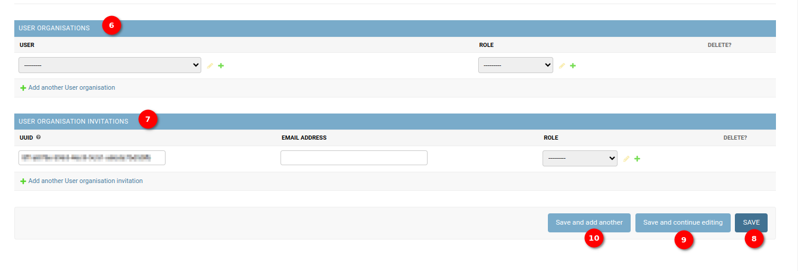

    6. **User Organisation Section:** In this section, administrators can efficiently manage users within the organisation.
        
        - **User Email Dropdown:** Select the email of the user to be added to the organisation from the dropdown list. Use the `Edit` icon to modify existing email details or the `Plus` icon to add a new email.

        - **Role:** Choose the role or position the user will have within the organisation. Use the `Edit` icon to modify existing role details or the `Plus` icon to add a new role.

        - **Delete Checkbox:** Mark the checkbox next to a user to delete them from the organisation.

        - **Add Another User Organisation:** Click on this link to add another user to the organisation.

    7. **User Organisation Invitations Section:** Administrators can invite users to join the organisation.

        - **UUID:** Automatically generated UUID for each user invitation.

        - **Email Address:** Provide the email of the user to be invited to the organisation.

        - **Role:** Choose the role the user will have within the organisation. Use the `Edit` icon to modify existing role details or the `Plus` icon to add a new role.

        - **Delete Checkbox:** Mark the checkbox next to an invitation to delete it.

        - **Add Another User Organisation Invitation:** Click on this link to add another user invitation.

    10. **Save:** Save the current record and then get redirected to the Django Admin Table/record list.
        
    11. **Save and add another:** Save the current record and then be redirected to a new page to add a new record.

    12. **Save and continue editing:** Save the current record while still showing the current record.

## General Table Management

All of the tables on the administration site follow similar structures and as such can be managed in similar ways.

### Managing Tables on the Administration Site

All tables on the administration site adhere to a consistent structure, facilitating uniform management procedures. The following points outline the general approach for adding, editing, and deleting records across various tables:

### Adding Tables

- To add a new record, locate the `Add <table name>` button typically available on the respective table page.
- Click on the button to initiate the creation of a new entry.
- Follow the prompts or fill in the required fields in the form that opens.
- Submit the form to add the new record to the table.

### Editing Tables

- For editing existing records, clicking on the name of the record will open a change record page, allowing the administrators to view or edit the record.
- Update the necessary information or fields as required.
- Save the changes to update the record.

### Delete Record of Tables

To delete a record, administrators can follow these steps using the action dropdown:

**Select Record:**
- Checkmark the checkbox available in front of the specific record that needs deletion.

**Open Action Dropdown:**
- Locate the action dropdown, often positioned near the table header or the selected record.

**Choose Delete Option:**
- Open the dropdown menu and select the `Delete` option.

**Initiate Deletion:**
- After selecting the delete option, click the `Go` button to initiate the deletion process.

To delete a record, administrators can utilise the following steps from the change page:

**Navigate to the Change Page:**
- Access the change page of the specific record that needs deletion by clicking on the record name.

**Locate Delete Button:**
On the change page, find the `Delete` button.

**Initiate Deletion:**
- Click the `Delete` button to initiate the deletion process for the record.

### Usage Tips

- Ensure accuracy when adding or editing records by double-checking the entered information.
- Exercise caution when deleting records, as this action is typically irreversible.
- Follow any specific guidelines or procedures outlined in the system documentation for individual tables.

### Additional Notes

- Consistent table structures streamline the process of managing data on the administration site.
- Users familiar with one table's management procedures can easily adapt to others with similar structures.
- Refer to the system documentation for any unique features or requirements specific to individual tables.
- By adhering to these general guidelines, administrators can effectively manage tables on the administration site, maintaining data accuracy and system efficiency.
