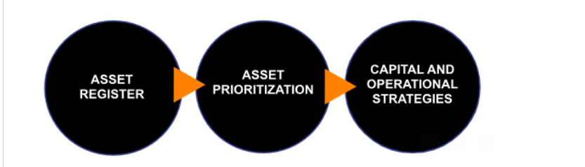

# **Welcome to MyCivitas**

Overview

MyCivitas is a user-friendly, cost-effective asset management platform designed specifically for smaller, budget-conscious municipalities.  Leveraging GIS technology, it seamlessly caters to both the strategic planning and day-to-day operational requirements of asset management.

Users can view, locate and query their asset inventory data. MyCivitas calculates and reports Asset Management related information including the condition, replacement cost, life expectancy, probability of failure, consequence of failure and associated risk related to assets.  MyCivitas also includes a Computerized Maintenance Management Software (CMMS) module to create and manage work orders.

MyCivitas uses QGIS, a free open-source desktop GIS and is integrated with Mergin Maps for recording information on site using a mobile app.

<!-- ### Purpose -->

## Where to start

We recommend the following three-step approach: 

LandInfo developed a three-step methodology to support smaller communities in the development of their asset management plans:

## Step 1: Asset Register

Assets are captured in MyCivitas’s predefined data structure using QGIS.  Typically, data is obtained from existing electronic data, hard-copy maps and reports. The remaining unknown assets are recorded through field surveys using Mergin Maps, an open-source mobile application.

Once the data is captured, MyCivitas is used to generate reports on the condition, life expectancy, replacement cost, etc. of assets. The goal is to answer the following asset management questions:

- What do we own?

- Where is it?

- What is the condition?

- What is the remaining life?

- What is the replacement value?

## Step 2: Asset Prioritization

The second phase is prioritizing assets based on risk. This phase is intended to identify critical assets. The probability of failure and consequence of failure values are collected for all assets. The goal is to answer the following Asset Management questions: 

- What assets are the high priority?

- What assets need to be replaced first?

## Step 3: Capital and Operational Strategies

Focusing on the high-priority assets identified in Step 2, the next step is to develop capital and operational strategies. A primary focus is to implement operational procedures to extend the life of assets and risk mitigation.

MyCivitas automatically calculates renewal costs as well as the anticipated maintenance costs and annual averaged infrastructure demand requirements.

<!-- ### Project roadmap

[Project Roadmap]() -->
<!-- Either insert link to roadmap or actual roadmap (Speak to team leads) -->

#### Contributing

We would love to collaborate with you! But first, please read our [contributor guidelines](about/contributing.md) which describe how to report issues, plan and contribute feature additions etc.

#### Code of conduct

Our community in this project is aligned with our [Code of Conduct](about/code-of-conduct.md) - please be sure to read and abide by that document in all interactions with our community.

#### Diversity statement

This project welcomes and encourages participation by everyone.

No matter how you identify yourself or how others perceive you: we welcome you. We welcome contributions from everyone as long as they interact constructively with our community.

While much of the work for our project is technical in nature, we value and encourage contributions from those with expertise in other areas, and welcome them into our community.

<!-- ## Project partners -->

<!-- Insert Project Partner Logos and/or Links -->
<!-- 
[Project Partner 1]() -->

#### Releases

<!-- Insert links to release pages, change as needed -->
[GitHub releases page]()
[Releases page]()

| | **Project Badges** | |
| ----------------------- | ----------------------- | ----------------------- |
|  |  |  |
|  |  |  |

#### Contributor License Agreement (CLA)
<!-- Insert links to CLA -->
Contributions to this project will be subject to our [Contributor License Agreement]()

#### License

This project is open source, and published under the AGPL-3.
You can read our license to find out what rights this license bestows on users and contributors.

[License](about/license.md)

<!-- Keep the Kartoza Logo at the bottom of the page if the project allows -->

## Disclaimer

 The software provided by this project is provided 'as is'. All information provided within the platform should be independently verified before using as the basis for action. The contributors and developers of this platform take no responsibility for any loss of revenue, life, physical harm or any other adverse outcome that may occur as a result of the use of this platform. 
