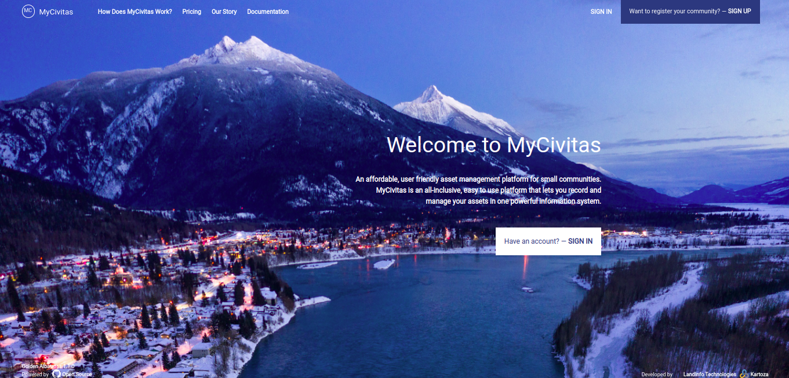

Welcome to MyCivitas

An affordable, user-friendly asset management platform for small communities.
MyCivitas is an all-inclusive, easy-to-use platform that lets you record and manage your assets in one powerful information system.

## Introduction

MyCivitas is a revolutionary project aimed at providing small communities with an affordable and user-friendly asset management platform. Our all-inclusive and easy-to-use platform is designed to empower you to record and manage your assets seamlessly within a powerful information system. MyCivitas is committed to simplifying the complex task of asset management, ensuring that even small communities can efficiently organise and oversee their valuable resources. Join us in embracing a solution that combines accessibility, affordability, and functionality for a streamlined approach to community asset management.

## Key concepts

**How does MyCivitas work?:** MyCivitas begins by providing a comprehensive map of your community, highlighting its assets and infrastructure. Users can capture and document essential information about the physical components within the community. With the gathered data, prioritise your community assets based on their significance and needs. MyCivitas allows you to assess and categorise assets for better management and decision-making. MyCivitas aids in capital planning by offering insights into the condition and importance of various community assets. This information supports strategic planning and budget allocation for effective infrastructure development. Streamline maintenance and improvement processes by setting up work orders within MyCivitas. Assign tasks, schedule activities, and track progress to ensure timely and efficient execution of projects. MyCivitas provides a robust platform for ongoing asset management. Monitor the status of infrastructure, track changes, and utilise the system to make informed decisions for the sustainable development of your community.

**Capture your infrastructure:** Create a detailed asset inventory by leveraging powerful mapping software. Our data capture system utilises QGIS, a free and open-source desktop application, making it user-friendly and accessible.

**Prioritize Your Assets:** Our system goes beyond simple inventory; it performs risk assessment analysis and preventative maintenance planning on your data. This ensures a nuanced understanding of asset priorities, allowing you to focus on areas that need immediate attention or mitigation.

**Support Your Capital Planning:** MyCivitas empowers you to make informed decisions crucial for supporting your capital planning. By providing comprehensive insights into asset conditions and requirements, you can strategically allocate resources and budget effectively.

**Set Up Work Order:** Streamline your maintenance processes by utilising the platform to plan both ad hoc and scheduled maintenance tasks. MyCivitas enables efficient task assignment, scheduling, and tracking, facilitating a proactive approach to infrastructure management.

**We Are Here to Help:** Let us know if you need any help along the way, from capturing data to presenting to the council. We have a team of experienced staff available.

Please note that support is not included in the hosting fee. A popular option for small communities is to sign an annual support contract. Please inquire (support@civitas.ca) and we will connect you with a team member near you

**Enjoy Asset Management:** Practice effective and sustainable asset management on our affordable platform to benefit your community.

### Disclaimer

The software provided by this project is provided 'as is'. All information provided
within the platform should be independently verified before using as the basis for
action. The contributors and developers of this platform take no responsibility
for any loss of revenue, life, physical harm or any other adverse outcome that may
occur as a result of the use of this platform.

<!-- ### Purpose

### Scope of project

### Project roadmap

[Project Roadmap]() -->
<!-- Either insert link to roadmap or actual roadmap (Speak to team leads) -->

#### Contributing

We would love to collaborate with you! But first, please read our [contributor
guidelines](about/contributing.md) which describe how to report
issues, plan and contribute feature additions etc.

#### Code of conduct

Our community in this project is aligned with our [Code of
Conduct](about/code-of-conduct.md) - please be sure to read and abide by that
document in all interactions with out community.

#### Diversity statement

This project welcomes and encourages participation by everyone.

No matter how you identify yourself or how others perceive you: we welcome you.
We welcome contributions from everyone as long as they interact constructively
with our community.

While much of the work for our project is technical in nature, we value and
encourage contributions from those with expertise in other areas, and welcome
them into our community.

<!-- ## Project partners -->

<!-- Insert Project Partner Logos and/or Links -->
<!-- 
[Project Partner 1]() -->

#### Releases

<!-- Insert links to release pages, change as needed -->
[GitHub releases page]()
[Releases page]()

| | **Project Badges** | |
| ----------------------- | ----------------------- | ----------------------- |
|  |  |  |
|  |  |  |

#### Contributor License Agreement (CLA)
<!-- Insert links to CLA -->
Contributions to this project will be subject to our [Contributor License Agreement]()

#### License

This project is open source, published under the AGPL-3.
You can read our license to find out what rights this license bestows to users and contributors.

[License](about/license.md)

<!-- Keep the Kartoza Logo at the bottom of the page if the project allows -->

