# User Guide Community Map

Welcome to the `Community Map` feature! This guide will walk you through the steps to access and utilise the `Community Map` on MyCivitas.

## How do I access the map?

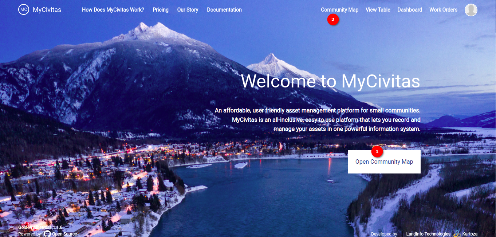

Locate 1️⃣ the `Community Map` button available in the middle of the landing page. Simply click on the Community Map button to be redirected to the Community Map page. Alternatively, you can click on 2️⃣ the `Community Map` option on the navigation bar to redirect to the Community Map page.

- Automatic Redirection: After successfully logging in, you will be automatically redirected to the `Community Map` page.

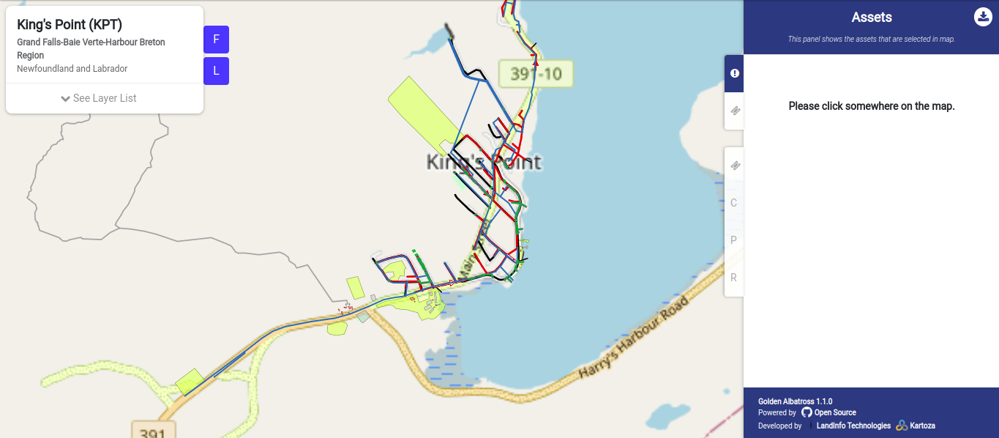

- Zoom In/Out: Use your touchpad or mouse to zoom in and out of the map.
    
    - Touchpad: Pinch in to zoom out, pinch out to zoom in.
    - Mouse: Scroll up to zoom in, scroll down to zoom out.

## How do I use a filter?

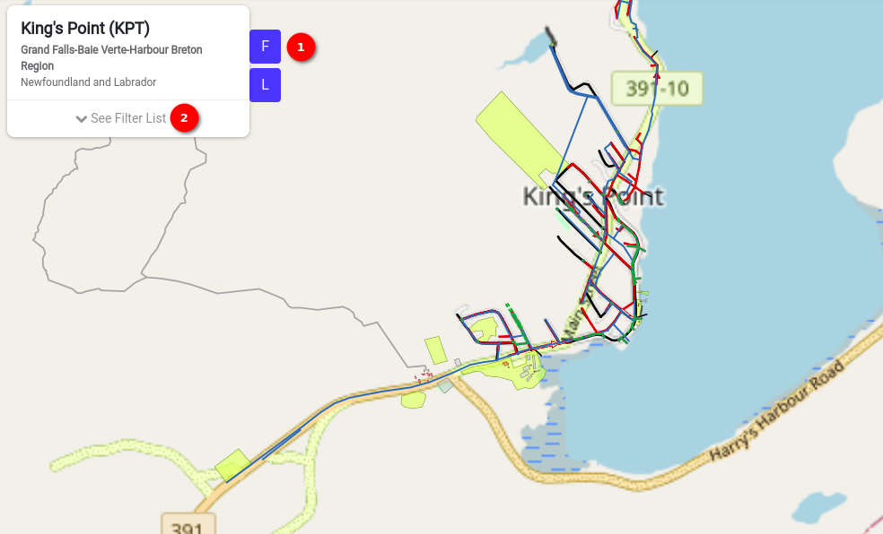

Click on 1️⃣ the `F` button to select the filters to show on the side panel once you click on this button you will see 2️⃣ the `See Filter List` click on this to view the available filters. Choose filters from the list to visualise specific, filtered data on the map.

### Choose classification filters and sub-filters

You can choose the classification filters and sub-filters of your choice by checking the checkbox available in front of the filters and sub-filters.

Map with classification filters and sub-filters

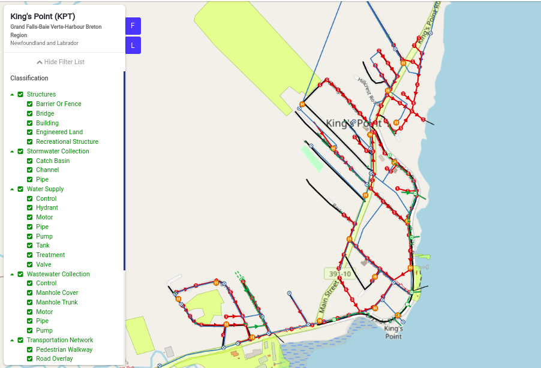

Map without classification filters and sub-filters

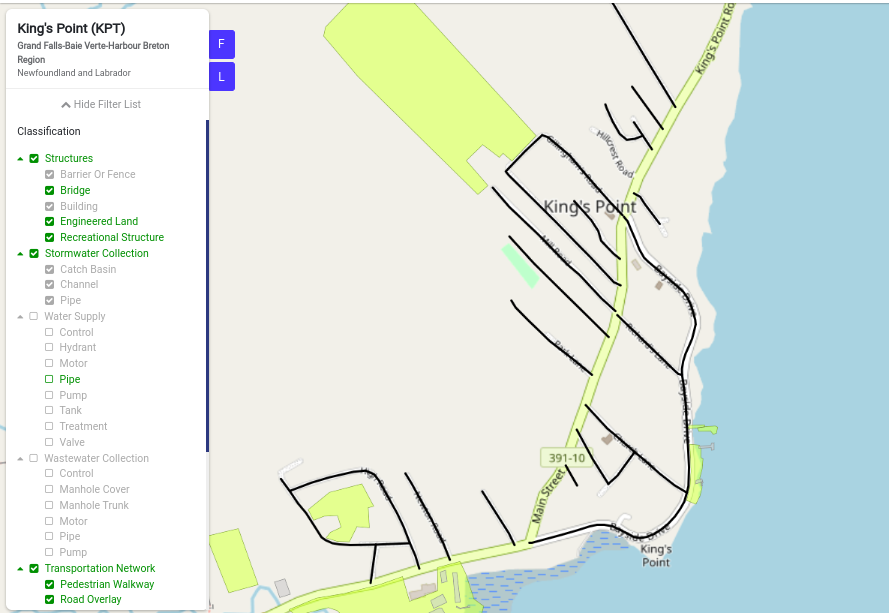

### Choose risk filters

You can choose the risk filters of your choice by clicking on the radio button available in front of the filters.

Map with risk filters

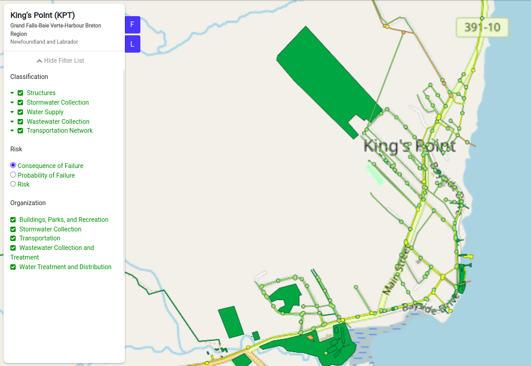

Map without risk filters

### Choose Organisation filters

You can choose the organisation filters of your choice by checking the checkbox available in front of the filters.

Map with all organisation filters

Map without some organisation filters

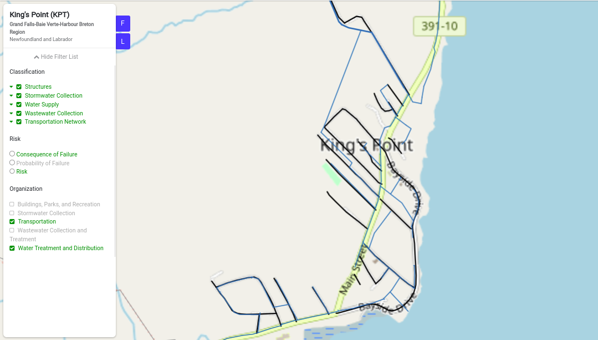

## How do I use layers?

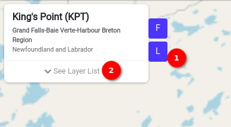

Click on 1️⃣ the `L` button to select the layers to show on the side panel once you click on this button you will see 2️⃣ the `See Layer List` click on this to view the available layers. Choose layers from the list to visualise specific layer data on the map.

### Choose classification layers and sub-layers

You can explore various options available for visualisation. Each option includes subcategories and an image with corresponding icons and names.

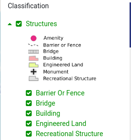
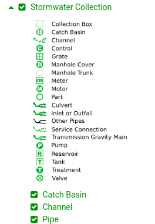
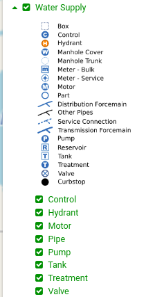
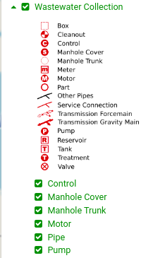
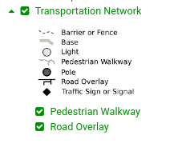

Map with classification layers and sub-layers

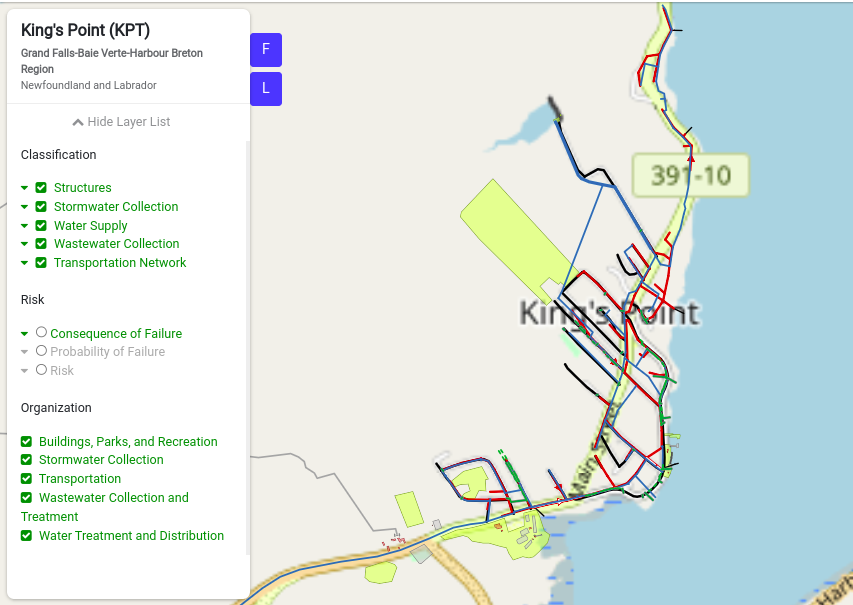

Map without classification layers and sub-layers

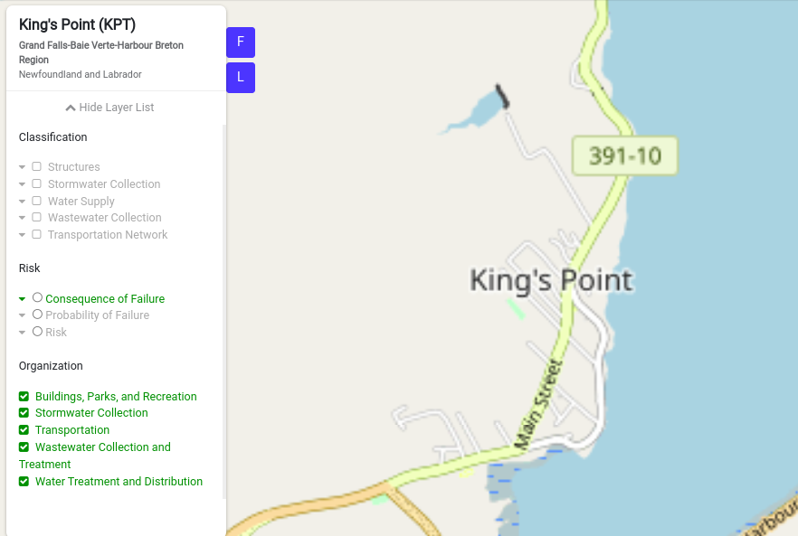

### Choose risk layer

You can choose the risk layer of your choice by clicking on the radio button available in front of the layer.

Map with risk layer

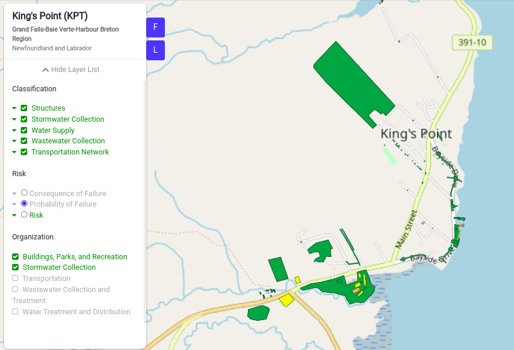

Map without risk layer

### Choose Organisation layers

You can choose the organisation layers of your choice by checking the checkbox available in front of the layers.

Map with all organisation layers

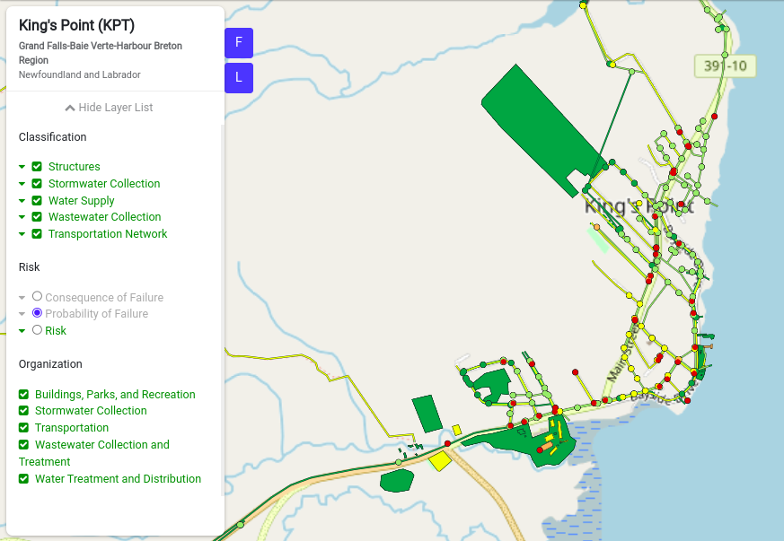

Map without some organisation layers

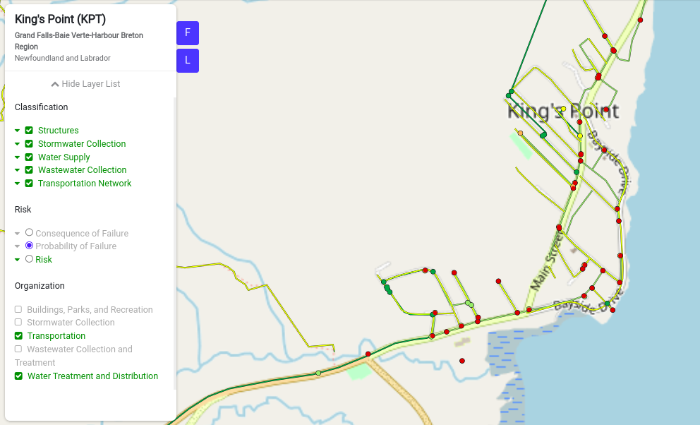

## How do I create a ticket?

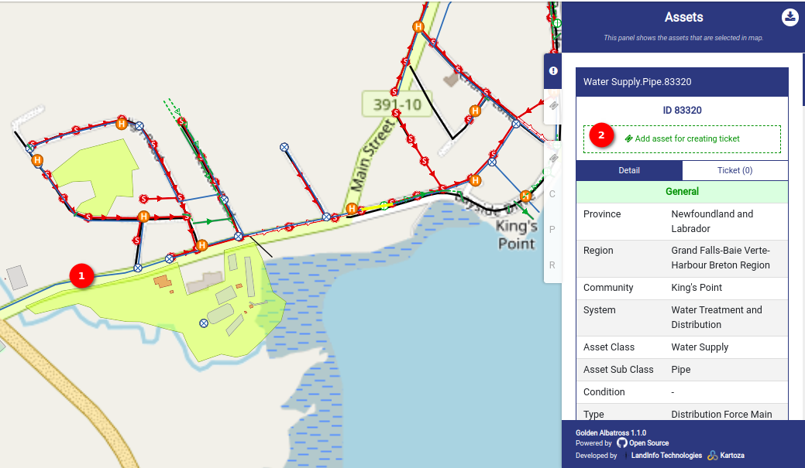

To create a ticket you can 1️⃣ click somewhere on the map once you click on the map, 2️⃣ the `Add asset for creating ticket` button will appear on the asset panel with the details.

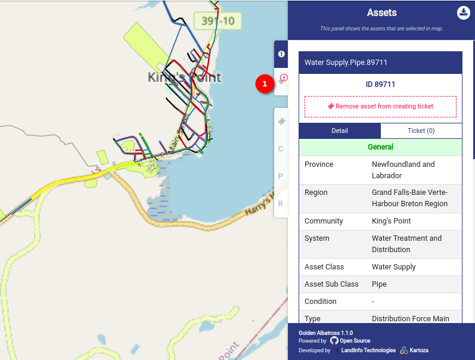

Click on the `Add asset for creating ticket` button and then click on 1️⃣ the `Create Ticket` panel to create a ticket. On create ticket panel you will see the create ticket form fill that form with require details to create ticket.

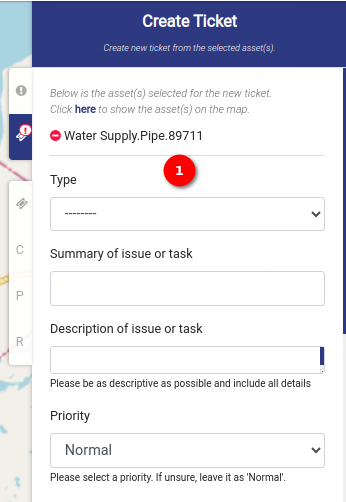
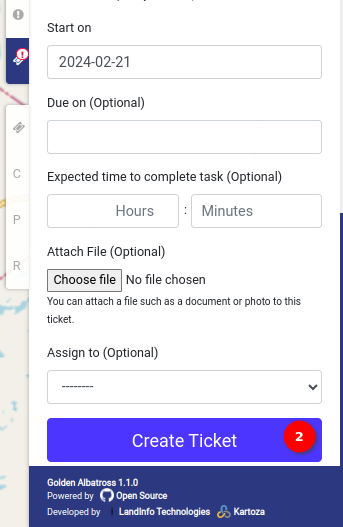

Fill in 1️⃣ the information in the following fields.

- Type: Choose from the dropdown the type of the ticket.

- Summary of Issue or Task: Provide a summary of the issue or task.

- Description of Issue or Task: Be as descriptive as possible, including all relevant details.

- Priority: Select a priority level. If unsure, leave it as `Normal`.

- Start On: Defaults to the current date.

- Due On (Optional): Choose a due date if applicable.

- Expected Time to Complete Task (Optional): Specify the estimated time in hours and minutes.

- Attach File (Optional): Attach a file, such as a document or photo, to the ticket.

- Assign To (Optional): Assign the ticket to a specific person if needed.

Click on 2️⃣ the `Create Ticket` button to finalise and create the ticket. Once you click on this button the ticket is created and you will be redirected to the edit tickets page.

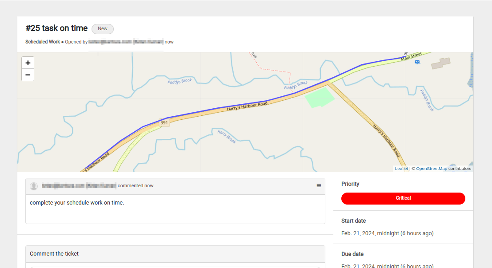

For detailed instructions on the community map click [here](../manual/community-map.md)
