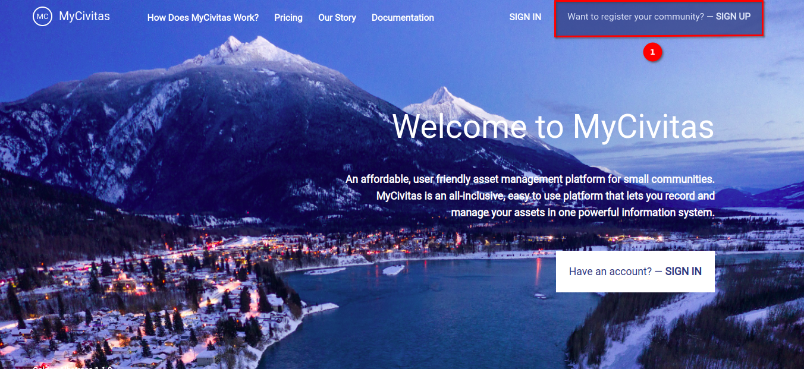
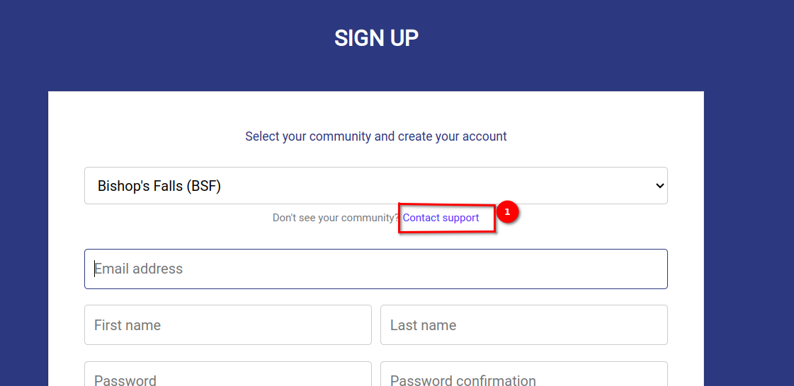
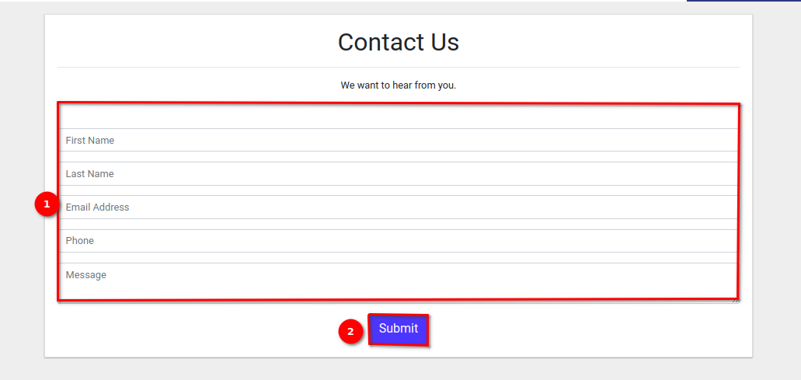
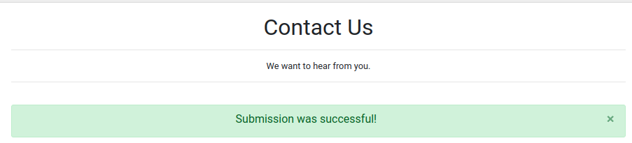

# Contact Us Page User Manual

Welcome to our `Contact Us Page!` This user manual will guide you through the process of effectively using our Contact Us page to get in touch with our support team or provide feedback. Please follow the instructions below to navigate the page smoothly.

## Accessing the Contact Us Page

Click on the 1️⃣ `Sign-Up` button. This will redirect you to the sign-up page where you can find the `Contact Support` link.

After clicking on the `Sign-Up` button from the landing page, you will be directed to a sign-up page on this page you will find the 1️⃣ `Contact support` link, you can directly access the Contact Us page by clicking on the `Contact support` link.

## Navigating the Contact Us page

Upon accessing the Contact Us page, you will find a form with fields designed to gather the necessary information to assist you effectively.

### Submitting Your Inquiry or Feedback
Carefully fill out all the 1️⃣ required fields in the form with accurate information. Craft your message in the `Message` field, providing relevant details or feedback to assist us in understanding your query or suggestion. Before submitting, take a moment to review all the information you've provided to ensure it's correct. Once you're satisfied with your message and information, click on the 2️⃣ `Submit` button to send your inquiry or feedback to our support team.

### Confirmation and Response

After submitting your message, you will receive a confirmation notification indicating that your message has been successfully submitted. Our support team will review your inquiry or feedback and respond to you via email or phone, depending on the contact information provided. Please allow us some time to process your request, and rest assured that we will do our best to address your concerns promptly and efficiently.

Thank you for choosing to contact us. We value your feedback and are committed to providing you with the assistance you need. If you have any further questions or require additional support, don't hesitate to reach out to us through this platform. We appreciate your business and look forward to serving you!
