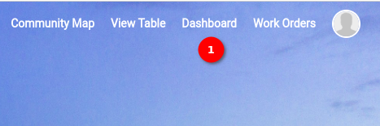
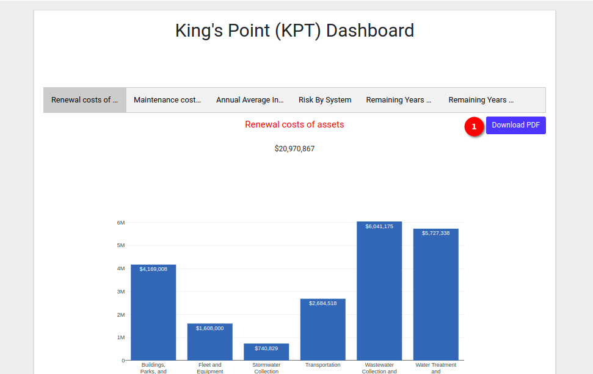
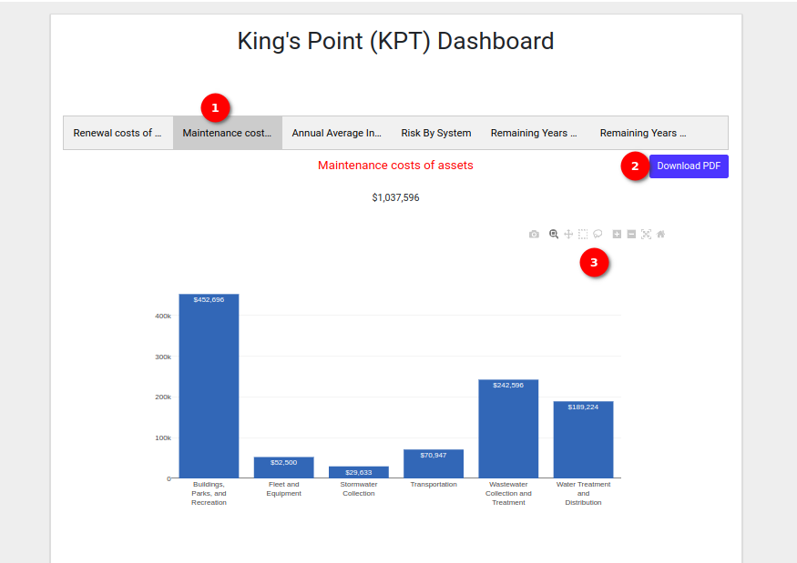
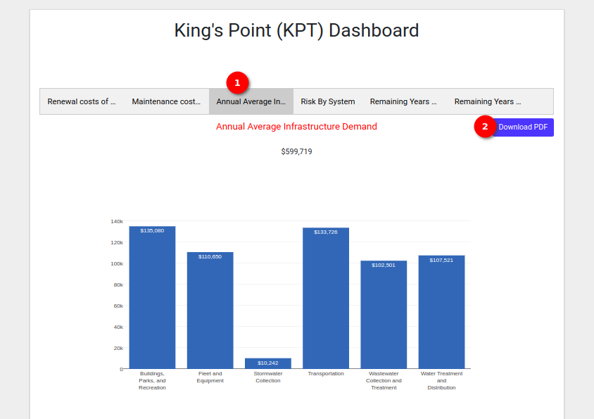
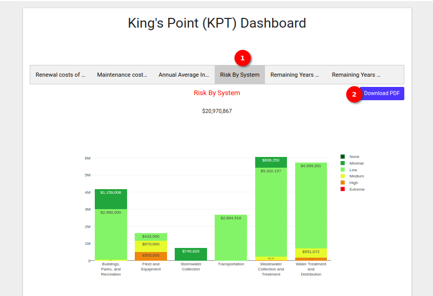
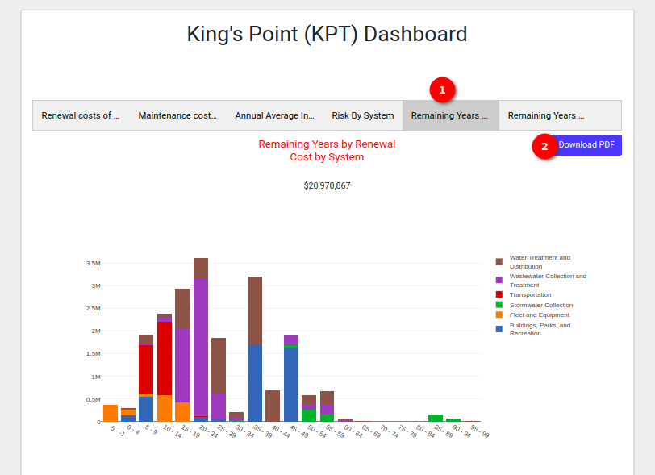
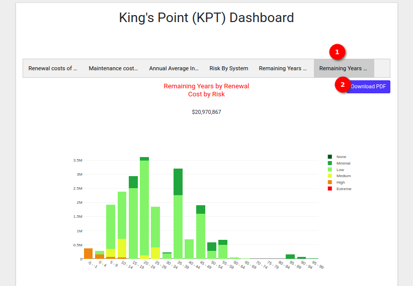

# User Guide Dashboard

Welcome to the `Dashboard` page. This guide will walk you through the steps to access and utilise the `Dashboard` page on MyCivitas.

## How do I access the dashboard?

Locate 1️⃣ the `Dashboard` option on the navigation bar to redirect to the Dashboard page. By default, the `Renewal costs of assets` data are displayed on the dashboard page.

You can download the `Renewal costs of assets` PDF for offline analysis to download the PDF click on 1️⃣ the `Download PDF` button.

## How do I download the maintenance costs of assets PDF?

Locate 1️⃣ `Maintenance costs of assets` and click on it to display the graph and the details in table format. To download the PDF simply click 2️⃣ the `Download PDF` button. You can enhance graph visualisation by using 3️⃣ the available icon options on the top right corner of the graph.

- Camera Image (Download as PNG): To download only the graph you can click on the `camera` icon.

- Magnifying Glass Image: Click to activate the zooming functionality. Select the bar graph to zoom in for a closer look.

- Pan Image: Click to enable panning. Narrow, widen, slide left, or slide right to adjust the graph view.

- Select Box Image: Activate the select box feature to choose a specific area on the graph.

- Lasso Select Image: Utilise the lasso select image option for precise graph selection.

- Plus Image (Zoom In): Zoom in for a more detailed view of the chart.

- Minus Image (Zoom Out): Zoom out to get a broader perspective of the chart.

- Auto Scale Image: Automatically scale the graph for optimal visualisation.

- Home Image (Refresh Axes): Click to reset and refresh the axes of the chart.

> Note: The available icons on all of the graphs will work same

## How do I download the annual average infrastructure demand PDF?

Locate 1️⃣ `Annual Average Infrastructure Demand` and click on it to display the graph and the details in table format. To download the PDF simply click 2️⃣ the `Download PDF` button.

## How do I download the risk by system PDF?

Locate 1️⃣ `Risk By System` and click on it to display the graph and the details in table format. To download the PDF simply click 2️⃣ the `Download PDF` button.

## How do I download the remaining years by renewal cost by system PDF?

Locate 1️⃣ `Remaining Years by Renewal Cost by System` and click on it to display the graph and the details in table format. To download the PDF simply click 2️⃣ the `Download PDF` button.

## How do I download the remaining years by renewal cost by risk PDF?

Locate 1️⃣ `Remaining Years by Renewal Cost by Risk` and click on it to display the graph and the details in table format. To download the PDF simply click 2️⃣ the `Download PDF` button.

For detailed information about these reports please refer to the [dashboard user manual](../manual/dashboard.md).
