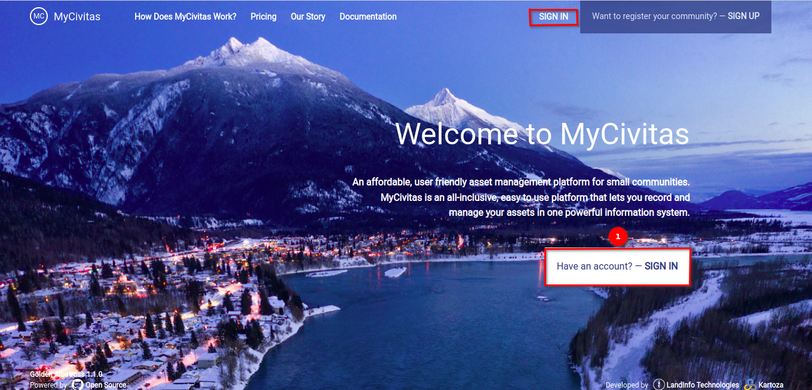
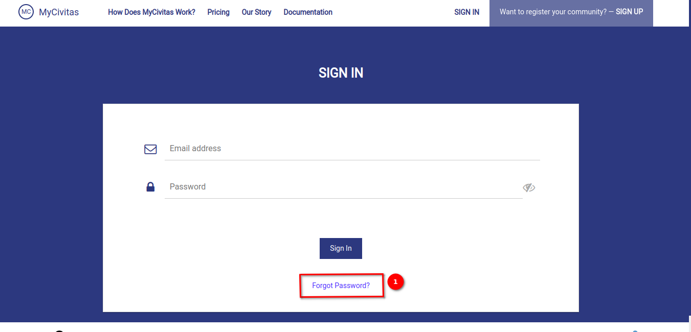
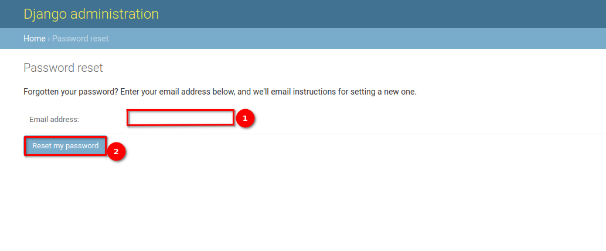
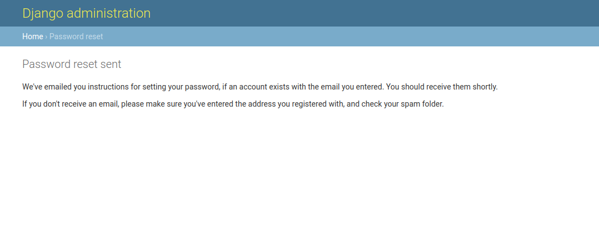
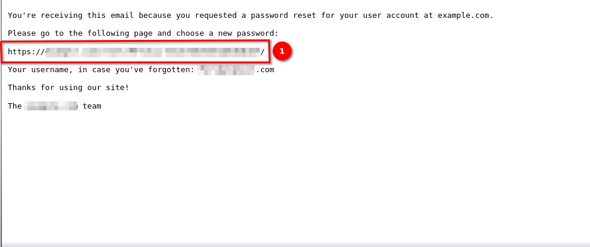
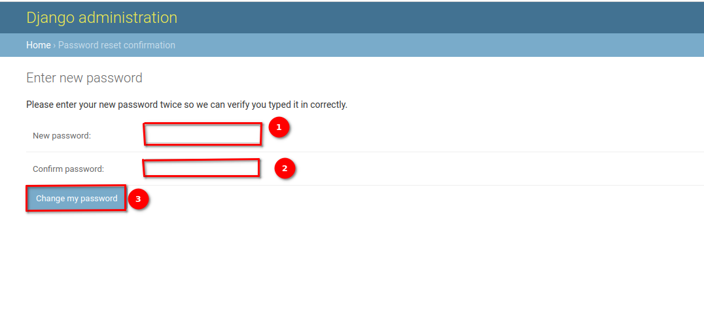
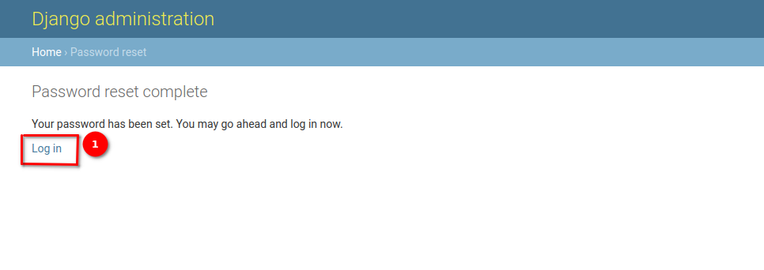

# Forgot Password User Guide

This user guide will assist you in resetting your password if you have forgotten it. Follow the step-by-step instructions below to initiate the password reset process:

## Landing Page

Start by accessing the landing page of the application. Click on the 1️⃣ `Sign-In` button available at the centre of the page or use the `Sign-In` button in the navigation bar. This action will redirect you to the sign-in page.

## Sign In Page

On the sign-in page, locate and click on the 1️⃣ `Forgot Password?` link.

## Reset Password Page

You'll be redirected to the `Reset Password` page. Enter the email address associated with your account into the provided 1️⃣ email field. Verify that the entered email address is correct. Click on the 2️⃣ `Reset my password` button to initiate the process.

You will see the message after sending the email

## Reset Password Email

Check your email inbox associated with the provided email address for an email from the application. Open the email and locate the password reset link. Click on the 1️⃣ password reset link provided in the email. You will be directed to the `Reset Password Confirmation` page.

## Reset Password Confirmation Page

Enter your desired new password in the 1️⃣ `New Password` field. Re-enter the new password in the 1️⃣ `Confirm Password` field to ensure accuracy. Click on the 3️⃣ `Change My Password` button to finalise the password change process.

## Password Reset Page

After successfully changing your password, you will be redirected to the `Password Reset` page. Click on the 1️⃣ `Log In` link to redirect to the login page. For detailed documentation on login click [here](../manual/sign-in.md)

## Conclusion

By following the steps outlined in this user guide, you can successfully reset your password and regain access to your account. If you encounter any difficulties or have questions during the process, please contact the application's support team for assistance.
