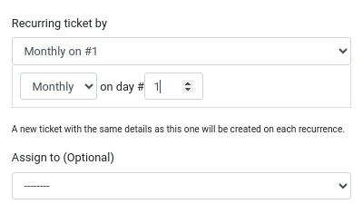
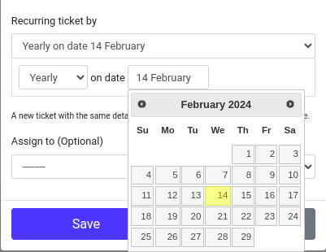

# Organisation User Guide

Welcome to the `Organisation` guide. This guide will walk you through the steps to view and manage the organisation on MyCivitas.

## How do I view the organisation?

Locate and click on 1️⃣ the `Profile` icon to show the organisation option. to view the organisation click on 2️⃣ the `organisation` option when you click on this option you will be redirected to the view organisation page.

## How do I view the organisation details?

To see more detailed information about your organisation such as its name and members you can click on 1️⃣ the name of the organisation. When you click on the organisation name you will be redirected to the organisation profile page where you can see the `name`, `community name`, `owner` and the created date of an organisation.

## How do I manage the organisation access?

To manage the organisation you can click on 1️⃣ the `Manage Access` option to open the organisation manage access page. Manage the access of the user by assigning the user role to the user to assign a user role click on 2️⃣ the role dropdown and select the role of your choice you want to assign the user if you want to remove user from the organisation. To remove a user from the organisation, click on the `Delete` icon in the respective row of that user's record.

## How do I invite a user to the organisation?

To invite a new user to the organisation click on the 4️⃣ `Invite  user` button. When you click on this button the invite user form will open.

You need to enter 1️⃣ email of the user you want to invite to your organisation and 2️⃣ assign a role to the user by selecting one from the dropdown options:

- CMMS Operator
- CMMS Viewer
- Dashboard Viewer
- Manager
- Operations Admin.

After selecting the user role, click on 3️⃣ the `Invite` button to send an invite to that user.

This process allows you to seamlessly invite users to your organisation with specified roles for effective collaboration.

## How do I create a new work order schedule?

Click on 1️⃣ the `Work Order Scheduler` option to open the work order schedule page. To create a new schedule click on 2️⃣ the `Create New Schedule` page. When you click this button the create schedule form opens.

Enter the values in 1️⃣ the form fields and the fields are:

- Asset Type: Choose the relevant asset type from the dropdown list.

- Activity Summary: Provide a brief summary of the activity associated with the scheduler.

- Activity Description: Add a detailed description of the activity. Be as descriptive as possible and include all relevant details.

- Recurring Ticket By: Choose the recurrence pattern from the dropdown list. There are two dropdowns with different options based on the selected recurrence type.

*Weekly*

*Monthly*

*Yearly*

- Assign To (Optional): Optionally, choose a person to assign the scheduler from the dropdown list.

Click on 2️⃣ the `Save` button to save the details and create the new scheduler.

Click on 3️⃣ the`Close` button to close the form without saving changes.
