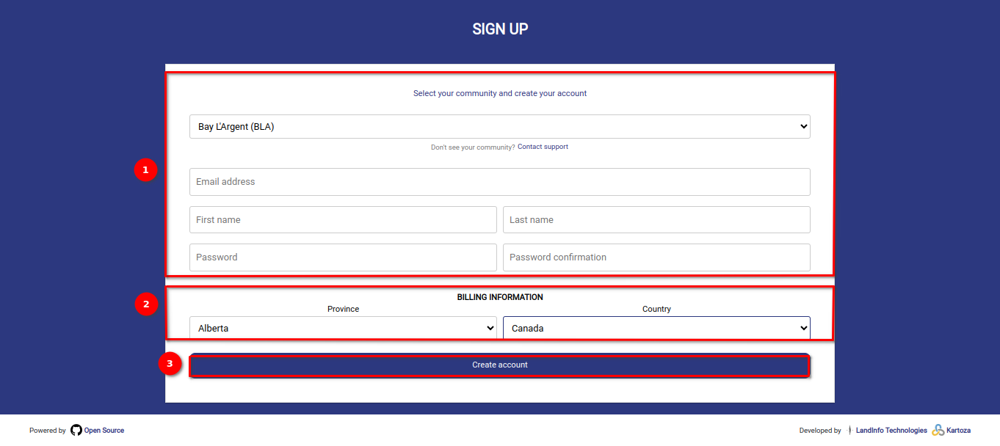
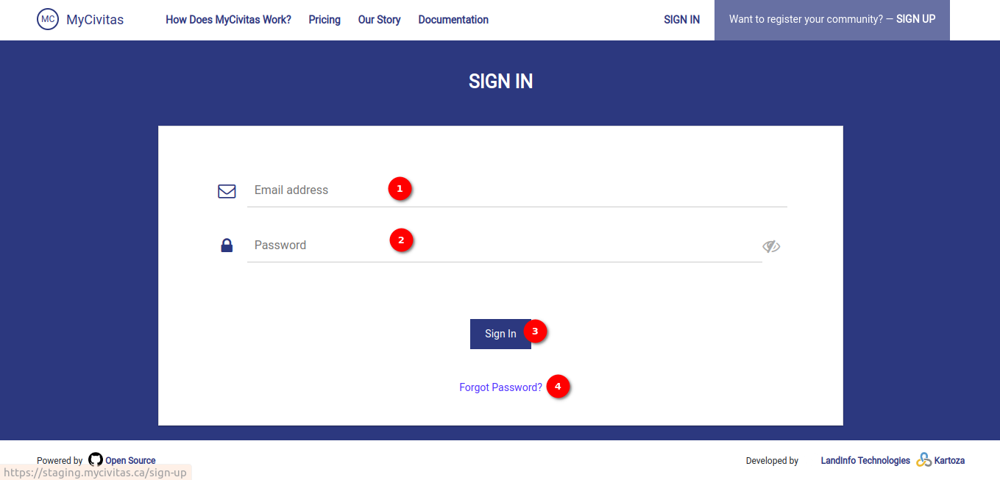

# User Guide: Registration, Login, and Logout on Mycivitas

## How do I register on the site?

Welcome to `Mycivitas!` Follow these simple steps to create your account and join our community.

1️⃣ Locate the `Sign-Up` button at the top right corner of the page. Click on the `Sign-Up` button to initiate the account creation process.

### Fill in the Required Fields

On the Sign-Up page, you will find several fields that need to be completed. 

These include two sections:

#### Community and Account information section

Fill in the community and account-related information, in 1️⃣ the `Community and Account` section.

- Community Dropdown: Select your community from the dropdown list.

- Email Address: Enter your valid email address. This will be used for communication and account recovery.

- First Name: Provide your first name in the designated field.

- Last Name: Enter your last name.

- Password: Create a secure password for your account. Make sure it meets any specified password requirements.

- Password Confirmation: Re-enter the password to confirm accuracy.

#### Billing information section

Fill in the billing-related information, in 2️⃣ the `Billing information` section.

- Province Dropdown: Select your province from the dropdown list.

- Country Dropdown: Choose your country from the provided dropdown options.

#### Create Account Button

After filling in all the required fields, double-check to ensure accuracy. Click on 3️⃣ the `Create Account` button to proceed.

Welcome to MyCivitas, Congratulations! You have successfully created your MyCivitas account.
You can now explore and engage with the community, connect with others, and enjoy the features Mycivitas has to offer.

If you encounter any issues during the sign-up process or have questions about your account, refer to the platform's contact page for assistance. We are excited to have you as part of our community!

## How do I login?

Welcome to MyCivitas! This user guide will walk you through the steps to log in to your MyCivitas account. Whether you are a community member or staff, accessing your account is quick and easy.

1️⃣ Look for the `Have an account? - Sign In` button in the middle of the page. Click on this button to redirect to the login page. Alternatively, you can find the 2️⃣ `Sign In` option in the navigation menu.
Click on `Sign In` to access the login page.

Once you are on the login page, follow these steps:
In 1️⃣ the provided field, enter your registered email address. Enter 2️⃣ your password in the designated field. To ensure accuracy, you can use the eye icon next to the password field to hide or reveal your password. Once you have entered 3️⃣ your email address and password, click on the `Sign In` button to proceed.

>Note: It is recommended to keep your login credentials confidential to ensure the security of your account. If you forget your password, use the `Forgot Password` option on the login page to reset it.

Click on the 4️⃣ `Forgot Password?` link, to reset your password if you forget it. For detailed instructions on the reset password functionality click [here](../manual/forgot-password.md)

Congratulations! You have successfully logged in to your MyCivitas account.

## How do I logout?

Logging out of your MyCivitas account is a straightforward process. Follow these simple steps to ensure a secure logout.

On any page within the MyCivitas platform, look for the profile icon. This icon is typically represented by an image associated with your account. Once you have located the profile icon, click on it. This action will open a dropdown menu. In the dropdown menu, you will find 1️⃣ the `Logout` option. It is usually clearly labelled to facilitate easy identification. Simply click on the `Logout` option. This action will log you out of your MyCivitas account.

Congratulations! You have successfully logged out of your MyCivitas account.

>Remember to keep your login credentials confidential and to log out of your account when using shared or public computers to maintain the security of your information.
