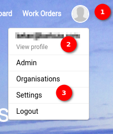
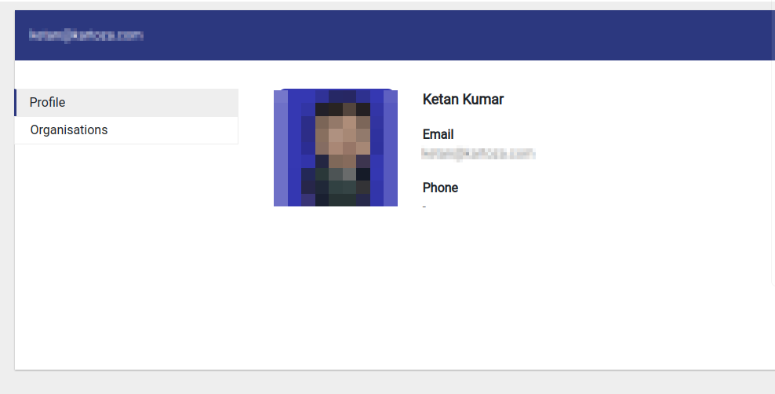
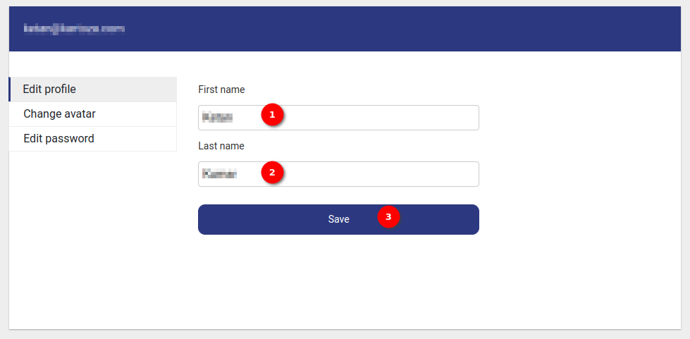
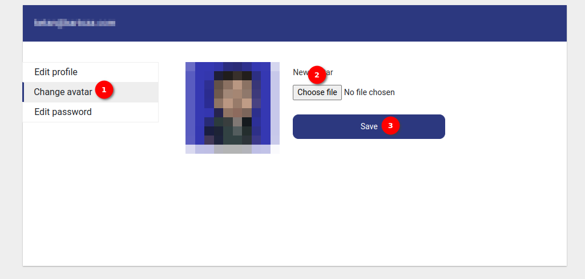
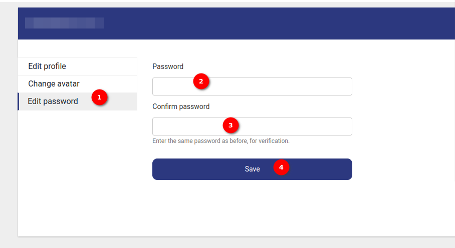

# User Profile User Guide

Welcome to the `User Profile` guide. This guide will walk you through the steps to view and manage the user profile MyCivitas.

## How do I view the profile details?

Locate and click on 1️⃣ the `Profile` icon to show the profile options. to view the profile details click on 2️⃣ the `view profile` option when you click on this option you will be redirected to the view profile page. Here you can only view the profile details.

## How do I edit the profile details?

Click on 3️⃣ the `Setting` option to redirect to the edit profile page. By default the `Edit Profile` page will open. Where you can edit 1️⃣ the `FirstName` and 2️⃣ the `LastName` and then click on 3️⃣ the `Save` button to save the changes.

## How do I edit the avatar?

Click on 1️⃣ the `Change Avatar` option to redirect to the change avatar page. To choose the avatar from the system click on 2️⃣ the `Choose file` button once you choose the avatar of your choice then click on 3️⃣ the `Save` button to set a new avatar for your profile.

## How do I edit the password?

Click on 1️⃣ the `Edit Password` option to redirect to the edit password page. Where you need to enter the password into 2️⃣ the `Password` field and enter the same password as before into 3️⃣ the `Confirm password` field then click on 3️⃣ the `Save` button to set a new password for your account.
