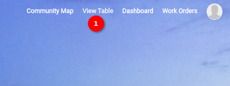
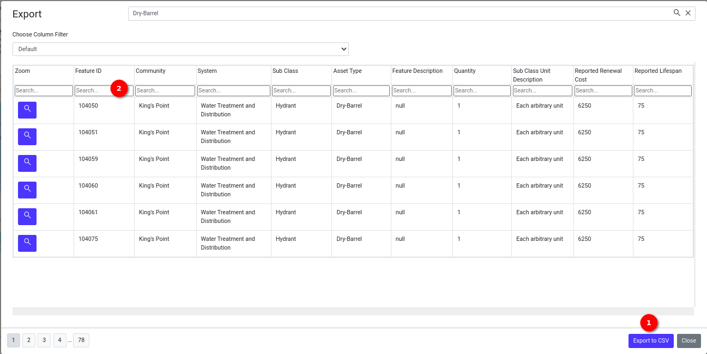
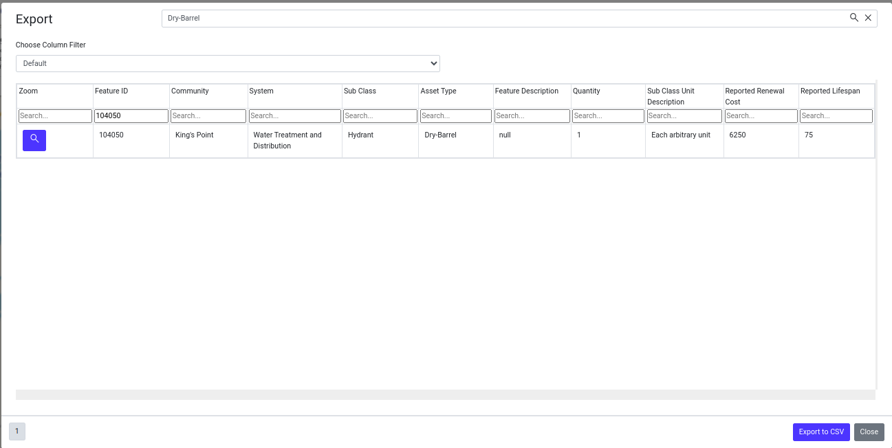
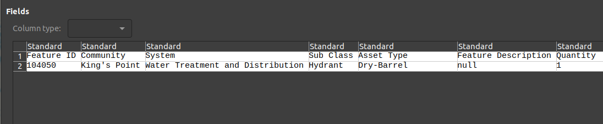
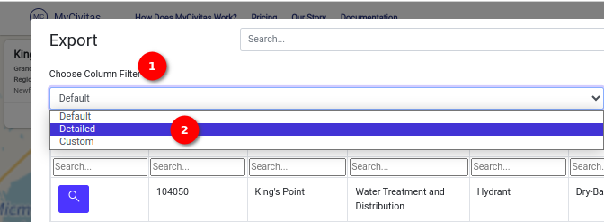
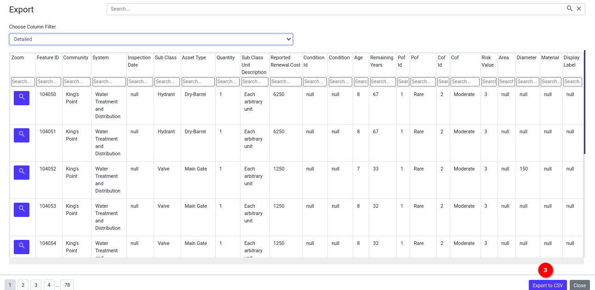
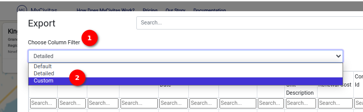
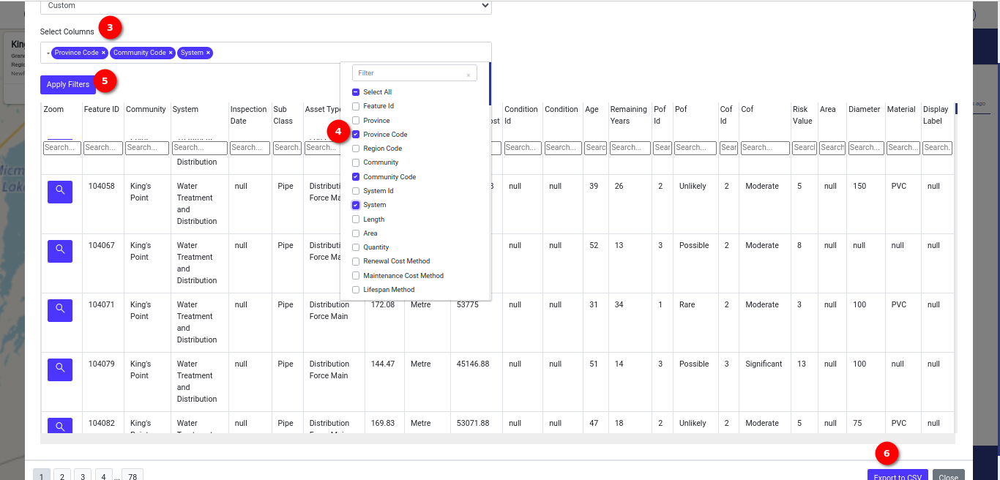
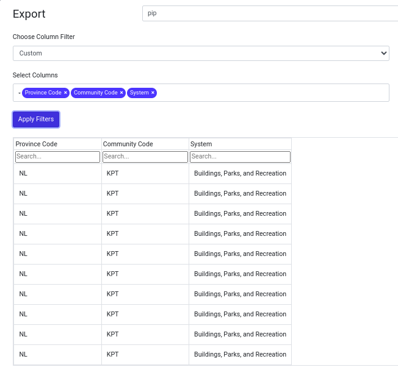

# User Guide View Table

Welcome to the `View Table` feature! This guide will walk you through the steps to access and utilise the `View Table` on MyCivitas.

## How do I access the table?

Locate 1️⃣ the `View Table` option on the navigation bar to redirect to the View Table page. By-default the default data displays on the view table page.

You can download the table data in `CSV` format by clicking on 1️⃣ the `Export to CSV` button.

## How do I search in a specific column and download CSV data?

Input a search query in 2️⃣ the search box to search for data in the table. you can download the search data in `CSV` format by clicking on the `Export to CSV` button.

Downloaded `CSV` file

## How do I download detailed CSV data?

You can download the detailed CSV data. Click on 1️⃣ the `Choose filter column` dropdown, and you will see 2️⃣ `detailed` option in the dropdown click on that option to view the detailed table view. You can search for specific data within each column effortlessly. To download the detailed data in CSV click on 3️⃣ the `Export to CSV` button.

## How do I download custom CSV data?

You can download the custom CSV data. Click on 1️⃣ the `Choose filter column` dropdown, and you will see 2️⃣ `custom` option in the dropdown click on that option to unveil 3️⃣ the `Select column` dropdown. Once the dropdown appears you can click on that dropdown to select the columns to display or download. To select columns check 4️⃣ the checkbox available in front of the columns. After selecting the columns click on 5️⃣ the `Apply` button to view selected columns. You can search for specific data within each column effortlessly. To download the custom data in CSV click on 6️⃣ the `Export to CSV` button.

For detailed instructions on the `View Table` page, click [here](../manual/view-table.md)
