# Work Order User Guide

Welcome to the `Work Order` page. This guide will walk you through the steps to access and utilise the `Work Order` page on MyCivitas.

## How do I access the Work Order?

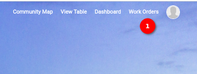

Locate and click on 1️⃣ the `Work Order` option on the navigation bar to redirect to the work order page. By default, the `table` data are displayed on the work order page which shows the work orders in tabular format.

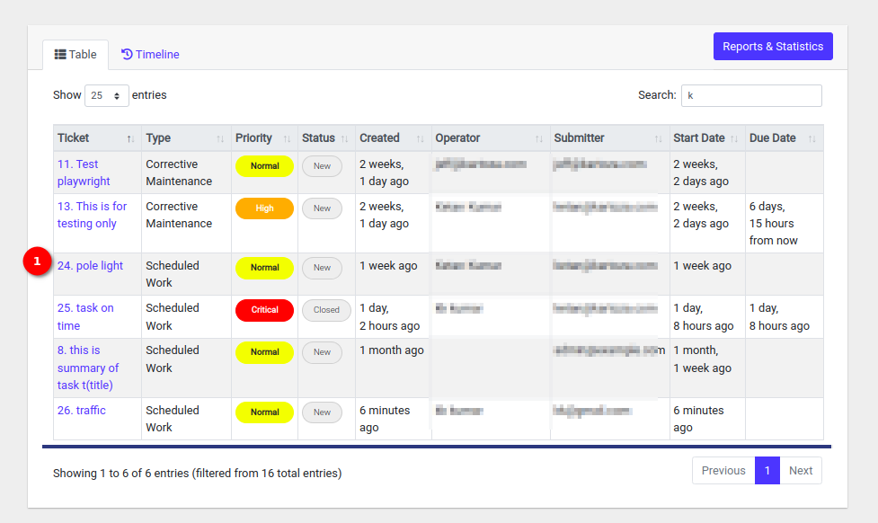

To view the work order click on 1️⃣ the name of the work order available in the first column. When you click on this button you will be redirected to the detailed view of that work order.

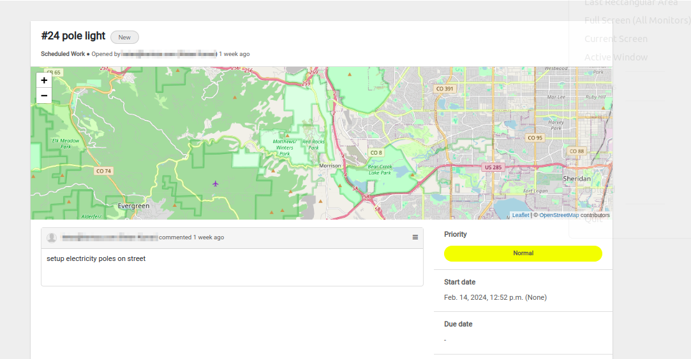

## How do I see the Work Order timeline?

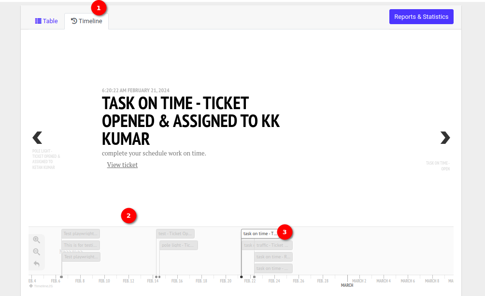

Click on 1️⃣ the `Timeline` option to view the work order timeline. To view the timeline of the specific work order you can use 2️⃣ the `timeline slider` available at the bottom of the page, scroll the timeline slider left/right to go to the specific work order and click on 3️⃣ the work order to view the timeline.

## How do I see the Reports & Statistics?

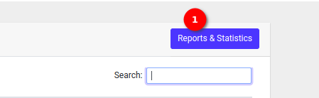

Click on 1️⃣ the `Reports & Statistics` option to view the work order reports & statistics.

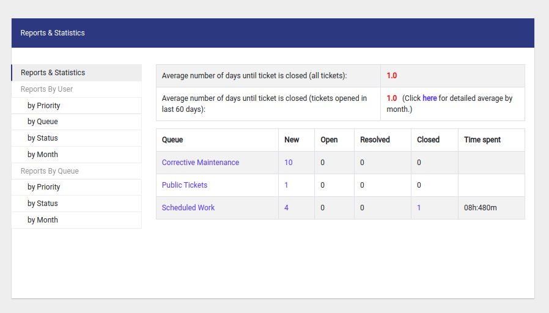

## How do I see the Reports By User?

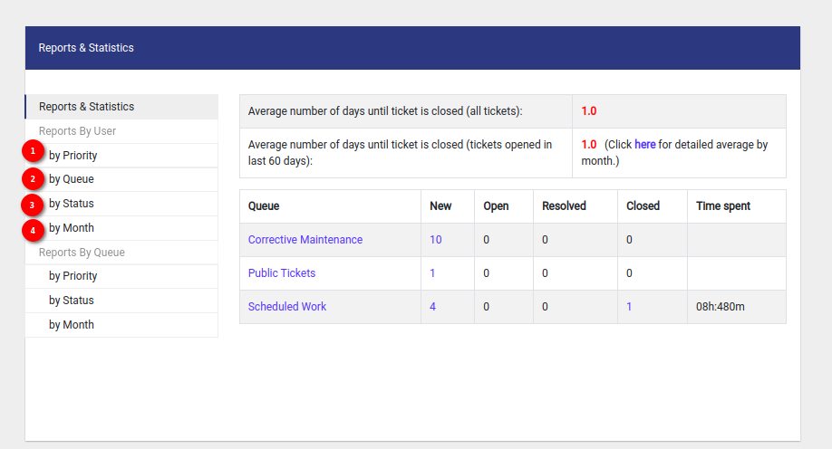

There are 4 types of reports you can view in the `Reports By User` section.

Click on 1️⃣ `by Priority` to view the report by priority.

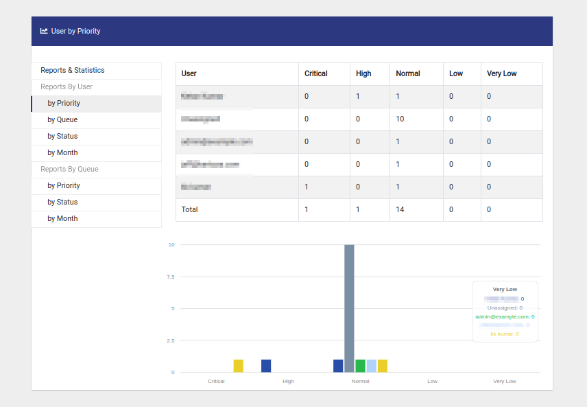

Click on 2️⃣ `by Queue` to view the report by queue.

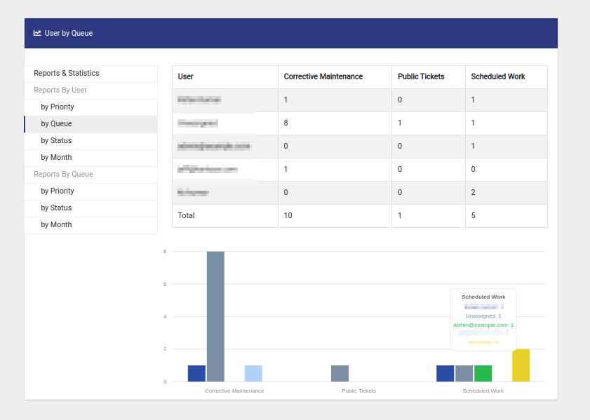

Click on 3️⃣ `by Status` to view the report by status.

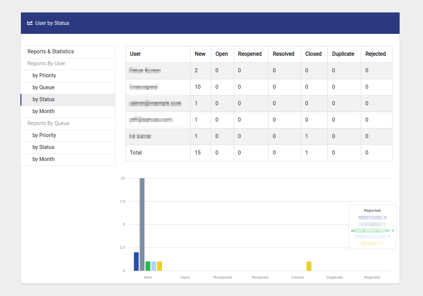

Click on 4️⃣ `by Month` to view the report by month.

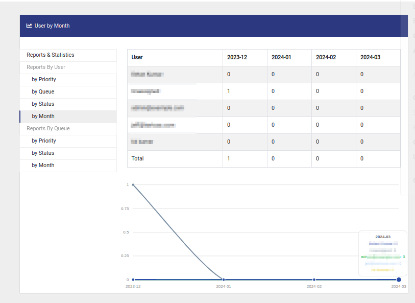

## How do I see the Reports By Queue?

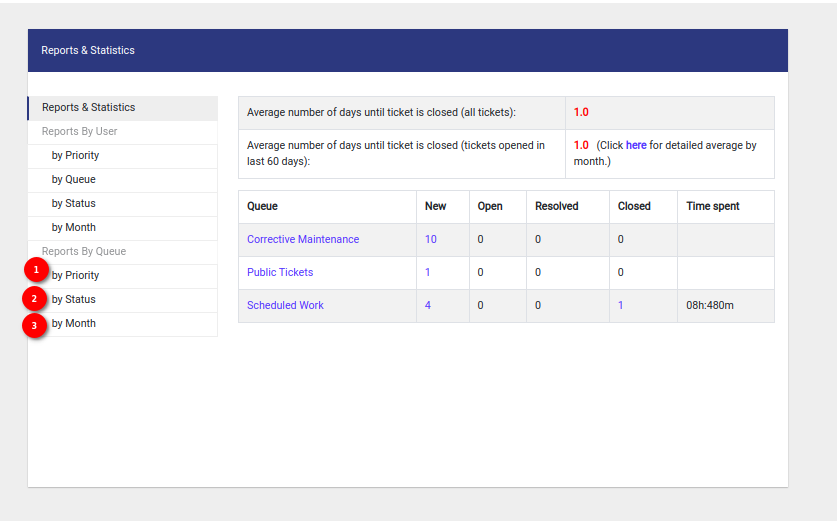

There are 3 types of reports you can view in the `Reports By Queue` section.

Click on 1️⃣ `by Priority` to view the report by priority.

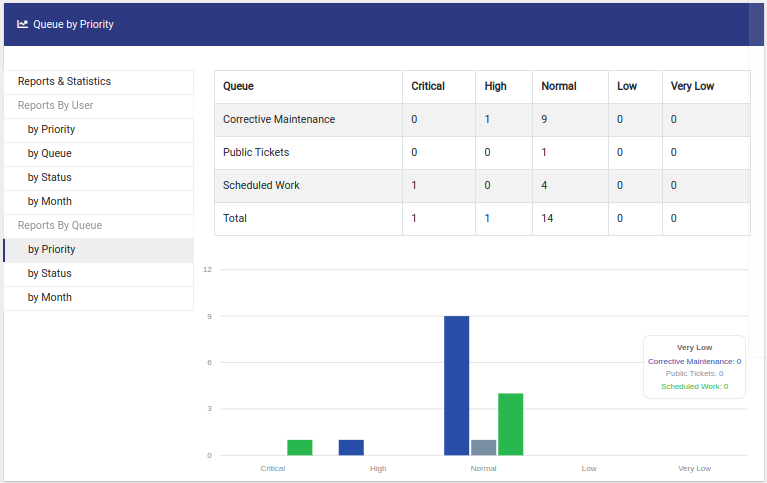

Click on 2️⃣ `by Status` to view the report by status.

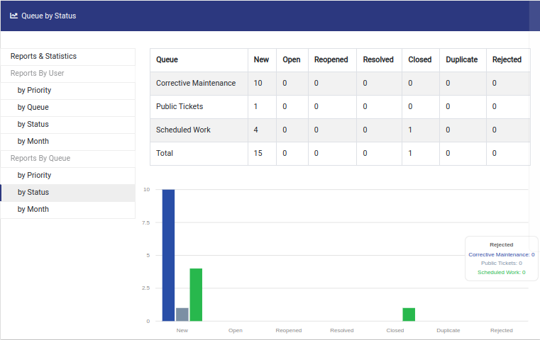

Click on 3️⃣ `by Month` to view the report by month.

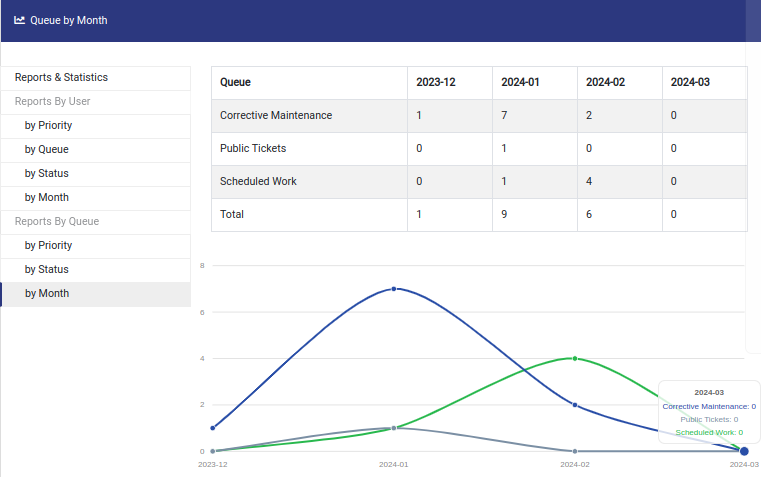
