# Community Map User Manual

The `Community Map` option provides an interactive and feature-rich experience for users to explore and engage with geographical data. Here's a guide to help the users navigate and utilize the various features:

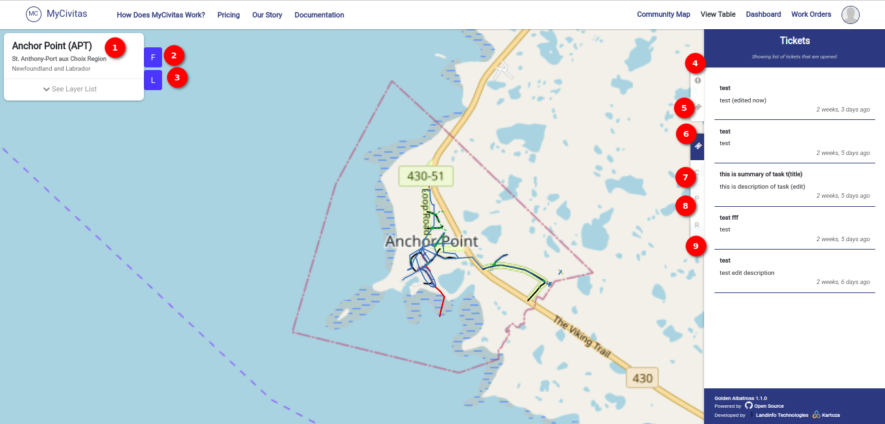

## Left Sidebar

1. **See List Dropdown:** Click on the `See List` dropdown, which will show a list of all available layers/filters in the app. The user can select from this list.

2. **Layers:** The left sidebar provides options to view available layers on the map. Click the `L` button to access a list of layers that the user can choose to visualize on the map.

    - Map with layers 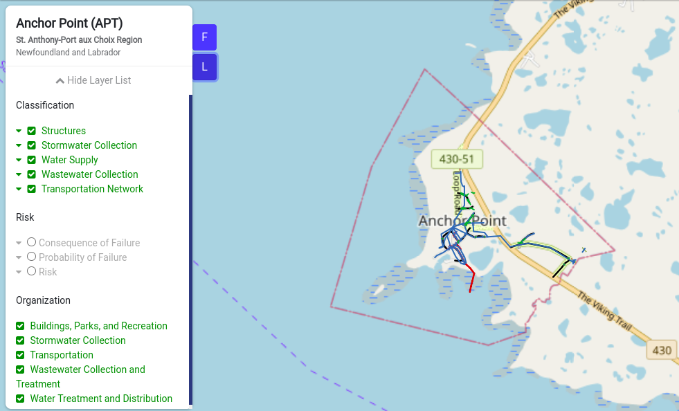

    - Map without layers 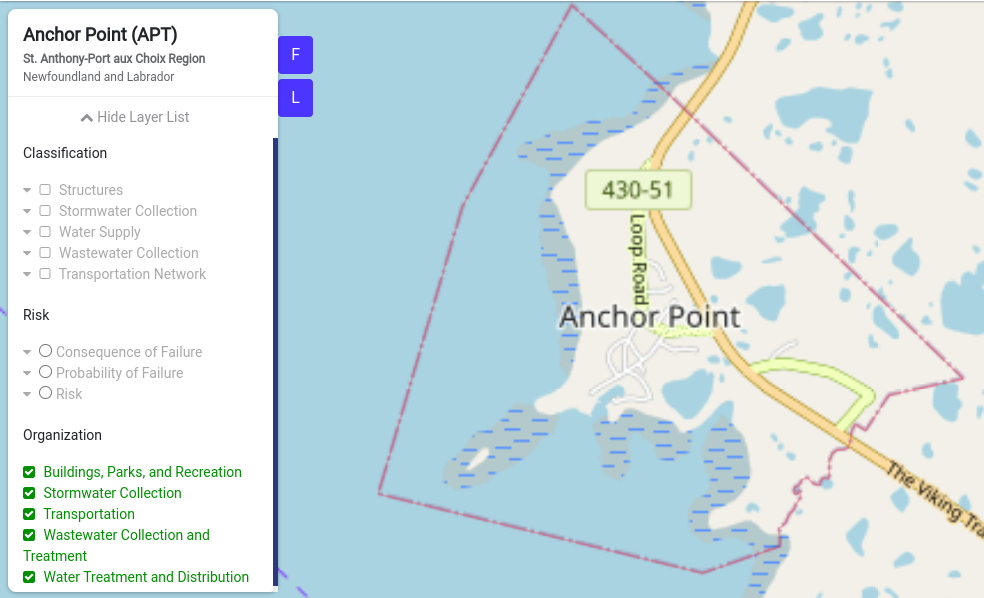

    In the `Community Map` feature, the `Layers` section plays a crucial role in customizing the user's map-viewing experience. Here's a detailed guide on the three sections available for layers:

    1. **Classification:** Under the `Classification` section, explore various options available for visualization. Each option includes subcategories and an image with corresponding icons and names.
        
        - **Structures:** Visualize information related to buildings and other structures.

            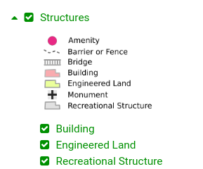

        - **Stormwater Collection:** Explore layers related to stormwater collection infrastructure.

            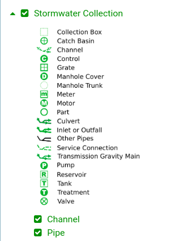

        - **Water Supply:** View layers associated with water supply systems.

            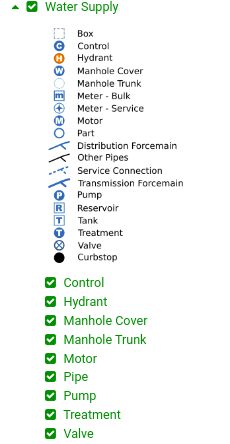

        - **Wastewater Collection:** Access layers pertaining to wastewater collection infrastructure.

            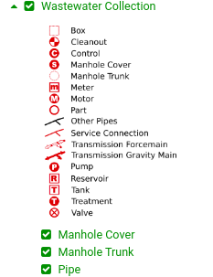

        - **Transportation Network:** Explore layers related to the transportation network.

            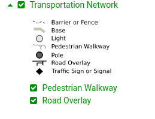

    2. **Risk:** Within the `Risk` section, find three options presented with radio buttons for selection:

        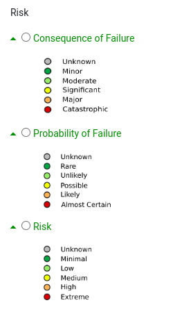

        - **Consequence of Failure:** Visualize layers related to the consequence of failure for different components.

        - **Probability of Failure:** Explore layers representing the probability of failure for various elements.

        - **Risk:** Visualize layers that depict the overall risk associated with different aspects.
    
    3. **Organization:** The `Organization` section offers various options for visualization. Choose from the following:

        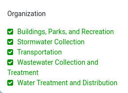

        - **Buildings:** View layers related to buildings within the community.

        - **Parks and Recreation:** Explore layers associated with parks and recreational areas.

        - **Stormwater Collection:** Access layers pertaining to stormwater collection infrastructure.

        - **Transportation:** Visualize layers related to the transportation system.

        - **Wastewater Collection and Treatment:** Explore layers associated with wastewater collection and treatment.

        - **Water Treatment and Distribution:** Access layers related to water treatment and distribution.

3. **Filters:** Click the `F` button to open the list of filters. Choose filters from the list to visualize specific, filtered data on the map.

    1. **Classification:** Under the `Classification` section, explore various options available for filtering with suboptions.

        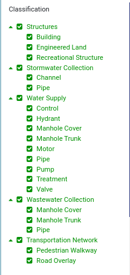

    2. **Risk:** Within the `Risk` section, find three options presented with radio buttons for selection.

        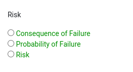

    3. **Organization:** The `Organization` section offers various options for filtering. The user can choose from the available options.

        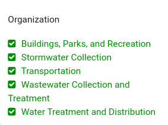

## Additional Tips:

- Use the layers to overlay different types of information on the map.

- Utilize filters to focus on specific data points or criteria.

- Experiment with different combinations of layers and filters for a customized view.

- By exploring the Community Map feature and experimenting with layers and filters, the user can gain valuable insights into the community's geographic data.

## Right Sidebar

On the right side of the map, the user will find various options related to work orders. Explore the different functionalities available to enhance the user's map-viewing experience.

4. **Assets:** The Assets panel provides information about selected assets on the map. When the user clicks on the map, the selected assets will be displayed in this panel.

    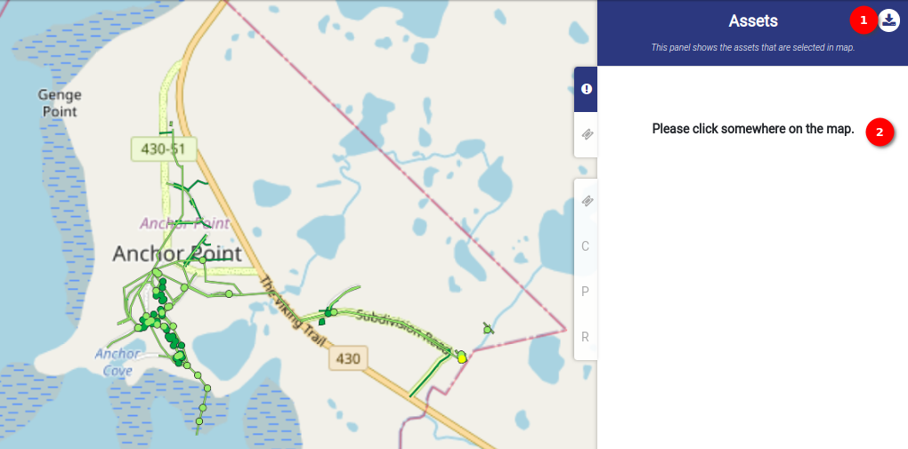

    1. **Download Icon:** The user can download the data in CSV format. Upon clicking, a data table will appear with relevant information.

        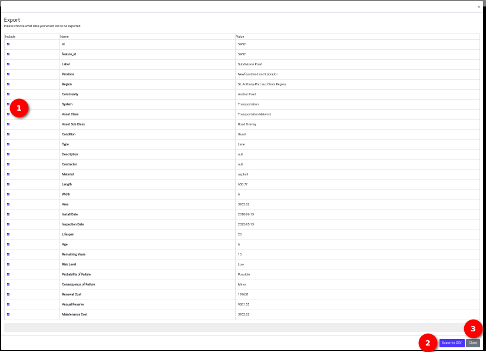

        1. **Checkbox Selection:** Each row in the table has a checkbox in front, allowing users to select or deselect specific rows for download.

        2. **Export to CSV Button:** Click the `Export to CSV` button to download the selected data in `CSV` format.

        3. **Close Table:** Click on the `Close` button, to close the data table, either user can click the cross icon available in the top right corner of the table.

        Use the Download button to access and download specific data from the table, providing flexibility and convenience.

        **Downloaded File**
        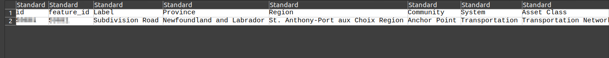

    2. **Show Assets:** To show assets, click somewhere on the map to select the desired location. The panel will showcase details about the assets chosen, providing relevant information about each selected item.

        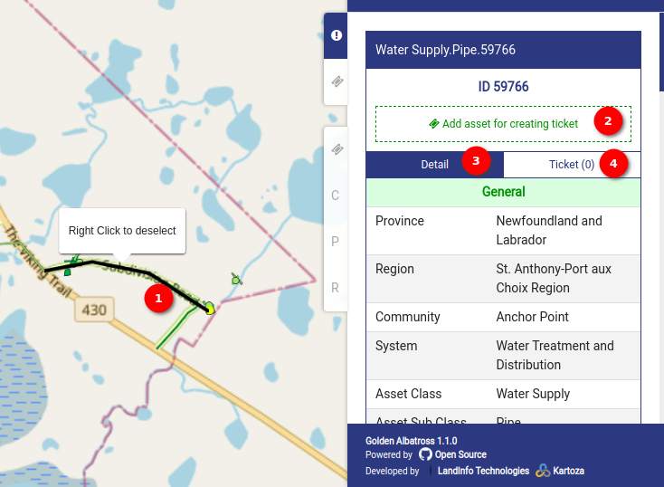

        1. **Clicked Location:** The location where the user clicked to view assets. The user can right-click to deselect the selected location if needed.

        2. **Add Assets for Creating Tickets:** Use the `Add Assets` feature to select assets and create tickets associated with them.

        3. **Asset Details:** Access comprehensive details about the assets, including `General`, `Properties`, `Life`, `Risk & Failure`, and `Cost` details. Toggle the visibility of these details by clicking on the respective table names to show or hide information.

        4. **Tickets with Count:** View associated tickets along with the count for each asset. Understand the ticket-related activity for the selected assets.

5. **Create Ticket:** To create a ticket follow the below steps.

    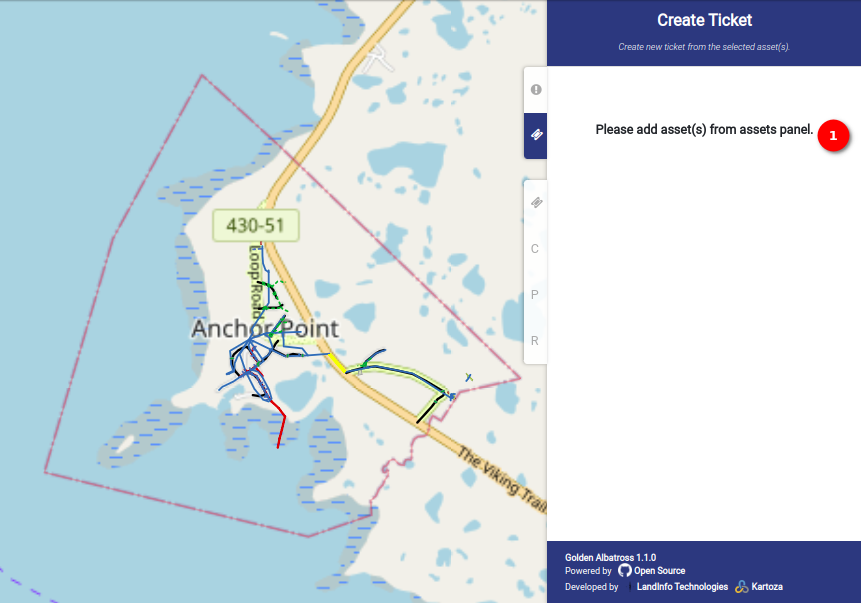

    1. **Message:** Navigate to the assets panel and add the desired asset.
        
        - Click on the desired location on the map to view assets and create a ticket simultaneously.
        - Alternatively, directly click on the desired location on the map to view assets and initiate ticket creation.

        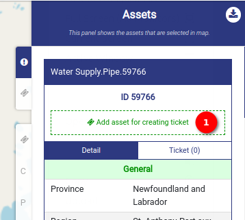

        1. **Add Asset for Creating Ticket:** Once the assets appear for the location, click on the `Add Asset for Creating Ticket` button to proceed with ticket creation. Upon clicking, an exclamation mark will be displayed on the `Create Ticket` panel. This button will transform into the `Remove Asset from Creating Ticket` button, the user can click on this button to remove the assets from creating the tickets. To create a ticket, navigate to the `Create Ticket` panel by clicking on the `exclamation mark` or `Create Ticket` panel.

            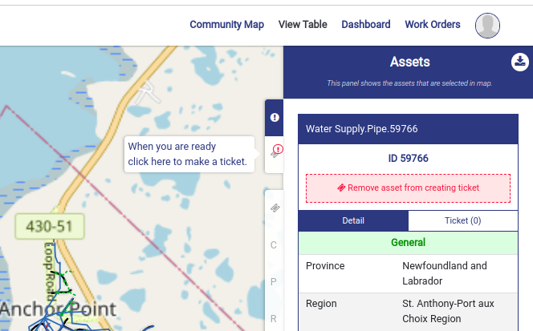

            1. **Minus Icon:** Click on the `Minus` icon to cancel the ticket creation process if needed.

            2. **Form Fields:** Fill in the information in the following fields:

                - **Type:** Choose from the dropdown the type of the ticket.

                - **Summary of Issue or Task:** Provide a summary of the issue or task.

                - **Description of Issue or Task:** Be as descriptive as possible, including all relevant details.

                - **Priority:** Select a priority level. If unsure, leave it as `Normal`.

                - **Start On:** Defaults to the current date.

                - **Due On (Optional):** Choose a due date if applicable.

                - **Expected Time to Complete Task (Optional):** Specify the estimated time in hours and minutes.

                - **Attach File (Optional):** Attach a file, such as a document or photo, to the ticket.

                - **Assign To (Optional):** Assign the ticket to a specific person if needed.

            3. **Create Ticket Button:**  Click the `Create Ticket` button to finalize and create the ticket. Once the user clicks on this button the ticket is created and the user will redirected edit tickets page.

                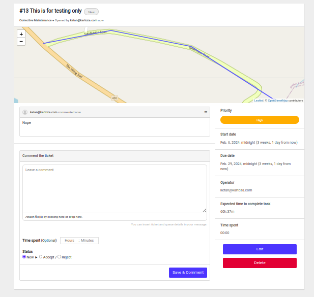

6. **Tickets:** In the `Tickets` panel, users can view a list of all tickets associated with their account. Click on the specific ticket in the list to view its details and relevant information.

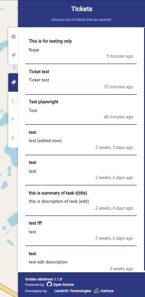

7. **Consequence of Failure:** This panel provides additional details in charts about the consequences of failure. The user can hover over the charts to view more details.

    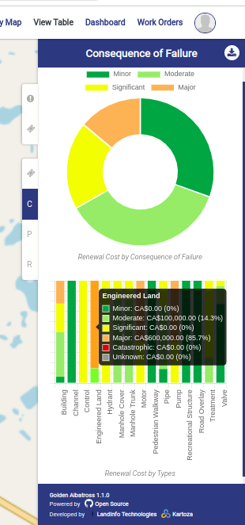

8. **Probability of Failure:** This panel provides additional details in charts about the probability of failure. The user can hover over the charts to view more details.

    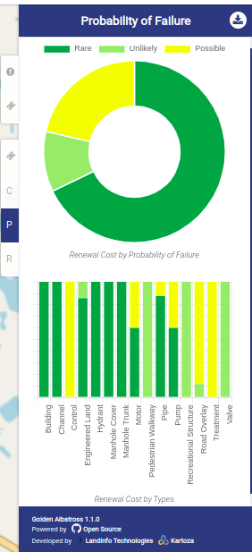

9. **Risk:** This panel provides additional details in charts about the risk. The user can hover over the charts to view more details.

    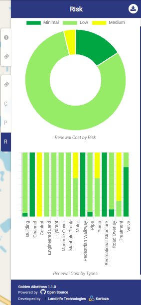
