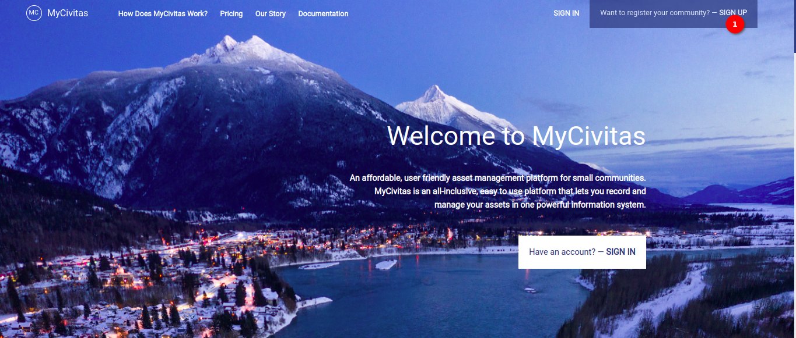
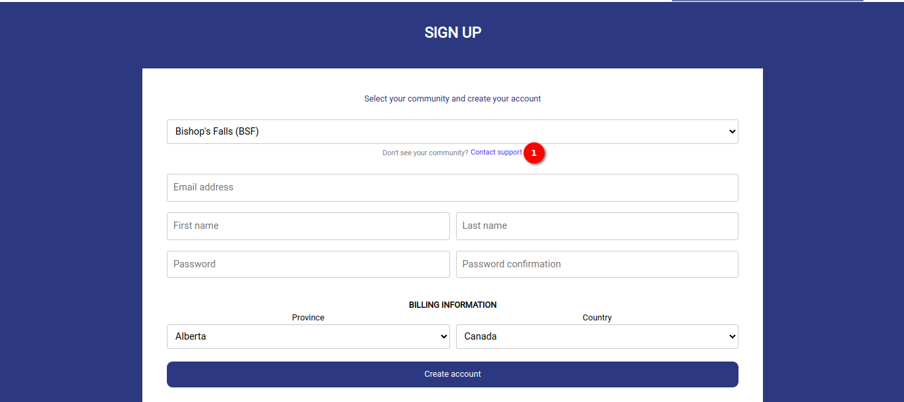
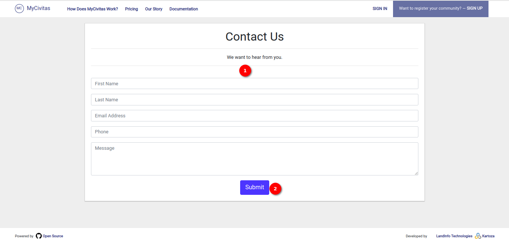
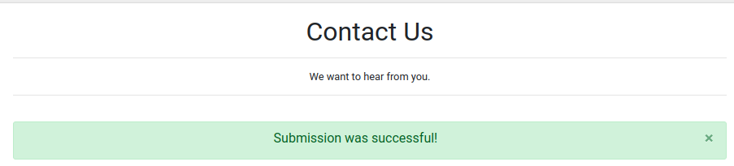

# Contact Page User Manual

Welcome to the `Contact` page user manual. This guide is designed to help the user effectively utilise the contact page to get in touch with our support team. Below are the instructions on how to navigate and utilise the contact page efficiently.

Click on the `Sign-Up` button. This will redirect the user to the sign-up page where you can find the `Contact Support` link.

## Sign-Up Page

1. **Contact Page:** Click on the `Contact support` link, to directly access the contact page.

## Contact Page

1. **Form Fields:** Once the user accesses the contact page, the user will see a form with the following fields:

    - First Name: Enter the first name in this field.

    - Last Name: Enter the last name in this field.

    - Email Address: Enter the email address where we can reach you.

    - Phone: Enter the phone number (optional).

    - Message: Write the message or inquiry in the provided text area.

2. **Submit Button:** Click on the `Submit` button after filling out all the necessary fields and are ready to send the message. The success message will shown on the contact page.

    

Thank you for using our Contact Page. If you have any further questions or need additional assistance, feel free to reach out to us through this platform. We appreciate your feedback and look forward to assisting you!
