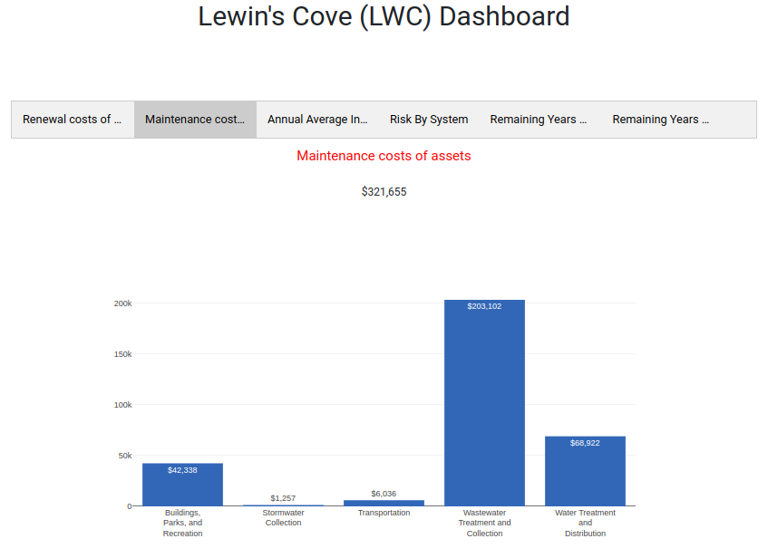
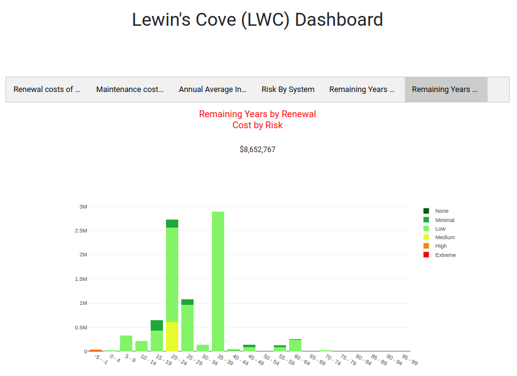

# Dashboard Page User Manual

Welcome to the `Dashboard` page, a centralised hub for a quick overview of linked communities. Follow this user manual to navigate and make the most out of the dashboard experience.

1. **Dashboard:** Click on the `Dashboard` option available in the navigation menu. Upon clicking this link, the user will be redirected to the Dashboard page.

    

    1. **Search:** Utilise the search feature to find a specific community effortlessly. Insert relevant keywords in the search bar to narrow down the search.

        

    2. **Community Name:** Click on the community name within the list to access detailed information about that specific community. Explore community details such as Renewal costs of assets, Maintenance costs of assets, Annual Average Infrastructure Demand, Risk By System, Remaining Years by Renewal Cost by System, and Remaining Years by Renewal Cost by Risk. By default `Renewal costs of assets` details are displayed.

        

        1. **Renewal costs of assets:**  Replacement costs are based on currently available costs and include the following components: Capital Costs - 65%, Contingency - 15%, Design - 10%, Inspections and Removal - 10%. As a starting point, a default replacement cost is applied for each asset type. However, in some cases, where the above general formula is not applicable or requires significantly less or more effort in one of the above areas, a custom cost might have been applied. This value will override the default value.

            

            

            1. **Download PDF:** Click on the `Download PDF` option to save the chart as a PDF file.

                

                

            2. **Available Options on Chart:** Explore various options on the chart for enhanced visualisation:

            - **Camera Image (Download as PNG):** Download the plot as a PNG image.
            
            - **Magnifying Glass Image:** Click to activate the zooming functionality. Select the bar graph to zoom in for a closer look.

            - **Pan Image:** Click to enable panning. Narrow, widen, slide left, or slide right to adjust the graph view.

            - **Select Box Image:** Activate the select box feature to choose a specific area on the graph.

            - **Lasso Select Image:** Utilise the lasso select image option for precise graph selection.

            - **Plus Image (Zoom In):** Zoom in for a more detailed view of the chart.

            - **Minus Image (Zoom Out):** Zoom out to get a broader perspective of the chart.

            - **Auto Scale Image:** Automatically scale the graph for optimal visualisation.

            - **Home Image (Refresh Axes):** Click to reset and refresh the axes of the chart.

            3. **Graph Bar:** Hover over a bar on the graph to view additional details and information related to that specific data point.

        2. **Maintenance costs of assets:** Maintenance costs are the estimated annual cost to maintain assets. As a starting point, a default value of 10% of the renewal cost is used.

            

            

        3. **Annual Average Infrastructure Demand:** This graph uses lifespan projections and renewal costs for a long-term outlook of infrastructure. This projection is theoretical and is not a realistic indication of spending timelines. A valuable output of this projection is an annualised infrastructure demand, indicated as a dotted line on the graph. This annualised value is obtained by dividing the renewal cost by the lifespan for each asset in the database and then summing the total. As lifespan and renewal cost data are updated, the annual infrastructure demand will update. The annual infrastructure demand could be lowered by committing to operations and maintenance programs to extend lifespans, deciding to rehabilitate versus replace, and more. The values shown in the graph are based on current $ values and the actual value of this average annual investment will increase over time with inflation.

            

            

        4. **Risk By System:** A risk value is obtained by combining Probability of Failure (PoF) and Consequence of Failure (CoF) values as per the following matrix. It is common asset management practice to shift the matrix in favour of the consequence of failure.

            

            

        5. **Remaining Years by Renewal Cost by System:** This section provides insights into the remaining operational years of a system based on its associated renewal cost. Gain a comprehensive understanding of the lifespan and associated costs of various systems within the context of renewal. Use this information for strategic planning and decision-making regarding system maintenance and financial allocation.

            

            

        6. **Remaining Years by Renewal Cost by Risk:** This section offers a detailed analysis of the remaining operational years of a system to its renewal cost and associated risk factors. Understand how the remaining lifespan of different systems correlates with their renewal costs and associated risks. Use this valuable information to prioritise and strategise system maintenance, considering both financial and risk considerations. Enhance decision-making processes by leveraging insights into the intersection of system longevity, renewal costs, and associated risks.

            

            
