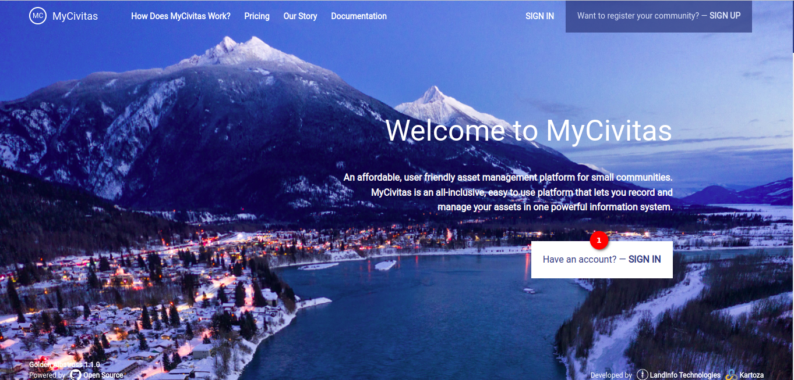
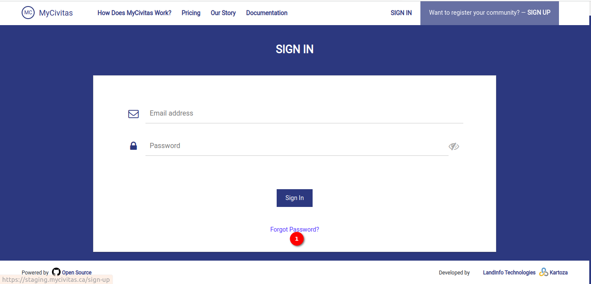
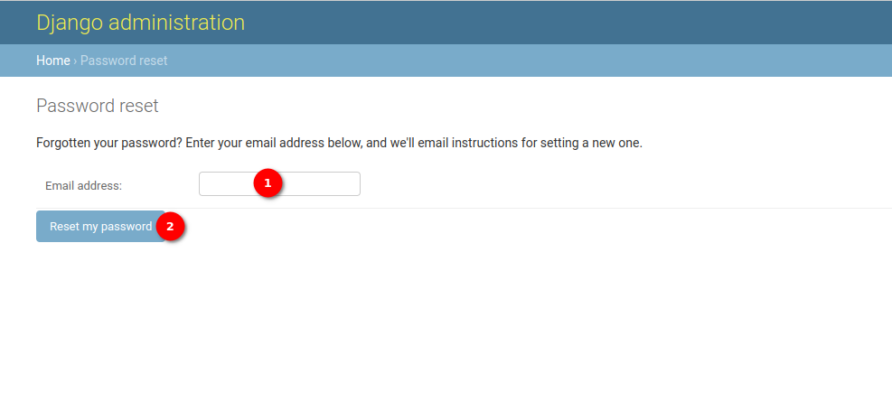
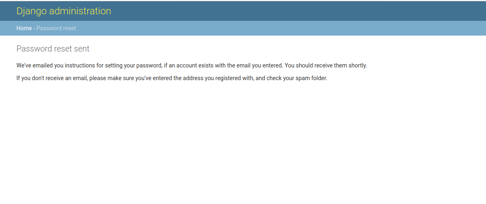
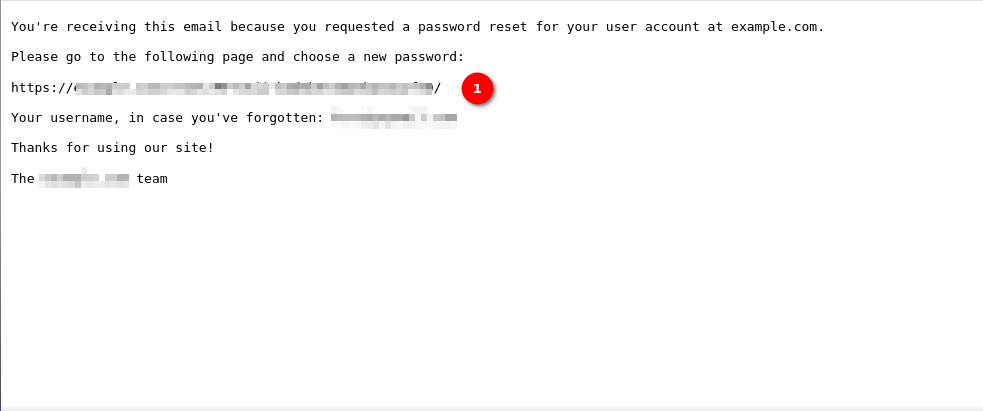
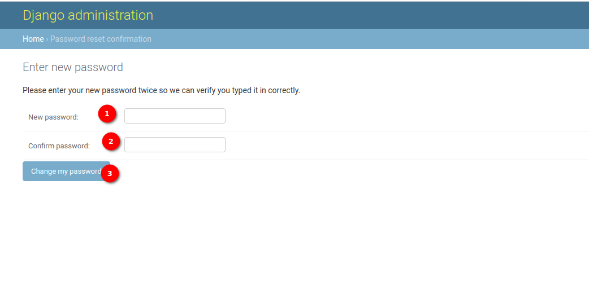
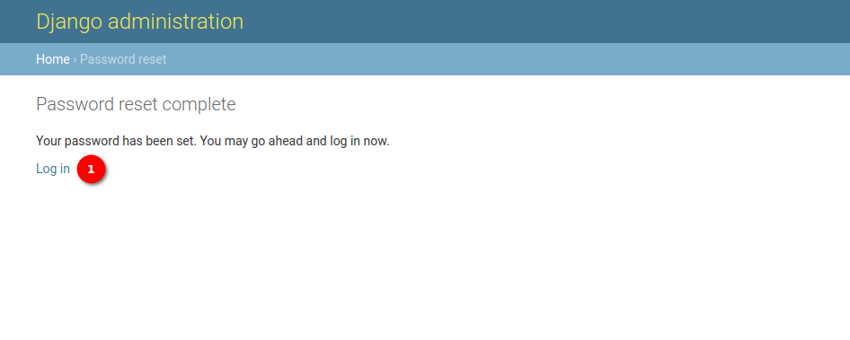

# Forgot Password User Manual

This user manual will guide the user through the process of resetting their password if they have forgotten it. Follow the step-by-step instructions below to initiate the password reset process:

## Landing Page

1. **Sign-In button:** Begin by accessing the sign-in page of the application. The user can do this by clicking on the `Sign In` button available at the center of the page or can use the `Sign In` button available in the navigation bar. Upon clicking, the user will be redirected to the sign-in page.

## Sign In Page

1. **Forgot Password?:** On the sign-in page, click on the `Forgot Password?` link. This link is typically positioned below the sign-in button and is used specifically for initiating the password reset process.

## Reset  Password Page

1. **Email Address:** After clicking the `Forgot Password?` link, you will be redirected to the `Reset Password` page. Here, the user will find an email field. Enter the email address associated with the account into the provided email field. This is the email address where the password reset instructions will be sent. Once you have entered your email address, verify that it is correct.

2. **Reset my password:** After confirming the email address, click on the `Reset my password` button. This action will initiate the process of sending a password reset link to the provided email address.

    

After clicking the `Reset my password` button, check the email inbox associated with the provided email address. Look for an email from the application containing instructions for resetting the account password. This email typically includes a unique link that the user can use to reset their password.

## Reset Password Email

1. **Reset Password Link:** Open the email received from the application and locate the password reset link. Click on the password reset link provided in the email. This link will direct the user to a page where they can create a new password for their account.

## Reset Password Confirmation Page

Follow the instructions on the password reset page to securely create a new password for your account.

1. **New Password Field:** This field is where the user needs to enter their desired new password. Ensure that the new password meets the specified criteria, such as minimum length and inclusion of special characters or numbers. Choose a strong and memorable password to enhance the security of the account.

2. **Confirm Password Field:** Re-enter the new password in this field to confirm that it matches the one entered in the `New Password` field. This step helps prevent typographical errors and ensures that the user has correctly entered their new password.

3. **Change My Password Button:** Click on this button to confirm and finalise the password change process. Before clicking, double-check that both the `New Password` and `Confirm Password` fields match and contain the intended password. Upon clicking, the system will process the password change request and update the account with the new password. After successfully changing the password, the user will be redirected to the reset password page.

## Password Reset Page

1. **Log In:** Click on the `Log In` button, to redirect to the login page and log in to the account with a new password. For detailed documentation on the login page click [here](./sign-in.md)

## Conclusion

By following the steps outlined in this user manual, they can successfully initiate the password reset process and regain access to their account in case the user has forgotten their password. If the user encounters any issues or has questions during the process, please reach out to the application's support team for assistance.
