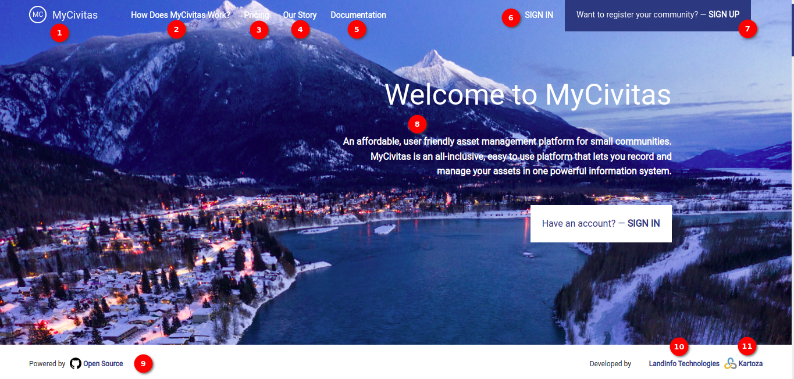
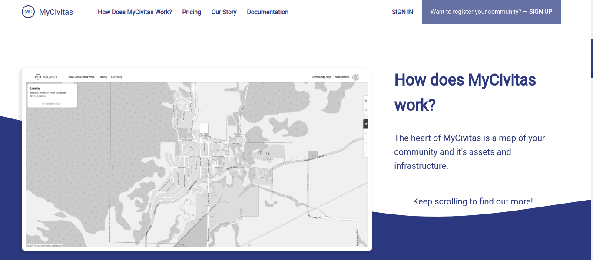

# MyCivitas Landing Page User Manual

Welcome to MyCivitas - The Community Asset Management Solution

## Introduction

`MyCivitas` is a comprehensive and user-friendly asset management platform tailored for small communities. The platform simplifies the process of recording, tracking, and managing assets in a centralised and efficient information system. Whether you are managing a homeowners association, a small municipality, or any community organisation, MyCivitas empowers users to take control of their assets with ease.

### Key Features

- **All-Inclusive Platform:** MyCivitas provides a one-stop solution for users with all community asset management needs. From property details to infrastructure, easily record and manage diverse assets on a single platform.

- **User-Friendly Interface:** MyCivitas' intuitive interface ensures that users, regardless of technical expertise, can navigate and utilise MyCivitas effortlessly. The platform is designed for accessibility and ease of use.

- **Affordability:** We understand the unique needs of small communities. MyCivitas offers affordable subscription plans, making robust asset management accessible to organisations of all sizes.

- **Powerful Information System:** MyCivitas is built on a powerful information system that allows the user to organise, search, and analyse the user's assets efficiently. Gain valuable insights to make informed decisions.

### Navigation

Use the navigation bar to explore various sections of the landing page. From understanding how MyCivitas works to exploring pricing and our story, everything is at the user's fingertips.

Easily sign in if the user is an existing user or sign up to join the MyCivitas community. MyCivitas' user-friendly registration process ensures a quick and hassle-free onboarding experience.

1. **MyCivitas:** Click on `MyCivitas` to swiftly return to the top of the landing page.

2. **How Does MyCivitas Work?:** Explore the functionalities and features of MyCivitas by clicking on this option.

    - **How Does MyCivitas Work?:** MyCivitas revolves around a centralised map interface that serves as the core of the user's community asset management. This interactive map provides a visual representation of the community's assets and infrastructure, offering a user-friendly and intuitive way to navigate and interact with the information. Keep scrolling to delve deeper into the functionalities and features that MyCivitas offers for efficient asset management.

    

    - **Capture Your Infrastructure:** MyCivitas empowers users to build a comprehensive asset inventory with ease. Utilising powerful mapping software, MyCivitas' data capture system is integrated with QGIS, a robust and free open-source desktop application. Leverage this combination to seamlessly capture and record detailed information about the community's infrastructure, ensuring accuracy and efficiency in asset management.

    

    - **Prioritize Your Assets:** MyCivitas goes beyond simple asset management by incorporating advanced functionalities. MyCivitas' system conducts thorough risk assessment analysis and preventative maintenance planning on user's data. This means the user can prioritise assets based on their criticality, allowing for strategic decision-making and proactive planning to ensure the longevity and optimal performance of their community's infrastructure.

    

    - **Support Your Capital Planning:** MyCivitas equips the user with the tools to make well-informed decisions that support capital planning initiatives. By providing comprehensive data and insights, MyCivitas' platform empowers the user to strategically allocate resources, prioritise projects, and optimise their capital investments. Make informed decisions backed by accurate and up-to-date information for effective long-term planning and development.

    

    - **Set Up Work Order:** MyCivitas streamlines maintenance planning by enabling the user to set up work orders effortlessly. Whether it is ad hoc tasks or scheduled maintenance, the platform provides a user-friendly interface for planning and organising maintenance activities. Take advantage of this feature to ensure timely and efficient management of tasks, contributing to the overall maintenance and well-being of their community's assets.

    

    - **We Are Here to Help** At MyCivitas, we understand that the user's journey, from capturing data to presenting to the council, may come with questions or needs for assistance. Rest assured, the  MyCivitas team of experienced staff is readily available to support the user every step of the way.
    Please note that support is not included in the hosting fee. For small communities seeking ongoing assistance, a popular option is to sign up for an annual support contract. Feel free to reach out to us at `support@civitas.ca`, and we will connect with a dedicated team member near the user. The user's success with MyCivitas is our priority, and we are committed to providing the help users need to maximize the benefits of our platform.

    

    - **Enjoy Asset Management** MyCivitas invites users to practice effective and sustainable asset management on our affordable platform for the benefit of the community. Embrace the convenience, insights, and efficiency that MyCivitas offers, ensuring that their assets are managed with precision and care. By leveraging our platform, you contribute to the overall well-being and success of the community's infrastructure. Enjoy the journey of asset management with MyCivitas!

    

3. **Pricing:** Learn about our subscription plans and pricing details to choose the best fit for your needs.

    

    **Plans**

    - **Silver:** Allowing up to 3 users in the organisation.

    - **Gold:** Allowing up to 5 users in the organisation.

    - **Diamond:** Allowing up to 10 users in the organisation.

4. **Our Story:** Discover the journey and mission behind MyCivitas. Get to know us better!

    

    - **Our Story:** MyCivitas was created by [LandInfo Technologies](https://www.landinfotech.com/) and [Kartoza](https://kartoza.com/) after we identified a need for an affordable and easy-to-use asset management system for small communities. The large proprietary offerings are overly complex and far too expensive for most small communities to be able to invest time into or afford.

    - **Open Source:** MyCivitas is Open Source software. This means that the intellectual property behind the platform is [freely available](https://github.com/landinfotech/mycivitas) to everyone and developed by a community of users who care about solving the problems you deal with every day in your small community.

5. **Documentation:** Access detailed documentation for in-depth information on MyCivitas features and usage.

6. **SIGN IN:** Click on the `SIGN IN` button, to access the MyCivitas account if you are already a registered user.

    

    - For detailed sign-in instructions, refer to the [sign-in page documentation](index.md).

7. **SIGN UP:** If the user is new, can take the opportunity to join the community by clicking the `SIGN UP` button. This option is also conveniently available in the middle of the page, just below the welcoming message.

    

    - For detailed sign-up instructions, refer to the [sign-up page documentation](index.md).

8. **Message:** Welcome to MyCivitas. Read the welcoming message that introduces MyCivitas as an affordable, user-friendly asset management platform for small communities.

## Landing Page After Login

### Navigation

Use the navigation bar to explore various sections of the landing page. From understanding how MyCivitas works to exploring pricing and our story, everything is at the user's fingertips.

Easily sign in if the user is an existing user or sign up to join the MyCivitas community. MyCivitas' user-friendly registration process ensures a quick and hassle-free onboarding experience.

1. **MyCivitas:** Click on `MyCivitas` to swiftly return to the top of the landing page.

2. **How Does MyCivitas Work?:** Explore the functionalities and features of MyCivitas by clicking on this option.

    - **How Does MyCivitas Work?:** MyCivitas revolves around a centralised map interface that serves as the core of the user's community asset management. This interactive map provides a visual representation of the community's assets and infrastructure, offering a user-friendly and intuitive way to navigate and interact with the information. Keep scrolling to delve deeper into the functionalities and features that MyCivitas offers for efficient asset management.

    

    - **Capture Your Infrastructure:** MyCivitas empowers users to build a comprehensive asset inventory with ease. Utilising powerful mapping software, MyCivitas' data capture system is integrated with QGIS, a robust and free open-source desktop application. Leverage this combination to seamlessly capture and record detailed information about the community's infrastructure, ensuring accuracy and efficiency in asset management.

    

    - **Prioritize Your Assets:** MyCivitas goes beyond simple asset management by incorporating advanced functionalities. MyCivitas' system conducts thorough risk assessment analysis and preventative maintenance planning on user's data. This means the user can prioritise assets based on their criticality, allowing for strategic decision-making and proactive planning to ensure the longevity and optimal performance of their community's infrastructure.

    

    - **Support Your Capital Planning:** MyCivitas equips the user with the tools to make well-informed decisions that support capital planning initiatives. By providing comprehensive data and insights, MyCivitas' platform empowers the user to strategically allocate resources, prioritise projects, and optimise their capital investments. Make informed decisions backed by accurate and up-to-date information for effective long-term planning and development.

    

    - **Set Up Work Order:** MyCivitas streamlines maintenance planning by enabling the user to set up work orders effortlessly. Whether it is ad hoc tasks or scheduled maintenance, the platform provides a user-friendly interface for planning and organising maintenance activities. Take advantage of this feature to ensure timely and efficient management of tasks, contributing to the overall maintenance and well-being of their community's assets.

    

    - **We Are Here to Help:** At MyCivitas, we understand that the user's journey, from capturing data to presenting to the council, may come with questions or needs for assistance. Rest assured, the  MyCivitas team of experienced staff is readily available to support the user every step of the way.
    Please note that support is not included in the hosting fee. For small communities seeking ongoing assistance, a popular option is to sign up for an annual support contract. Feel free to reach out to us at `support@civitas.ca`, and we will connect with a dedicated team member near the user. The user's success with MyCivitas is our priority, and we are committed to providing the help users need to maximize the benefits of our platform.

    

    - **Enjoy Asset Management:** MyCivitas invites users to practice effective and sustainable asset management on our affordable platform for the benefit of the community. Embrace the convenience, insights, and efficiency that MyCivitas offers, ensuring that their assets are managed with precision and care. By leveraging our platform, you contribute to the overall well-being and success of the community's infrastructure. Enjoy the journey of asset management with MyCivitas!

    

3. **Pricing:** Learn about our subscription plans and pricing details to choose the best fit for your needs.

    

    **Plans**

    - **Silver:** Allowing up to 3 users in the organisation.

    - **Gold:** Allowing up to 5 users in the organisation.

    - **Diamond:** Allowing up to 10 users in the organisation.

4. **Our Story:** Discover the journey and mission behind MyCivitas. Get to know us better!

    

    - **Our Story:** MyCivitas was created by [LandInfo Technologies](https://www.landinfotech.com/) and [Kartoza](https://kartoza.com/) after we identified a need for an affordable and easy-to-use asset management system for small communities. The large proprietary offerings are overly complex and far too expensive for most small communities to be able to invest time into or afford.

    - **Open Source:** MyCivitas is Open Source software. This means that the intellectual property behind the platform is [freely available](https://github.com/landinfotech/mycivitas) to everyone and developed by a community of users who care about solving the problems you deal with every day in your small community.

5. **Documentation:** Access detailed documentation for in-depth information on MyCivitas features and usage.

6. **Community Map:** Navigate through an interactive map interface, allowing the user to explore metadata, geographic data, and available records visually. Effortlessly manage and visualise their community's assets. For detailed documentation on the `Community Map` click [here](./community-map.md)

7. **View Table:** Access a detailed table view of the user's community's assets. Utilise search and filter options for efficient data exploration and management. For detailed documentation on the `View Table` click [here](./view-table.md)

8. **Dashboard:** Gain insights into the user's community's asset metrics with an informative dashboard. View linked communities and click for detailed information. For detailed documentation on the `Dashboard` click [here](./dashboard.md)

9. **Work Orders:** Efficiently manage work orders for your community. Create, edit, and track the progress of tasks seamlessly. For detailed documentation on the `Work Order` click [here](./work-order.md)

10. **Profile Icon:** Click on the `Profile` icon at the top right of the page to access the profile-related functionalities where the user can view or edit the details.

    

11. **Message:** Welcome to MyCivitas. Read the welcoming message that introduces MyCivitas as an affordable, user-friendly asset management platform for small communities.
