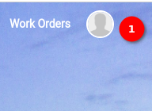
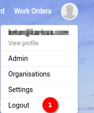

# Logout User Manual

Logging out of `MyCivitas` is a simple process that enhances the security of the user's session. Here is a quick guide to help the user navigate through the logout functionality.

1. **Profile Icon:** Locate the profile icon situated at the top right corner of the `MyCivitas` platform.

Click on the profile icon to reveal a dropdown menu with various user-related options.

1. **Logout:** Within the dropdown menu, click on the `Logout` option. When the user clicks on this the user will be successfully logged out of their MyCivitas account.

Logging out is essential for maintaining the security of the user's account, especially if the user is using a shared or public computer.
