# Profile Options User Manual

Explore and manage a user's `MyCivitas` profile efficiently with the following user-friendly guide.

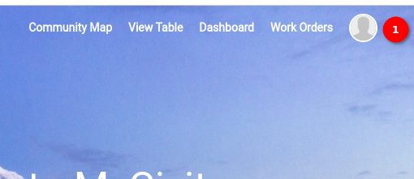

1. **Profile Icon:** Locate the profile icon situated on the top right corner of the `MyCivitas` platform. Click on the profile icon to unveil a dropdown menu with multiple options related to the profile.

## Profile Options

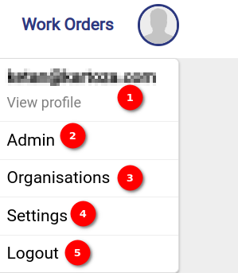

1. **User Email:** Click on the `User Email` option to seamlessly view your profile details. By selecting this option, you will be directed to the profile page.

    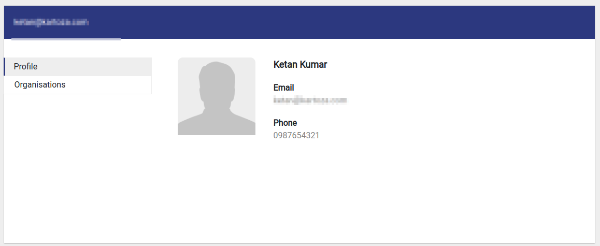

    - By default the profile details are displayed the user can click on the `Organisation` to view the organisation details

2. **Admin:** For super users with administrative privileges, the `Admin` option provides access to the admin panel. Click on `Admin` to open the admin panel and manage advanced settings.

3. **Organisation:** Select `Organisation` to gain insights into the details of the organisation the user is associated with. Clicking on this option will redirect you to the organisation page.

    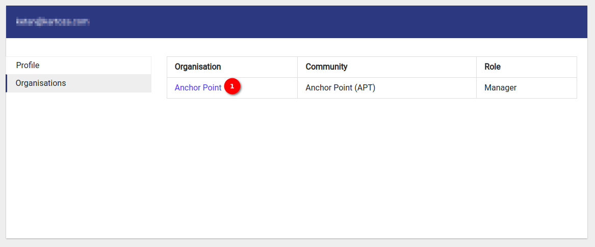

    1. **Organisation Name:** Click on the organisation name to view more detailed information about it, including its owner and creation date.

        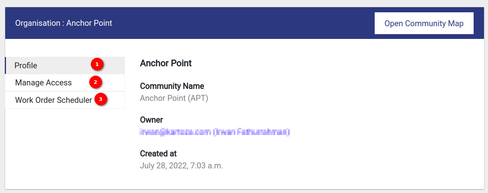

        1. **Profile:** By default, the organissation's `Profile` page will open. To navigate to the Community Map, click on the `Open Community Map` button. To view the owner's profile, click on the clickable owner name.

        2. **Manage Access:** Click on the `Manage Access` to go to the organisation manage access page where the owner can manage the access of associate users.

            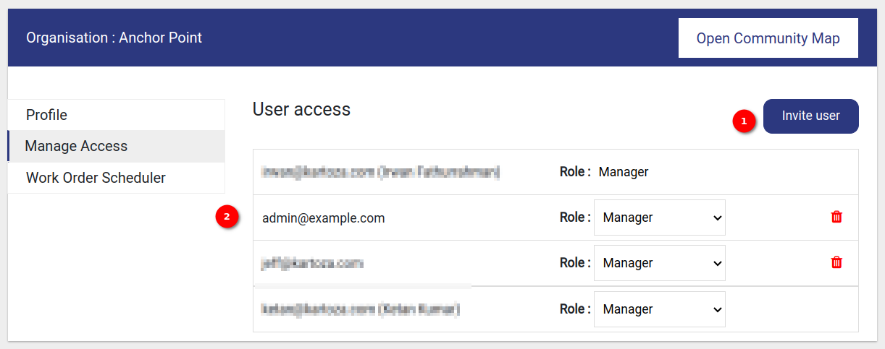

            1. **Invite User:** Click on this button to invite new members to the organisation. When the user clicks on this button the invite user form opens.

                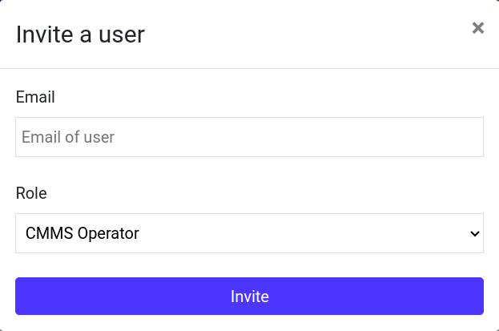

                - Provide the `Email` address of the person you want to add as a member in the input field.
                - Choose their `Role` from the dropdown. The available roles are `CMMS Operator`, `CMMS Viewer`, `Dashboard Viewer`, `Manager` and `Operations Admin`.
                - Click on the `Invite` button, to invite the user.

            2. **User Access Details** The owner can update the user's role by selecting from the dropdown and also can delete the user from the organisation by clicking on the `Delete` icon.

                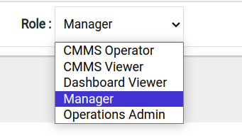
        
        3. **Work Order Scheduler:** Click on the `Work Order Scheduler`, to go to the organisation work order scheduler page. This is where the user can create, view or edit work orders.

            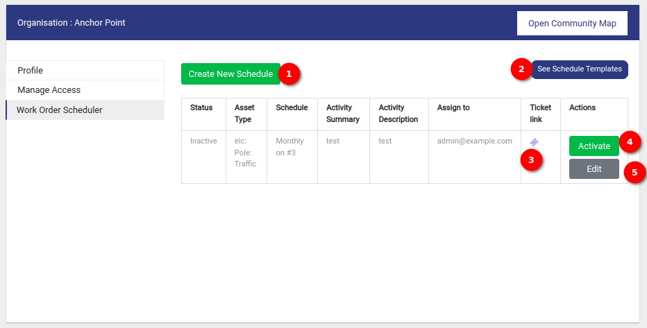

            1. **Create New Scheduler:** Click on this button to create a new scheduler. When the user clicks on this button the `Create New Scheduler` form opens.

                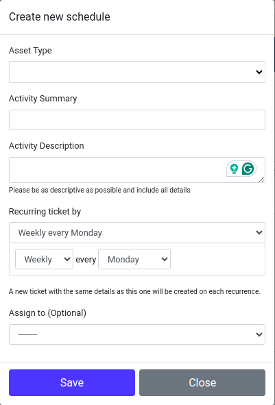

                - **Asset Type:** Choose the relevant asset type from the dropdown list.

                - **Activity Summary:** Provide a brief summary of the activity associated with the scheduler.

                - **Activity Description:** Add a detailed description of the activity. Be as descriptive as possible and include all relevant details.

                - **Recurring Ticket By:** Choose the recurrence pattern from the dropdown list. There are two dropdowns with different options based on the selected recurrence type.

                    **Weekly**

                    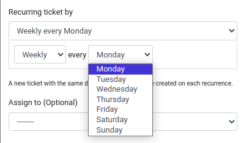

                    **Monthly**

                    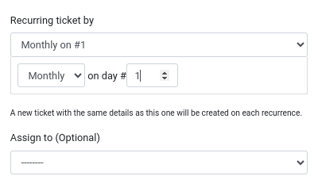

                    **Yearly**

                    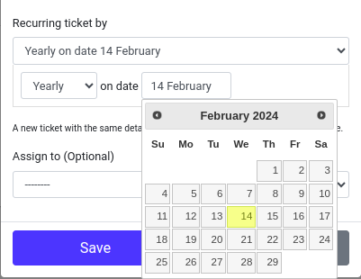

                - **Assign To (Optional):** Optionally, choose a person to assign the scheduler from the dropdown list.

                **Save and Close button:** Two buttons are available at the bottom of the form.

                - Click `Save` to save the details and create the new scheduler.

                - Click `Close` to exit the form without saving changes.

                - Ensure all mandatory fields are filled to successfully create the scheduler.

                - Review all the entries before saving to ensure accuracy.

            2. **See Schedule Templates:** Click on this button, to see the schedule templates.

            3. **Ticket Icon:** Click on the `Ticket` Icon, to view the ticket.

                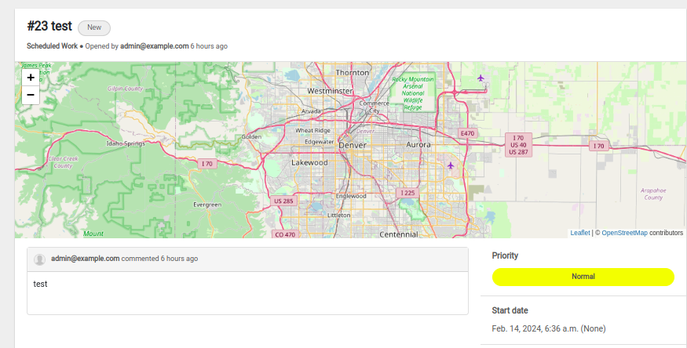
            
            4. **Active/Inactive button:** This button allows users to toggle the status of a ticket between `Active` and `Inactive`.

            5. **Edit button:** Click on this button to edit the particular scheduler. When the user clicks on this button the edit scheduler form will open to edit the scheduler.

4. **Settings:** Utilise the `Settings` option to make adjustments to the user's profile details. Click on `Settings` to go to the edit profile page.

    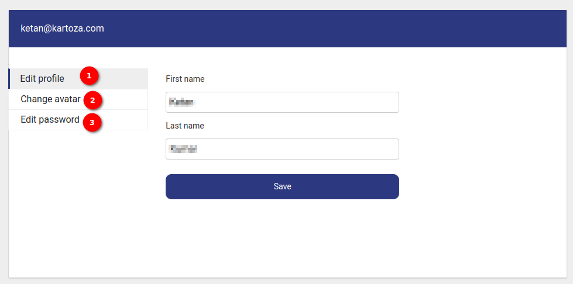

    1. **Edit Profile:** The `Edit Profile` page is open by default the user can update their `First name` and `Last name`. After making the necessary changes, click the `Save` button to save the updated profile information.

    2. **Change Avatar:** Select `Change Avatar` to go to edit avatar page. The user can update the profile picture here. Click on the `Choose File` button to select a new avatar file. After selecting the file, click the `Save` button to save the changes.

        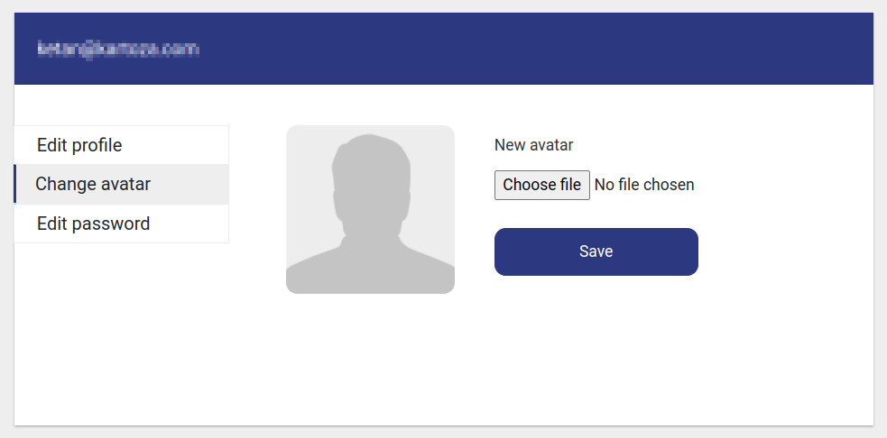
    
    3. **Edit Password:** Select `Edit Password` to go to the edit password page. Enter the new password in the `Password` and `Confirm Password` fields. Click the `Save` button to update the password.

        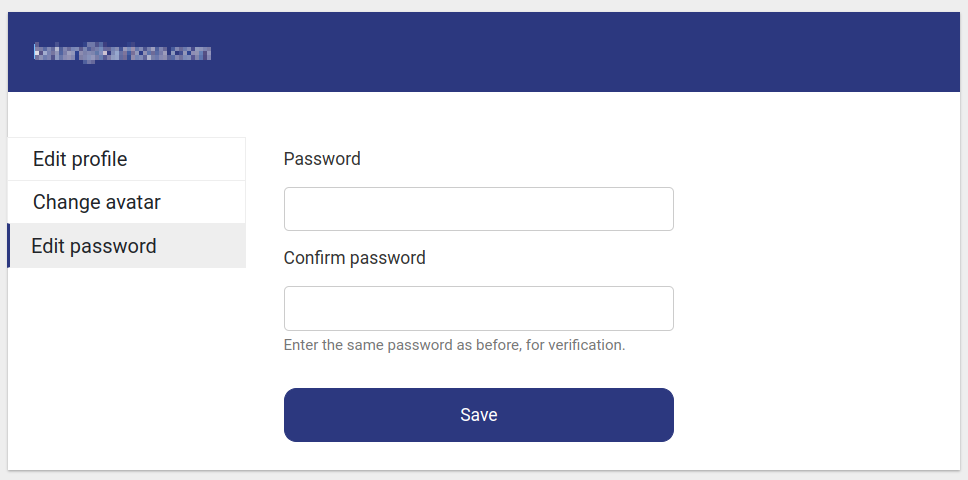

5. **Logout:** Click on the `Logout` button to logout from the account. For detailed documentation on logout click [here](logout.md).
