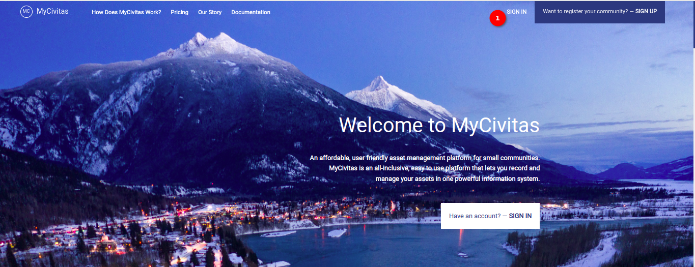
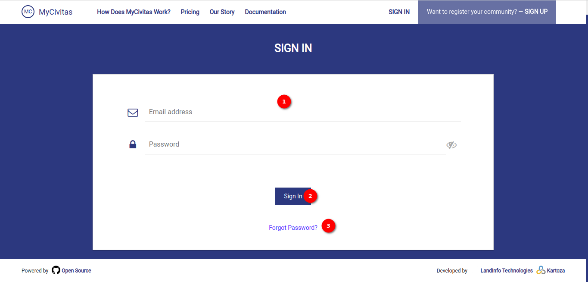

# Sign-In Page User Manual

Welcome to the `Sign-In` page of MyCivitas! This page provides a secure gateway for registered users to access their accounts. To sign in and explore the features of the platform, follow the simple steps outlined below. If the user is new here, they can go to the `Sign-Up` page to create a new account.

1. **Sign-In Button:** Find the `Sign-In` button in the top-right corner of the page. Click on this button to navigate to the sign-in page.

## Sign-In Page

1. **Sign-In Form:** The user needs to provide the required information for signing into their account by filling out this form.

    **Sign-In Form Fields:**

    - **Email Address:** Enter your registered email address in this field.

    - **Password:** Input your account password in this field.

    - **Eye Icon:** Click the `Eye` icon on the password field to toggle between showing and hiding the password for enhanced security.

2. **Sign-In Button:** After entering the required information, click the `Sign-In` button to log in to your account.

By following these simple steps, the user can access their account securely.

3. **Forgot Password:** The user can reset their pass by using the `Forgot Password` link. For detailed instructions on the reset password functionality click [here](./forgot-password.md)
