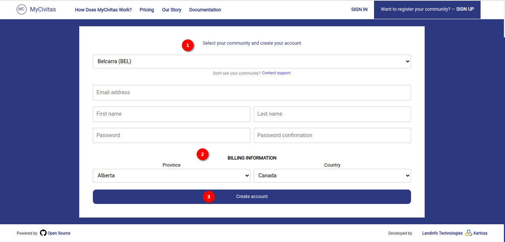

# Sign-Up Page Documentation

Welcome to the community! The `SIGN-UP` page is the gateway to unlocking a world of possibilities. Whether the user is a seasoned professional or a passionate enthusiast, MyCivitas offers a diverse range of features tailored to meet the user's needs.

To get started, simply click on the `SIGN-UP` button in the top right corner. Once there, the user will find a user-friendly form designed to capture essential details and tailor user experience.

## Sign Up Page

The sign-up process is divided into two main sections:

1. **Select Your Community and Create Your Account:** In this section, the user needs to choose their community from a dropdown menu. And needs to provide the following information:

    - **Email Address:** Enter your valid email address.

    - **First Name:** Your first name.

    - **Last Name:** Your last name.

    - **Password:** Set a secure password.

    - **Confirm Password:** Confirm the password entered above.

2. **Billing Information:** This section requires billing details:

    - **Province:** Select your province from the dropdown menu.

    - **Country:** Choose your country from the dropdown menu.

3. **Create Account Button:** Click the `Create Account` button to submit the form and create your account.

4. **Open Source: Github Link:** Explore our open-source projects on [GitHub](https://github.com/landinfotech/mycivitas) to stay connected with our community and contribute to exciting initiatives.

5. `Developed By` **LandInfo Technologies:** Visit the [LandInfo Technologies](https://www.landinfotech.com/) website to learn more about the organisation behind MyCivitas.

6. `Developed By` **Kartoza:** Explore the [Kartoza](https://kartoza.com/) website for additional information about the organisation that developed MyCivitas.

By following these steps and providing the necessary information, users can successfully create an account on `MyCivitas`.
