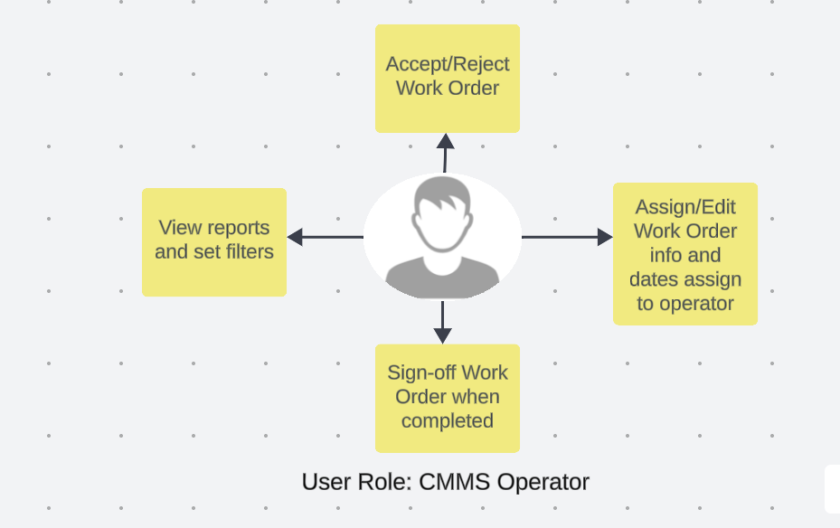
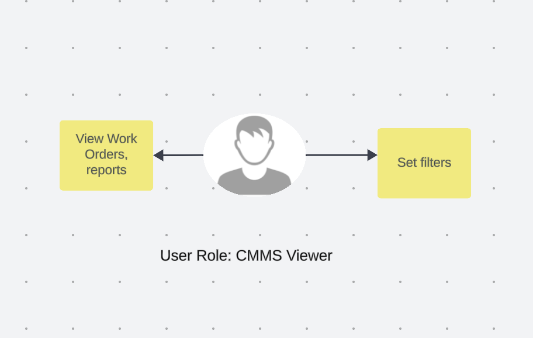
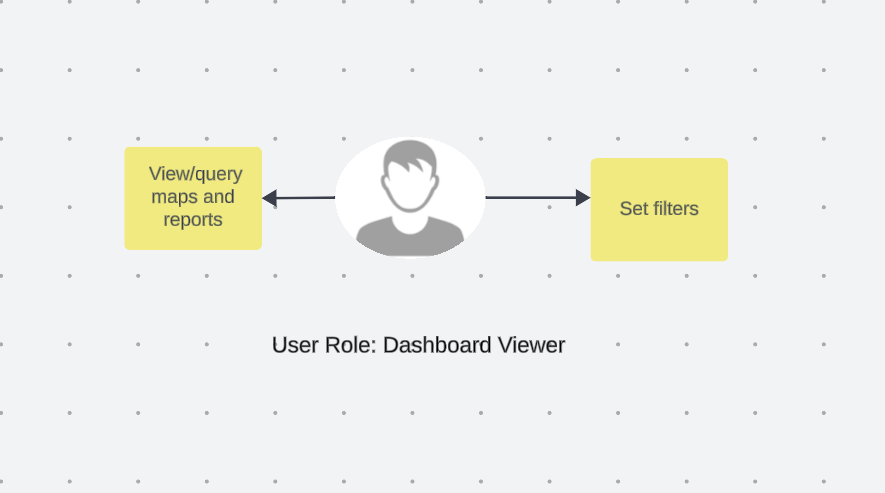
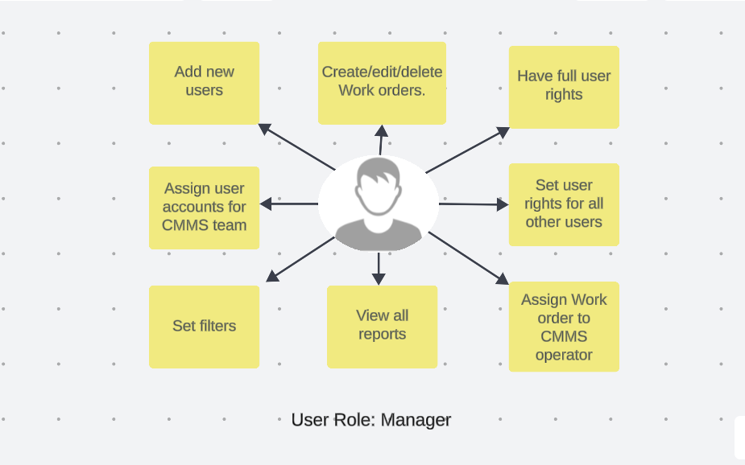
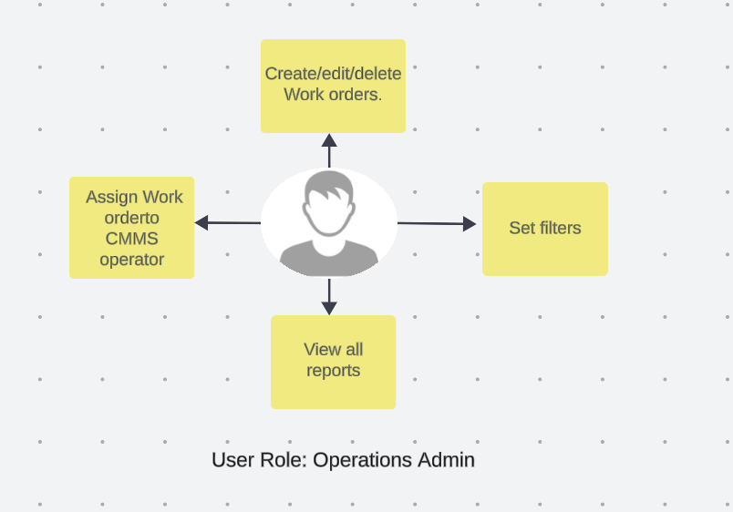

# User Roles Documentation

**User Roles Overview:** Provide a comprehensive overview of different user roles within the system. Clearly define each role and describe the specific responsibilities, permissions, and access levels associated with each role. This section should serve as a foundation for users to understand their position within the system and the scope of actions they can perform. Include any relevant information about role hierarchies or dependencies, and highlight the importance of adhering to assigned roles for efficient and secure system operation.

1. **CMMS Operator:** The CMMS Operator role possesses the capability to manage work orders efficiently, including accepting or rejecting them, assigning or editing work order details, assigning tasks to operators, signing off on completed work orders, and accessing reports with customisable filters.

    

    - **Accept/Reject work order:** Streamline workflow management by providing the ability to accept or reject work orders. This ensures clear communication and efficient handling of task assignments.

    - **Assign/Edit work order info and dates assign to operator:** Dynamically manage work orders by assigning or editing key information such as details and dates. Facilitate a smooth workflow by assigning tasks to designated operators for streamlined task execution.

    - **Sign-off work order when completed:** Enhance accountability and task completion tracking by allowing users to sign off on work orders upon successful completion. This contributes to accurate record-keeping and progress monitoring.

    - **View reports and set filters:** Access valuable insights into work order data by viewing detailed reports. Utilise flexible filtering options to customise data views based on specific criteria. This feature empowers informed decision-making and performance analysis within the system.

2. **CMMS Viewer:** The CMMS Viewer role allows for comprehensive observation, including viewing work orders, reports, and setting filters, but with limitations as it does not have editing privileges.

    

    - **View work orders, reports, and set filters:** CMMS Viewers can access and observe work orders and reports within the system, utilizing filter options to tailor the displayed data according to specific criteria.

    - **Cannot edit:** This role does not have editing capabilities, ensuring that CMMS Viewers can review and analyze data without the ability to make alterations or modifications to the work orders or related information.

3. **Dashboard Viewer:** The Dashboard Viewer role enables users to view and query maps and reports, along with the flexibility to set filters for a customised and detailed perspective.

    

    - **View/Query maps and reports:** Dashboard Viewers have the ability to visually explore maps and review reports within the dashboard, providing an interactive and informative experience.

    - **Set filters:** This role allows users to set filters, tailoring the displayed information based on specific criteria. This feature enhances the user's ability to focus on relevant data for a more targeted analysis.

4. **Manager:** The Manager role holds comprehensive control, with the ability to add new users, set user rights, including full user rights, assign user accounts for the CMMS team, create, edit, or delete work orders, assign work orders to CMMS operators, and view all reports with customisable filters.

    

    - **Add new users:** Managers can actively expand the team by adding new users to the system.

    - **Set user rights for all other users:** This role empowers managers to define and manage user rights for all other users within the system.

    - **Have full user rights:** Managers enjoy full user rights, allowing unrestricted access to and control over the functionalities available in the system.

    - **Assign user accounts for CMMS team:** Managers can efficiently allocate user accounts within the CMMS team, ensuring a structured and organised user management process.

    - **Create, edit, or delete work orders:** This role provides the authority to create new work orders as well as edit or delete existing ones.

    - **Assign work order to CMMS operator:** Managers can assign specific work orders to CMMS operators, ensuring efficient task distribution.

    - **View all reports and set filters:** Managers have the privilege to access all reports within the system and utilise filters for a customised and detailed analysis.

5. **Operations Admin:** The Operations Admin role empowers users to create, edit, and delete work orders, assign work orders to CMMS operators, and view all reports with customisable filters, ensuring efficient and comprehensive oversight of operational tasks.

    

    - **Create, edit, or delete work orders:** Operations administrators have the authority to initiate new work orders as well as edit or delete existing ones.

    - **Assign work orders to the CMMS operator:** This role allows the assignment of specific work orders to CMMS operators, facilitating organised task distribution.

    - **View All Reports and Set Filters:** Operations administrators can access and review all reports within the system, utilising filters for a tailored and detailed analysis.
