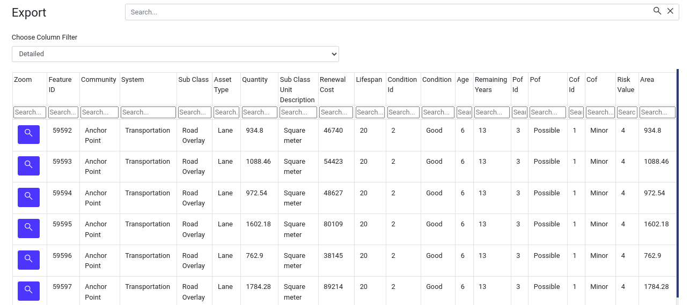

# View Table Page User Manual

## Overview

Welcome to the View Table page, a powerful tool designed to enhance the user's data exploration experience. This user manual will walk the user through the various features available on this page, helping the user make the most of the tabular data presentation.

1. **View Table:** Click on the `View Table` option available in the navigation menu. Upon clicking this link, the user will be redirected to the `View Table` page.

## View Table Page

1. **Search:** Effortlessly find specific asset data using the search feature. Insert relevant keywords and click on the search icon to initiate the search process.

    

2. **Choose Column Filter:** The `Choose Column Filter` feature allows the user to tailor their data view based on their preferences. Here's a guide on the available options:

    1. **Default:** The `Default` option displays the default set of columns. It provides a standard view of the table with commonly used columns.

        
   
    2. **Detailed:** The `Detailed` option expands the user's view by showing all available columns. Get a comprehensive look at the data with this detailed display.

        

    3. **Custom:** Opt for customisation with the `Custom` option. When selected, the `Select Columns` dropdown and `Apply Filter` button will appear.

        

        1. **Select Columns Dropdown:** Click on the dropdown to reveal a list of all available columns. The user can choose the columns they want to display in the customised view.

        2. **Selected Columns:** Shows the selected columns by the user.

        3. **Apply Button:** After selecting the preferred columns, click the `Apply Filter` button. The table will update to reflect the customised column selection.

        - Filtered columns 

3. **Column Search Option:** Refine the data exploration within each column. Find a dedicated search option below the column name and search for specific data within each column effortlessly.

    

4. **Magnifying Glass Icon:** Explore asset locations directly from the table. Locate the magnifying glass icon in front of each row. Click on the icon to view the location of the asset on the map.

    

5. **Pagination Option:** Efficiently navigate through different pages of the table. Click on the page number option to switch between data pages. Easily access information from various sections of the dataset.

6. **Import to CSV Button:** Download table data for further analysis or record-keeping. Click on the `Import to CSV` button to download data in `CSV` format.

7. **Close Button:** Conclude the table view session with a simple click. Use the `Close` button to exit the table view.

Explore these user-friendly features to streamline the data analysis process and gain valuable insights.
