# Work Order Page User Manual

Welcome to the `Work Order` page, a central hub for managing and tracking work orders. This user manual will guide the user through the features available on this page.

1. **Work Order:** Click on the `Work Order` option available in the navigation menu. Upon clicking, the user will be redirected to the Work Order page. By default, the Work Order table will be displayed. The table provides an overview of all existing tickets, including key details such as status, assignee, and due date.

## Work Order Page

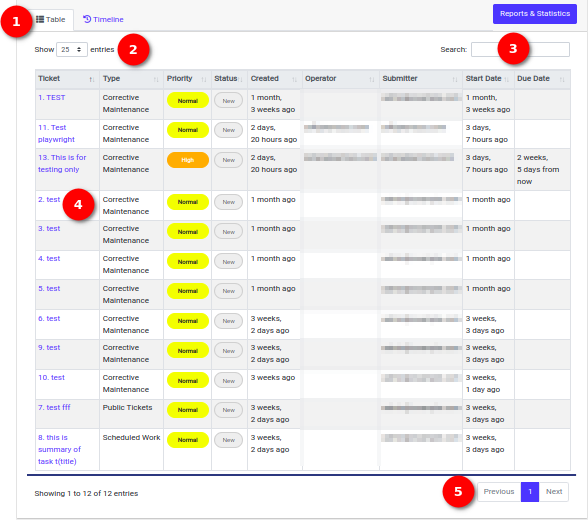

### Table Section

1. **Table:** The table section displays the list of tickets. Each row represents a ticket. It includes columns such as `Ticket`, `Type` `Priority`, `Status`, `Created`, `Operator`, `Submitter`, `Start Date`, and `Due Date`. Each column has an up/down arrow to indicate the option to display the list in ascending or descending order.

2. **Show Entries Dropdown:** Utilise the `Show Entries` dropdown to choose the number of entries as per user convenience to display on the page. Options include 10, 25, 50, and 100 entries, allowing for customised viewing.

    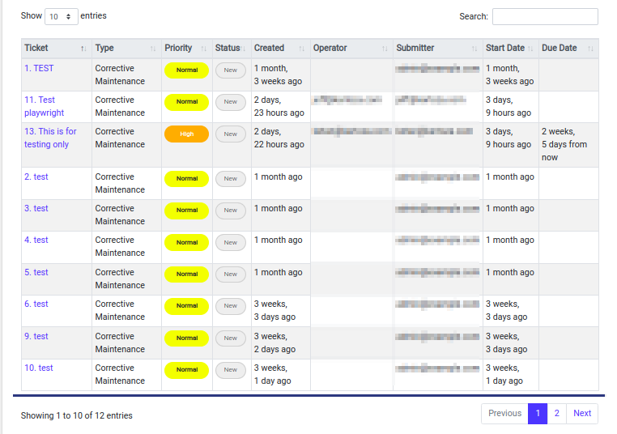

3. **Search Option:** Use the search functionality to find a specific ticket efficiently. Insert relevant keywords in the search bar to narrow down the search results.

    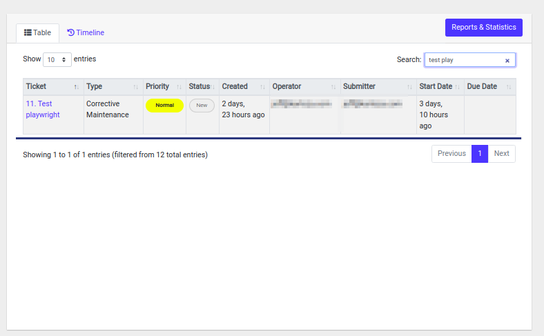

4. **Ticket Name:** Click on the ticket name within the table to:

    - View detailed information about the ticket.
    - Edit the ticket details.
    - Delete the ticket if needed.

    Upon clicking, the user will be redirected to the `Work Order` Edit page for further actions.

    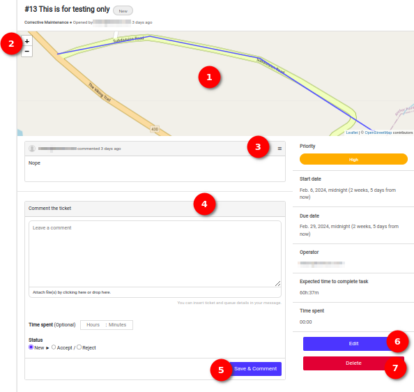

    Welcome to the `Work Order Edit` page, where the user can fine-tune and manage the details of their work orders.

    1. **Location on the Map:** This section displays the specific location on the map for which the work order ticket is created. Gain visual insights into the geographical context of the work order.
    2. **Plus/Minus Icons:** Utilise the `Plus/Minus` icons for zooming in and out on the map. Adjust the map view to focus on specific details or get a broader perspective.

    3. **Menu Icon:** Click on the `Menu` icon to access options for editing or deleting the work order description. Efficiently manage and modify the work order details as needed.

    4. **Comment the Ticket Section:** In this section, the user can:

        - **Add Comment:** Share additional information or updates related to the work order. Attach files by clicking the designated area or dragging and dropping files. The user can insert ticket and queue details in the message for clarity.

        - **Add Time Spent:** Specify the time spent on the work order in hours and minutes.

        - **Status:** Choose the status of the work order from options like `New`, `Accept`, or `Reject`.

    5. **Save & Comment Button:** Click the `Save & Comment` button to save any changes made and add comments to the work order. Ensure the updates are captured and visible for future reference.

    6. **Edit Button:** Click on the `Edit` button to open the `Edit Ticket Form`.

        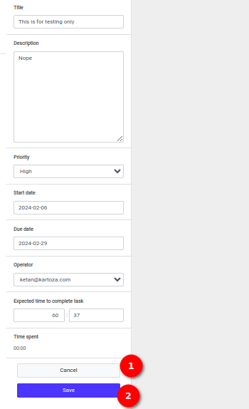
        
        The user can update the following fields as needed:
        - Title
        - Description
        - Priority (dropdown selection)
        - Start Date
        - Due Date
        - Operator (dropdown selection)
        - Expected Time to Complete Task (hours and minutes)

        1. **Cancel Button:** Use the `Cancel` button to discard any changes made in the Edit Ticket Form. Ideal for reverting back to the original ticket details without saving modifications.

        2. **Save Button:** Click the `Save` button to confirm and save the updated information. Ensure that the changes are recorded and reflected in the work order details.

    7. **Delete:** The user can delete the ticket using the `Delete` button. When the user clicks on the button, a confirmation popup opens, ensuring the user's intention before proceeding with the deletion of the ticket.

5. **Previous/Next Button:** Navigate through multiple pages of the `Work Order` table using the `Previous` and `Next` buttons. Easily access different sets of work orders based on the user's viewing preferences.

### Timeline Section

Explore the `Timeline` section, a central hub for navigating through various tickets and their details. Here's the guide to efficiently use this feature.

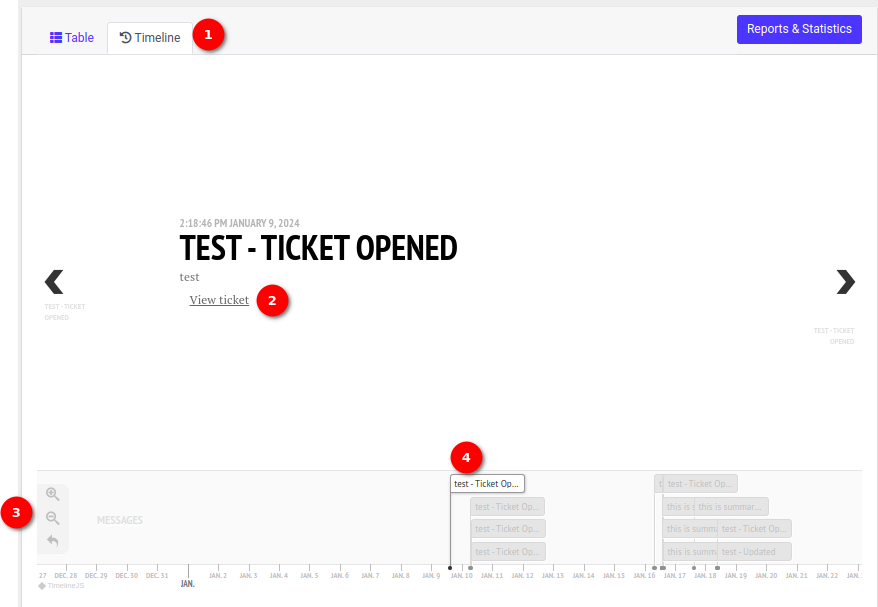

1. **Timeline:** The `Timeline` shows all activities related to a specific Work Order. In the middle of the page, the user will find the title of the ticket along with its description. The created date of the ticket is also prominently displayed.

2. **View Ticket:** A `View Ticket` link is available, providing a quick way to access the full details of the displayed ticket. When the user clicks on this link they will redirected to the edit ticket page.

    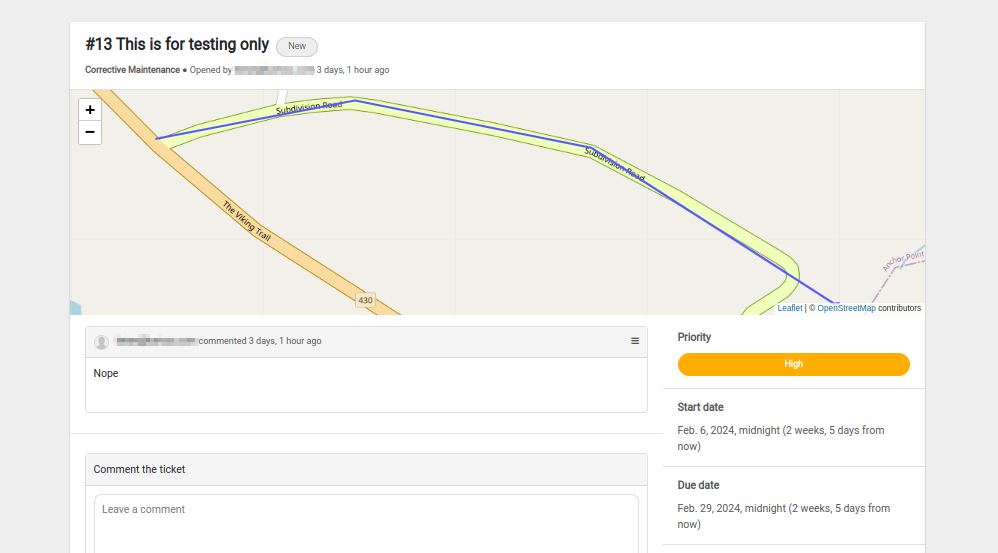

3. **Useful feature:** The user can use these features for better visualisation.

    - **Zoom In Icon** Click on this icon to `Zoom In` the timeline graph line.

        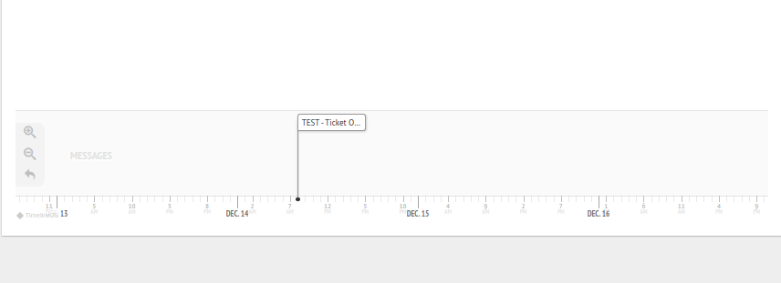

    - **Zoom Out Icon** Click on this icon to `Zoom Out` the timeline graph line.

        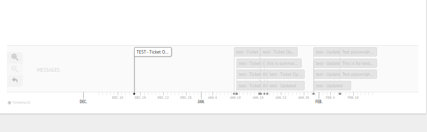

    - **Go Back Icon** Click on this icon to `Go Back` to the start point of the timeline graph line.

        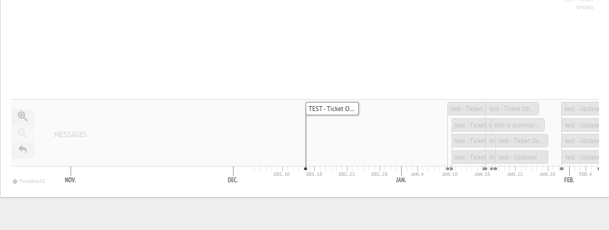

4. **Status:** This shows the status of the ticket and the assigned person's email.

### Reports & Statistics Section

Unlock valuable insights into ticket management with the Reports & Statistics section. Here's a comprehensive guide to navigating and interpreting the presented information.

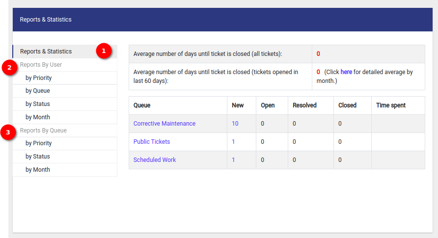

1. **Report & Statistics:** This section provides the average number of days until a ticket is closed for all tickets. Additionally, it offers insights into the average number of days until ticket closure specifically for tickets opened in the last 60 days. Click `here` to delve into more granular data.

    - **Queue (Clickable):** Click on the queue type to explore detailed information about tickets in that specific category.

    - **New:** Number of tickets in the `New` status.

    - **Open:** Number of tickets in the `Open` status.

    - **Resolved:** Number of tickets in the `Resolved` status.

    - **Closed:** Number of tickets in the `Closed` status.

    - **Time Spent:** Insights into the cumulative time spent on all tickets.

2. **Reports By User:**  Explore detailed insights into ticket management by utilising the `Reports by User` section. Choose from four distinct options to view both table and chart representations.

    1. **By Priority:** Click on `By Priority` to access a comprehensive table and chart showcasing ticket distribution based on priority. Understand the distribution of tickets categorised by their priority levels.

        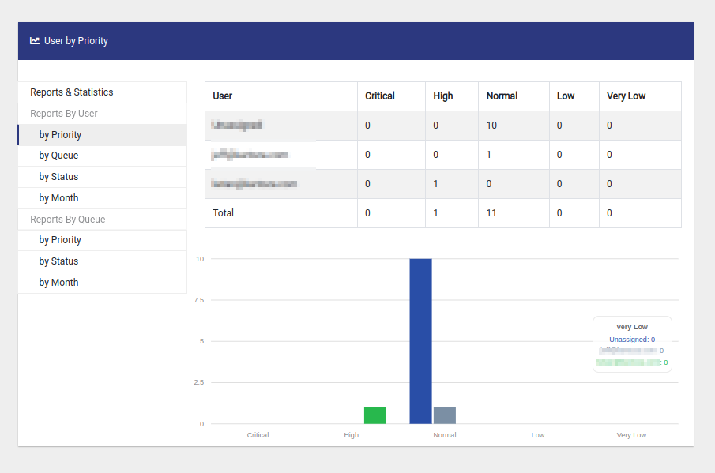

    2. **By Queue:** Opt for `By Queue` to delve into a detailed breakdown of tickets across different queues. Explore the distribution of tickets within each queue, providing insights into workload distribution.

        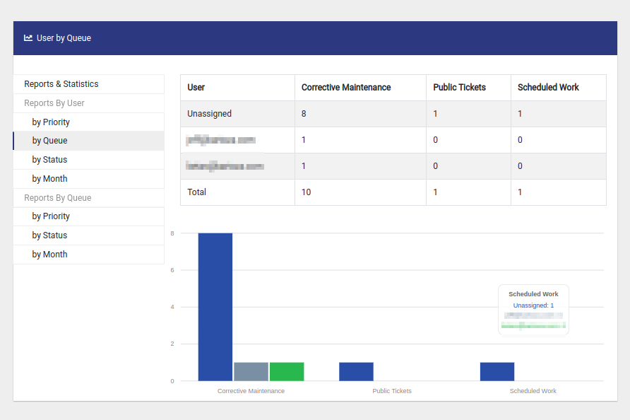

    3. **By Status:** Select `By Status` to view an informative table and chart displaying the distribution of tickets based on their status. Gain insights into the current status distribution of tickets within the system.

        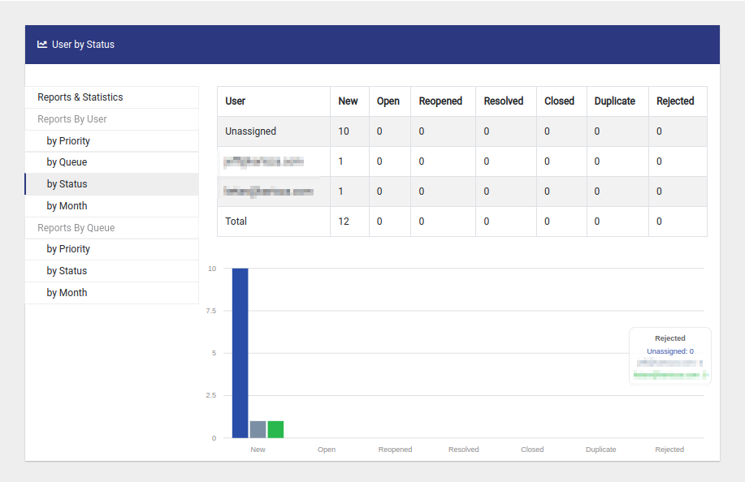

    4. **By Month:** Click on `By Month` to access a detailed breakdown of ticket data month-wise. Explore how ticket-related metrics vary across different months.

        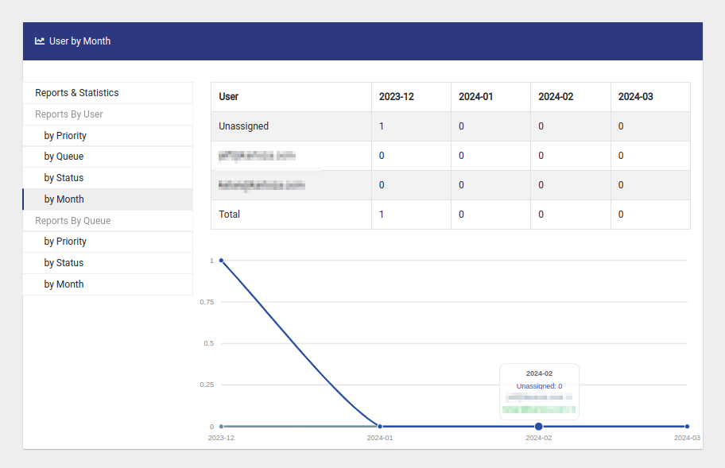

3. **Reports By Queue:** Gain valuable insights into ticket distribution across different queues with the Reports by Queue section. Choose from three distinct options to view both table and chart representations.

    1. **By Priority:** Click on `By Priority` to access a comprehensive table and chart showcasing ticket distribution based on priority within each queue. Understand the priority-wise distribution of tickets for efficient workload management.

        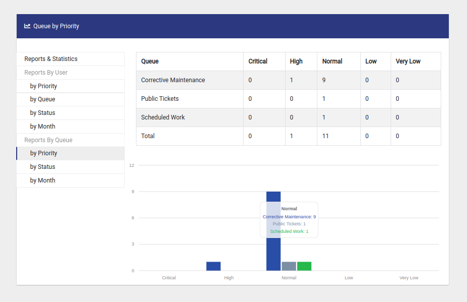

    2. **By Status:** Opt for `By Status` to view an informative table and chart displaying the distribution of tickets based on their status within each queue. Gain insights into the current status distribution of tickets for each queue.

        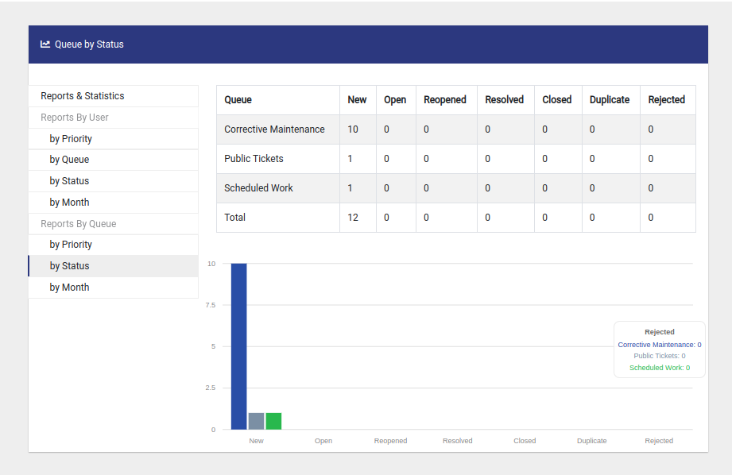

    3. **By Month:** Select `By Month` to access a detailed breakdown of ticket data month-wise within each queue. Explore how ticket-related metrics vary across different months for each queue. This can help you identify any seasonal trends or patterns that may impact your service delivery.

        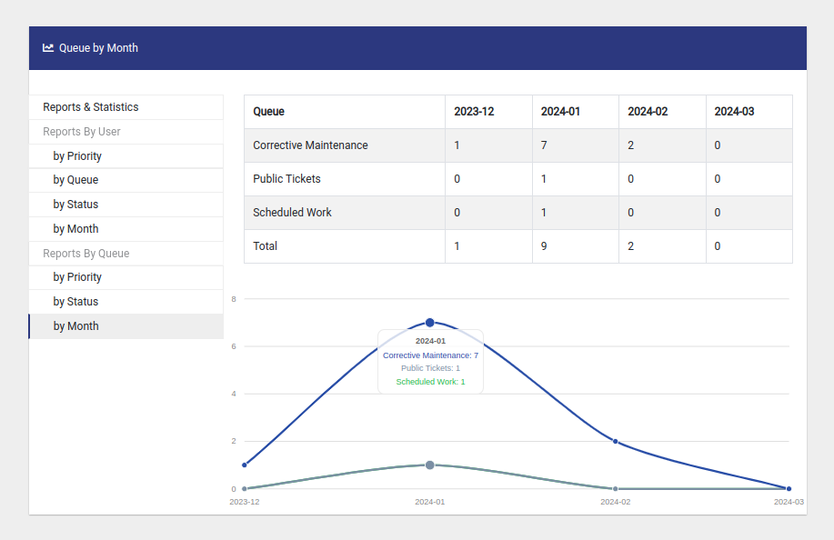
