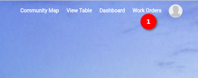

# Work Order Page User Manual

Welcome to the `Work Order` page, a central hub for managing and tracking work orders. This user manual will guide the user through the features available on this page.

1. **Work Order:** Click on the `Work Order` option available in the navigation menu. Upon clicking, the user will be redirected to the Work Order page. By default, the Work Order table will be displayed. The table provides an overview of all existing tickets, including key details such as status, assignee, and due date.

## Work Order Page

### Table Section

1. **Table:** The table section displays the list of tickets. Each row represents a ticket. It includes columns such as `Ticket`, `Type` `Priority`, `Status`, `Created`, `Operator`, `Submitter`, `Start Date`, and `Due Date`. Each column has an up/down arrow to indicate the option to display the list in ascending or descending order.

2. **Show Entries Dropdown:** Utilize the `Show Entries` dropdown to choose the number of entries as per user convenience to display on the page. Options include 10, 25, 50, and 100 entries, allowing for customized viewing.

    

3. **Search Option:** Use the search functionality to find a specific ticket efficiently. Insert relevant keywords in the search bar to narrow down the search results.

    

4. **Ticket Name:** Click on the ticket name within the table to:

    - View detailed information about the ticket.
    - Edit the ticket details.
    - Delete the ticket if needed.

    Upon clicking, the user will be redirected to the `Work Order` Edit page for further actions.

    

    Welcome to the `Work Order Edit` page, where the user can fine-tune and manage the details of their work orders.

    1. **Location on the Map:** This section displays the specific location on the map for which the work order ticket is created. Gain visual insights into the geographical context of the work order.
    2. **Plus/Minus Icons:** Utilize the `Plus/Minus` icons for zooming in and out on the map. Adjust the map view to focus on specific details or get a broader perspective.

    3. **Menu Icon:** Click on the `Menu` icon to access options for editing or deleting the work order description. Efficiently manage and modify the work order details as needed.

    4. **Comment the Ticket Section:** In this section, the user can:

        - **Add Comment:** Share additional information or updates related to the work order. Attach files by clicking the designated area or dragging and dropping files. The user can insert ticket and queue details in the message for clarity.

        - **Add Time Spent:** Specify the time spent on the work order in hours and minutes.

        - **Status:** Choose the status of the work order from options like `New`, `Accept`, or `Reject`.

    5. **Save & Comment Button:** Click the `Save & Comment` button to save any changes made and add comments to the work order. Ensure the updates are captured and visible for future reference.

    6. **Edit Button:** Click on the `Edit` button to open the `Edit Ticket Form`.

        
        
        The user can update the following fields as needed:
        - Title
        - Description
        - Priority (dropdown selection)
        - Start Date
        - Due Date
        - Operator (dropdown selection)
        - Expected Time to Complete Task (hours and minutes)

        1. **Cancel Button:** Use the `Cancel` button to discard any changes made in the Edit Ticket Form. Ideal for reverting back to the original ticket details without saving modifications.

        2. **Save Button:** Click the `Save` button to confirm and save the updated information. Ensure that the changes are recorded and reflected in the work order details.

    7. **Delete:** The user can delete the ticket using the `Delete` button. When the user clicks on the button, a confirmation popup opens, ensuring the user's intention before proceeding with the deletion of the ticket.

5. **Previous/Next Button:** Navigate through multiple pages of the `Work Order` table using the `Previous` and `Next` buttons. Easily access different sets of work orders based on the user's viewing preferences.
