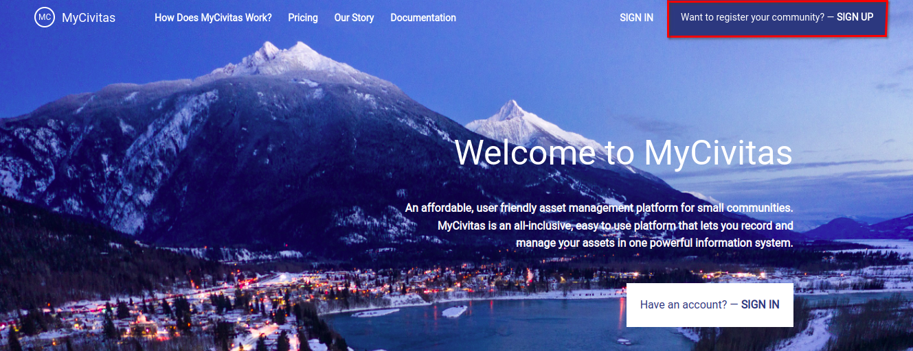

# MyCivitas Quickstart

## Accessing the Platform
<!-- Add a link to production version of a platform when available -->

Navigate to the [Home Page](https://staging.mycivitas.ca/) of the site, where you will be greeted by the landing page.

## Registration and Logging In
<!-- How to Register and then Login -->

Navigate to the `SIGN UP` button on the home page and fill in your details in the space provided.

You will be redirected to the registration page where you will be prompted to fill in some information. Namely; Your community name (choose from the dropdown), first name, Last name (surname), Email address you would like associated with your account, and the password you will use to log in to the platform. Additionally, you need to select the `Province` and the `Country`. Once you have filled in all of the information click on the `Create Account` button at the bottom of the registration window to create an account on MyCivitas.

## Logging in

Navigate to the home page of the platform and click on either of the two `SIGN IN` buttons.

You will then be redirected to the `Sign In` page. Fill in the email address you used for registration and your password. Then click on `Sign In` button to sign in on MyCivitas.

Once you log in you can explore the different features of the platform by clicking on the tabs available in the navigation.

You can check the user manual for the detailed documentation of every tab. To go to the user manual you can click [here](../manual/index.md)

To go to the user guide you can click [here](../guide/index.md)
