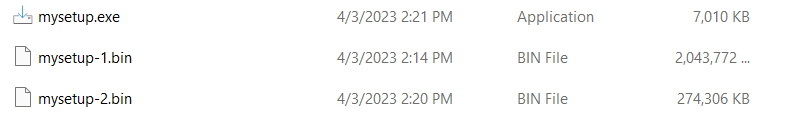
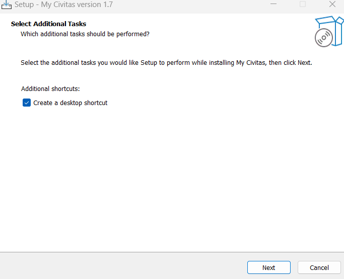

# Setting up environment

The aim of this document is to explain how to set up your machine to run the executable for My Civitas

## Requirements for system
1. Postgres server is neccesary
2. pgAdmin is optional

## How to install postgres server with pgAdmin
### Install postgres
1. Download the installer from (https://www.postgresql.org/download/windows/)[https://www.postgresql.org/download/windows/] 
2. The installer is designed the be straigtforward, follow the prompts in the installation wizard
3. Keep the port for postgres sql as 5432

### Install pgAdmin
1. Download the installer from (https://www.postgresql.org/ftp/pgadmin/pgadmin4/v6.18/windows/)[https://www.postgresql.org/ftp/pgadmin/pgadmin4/v6.18/windows/]
2. Run the installer and follow the prompts in the installation wizard
  

  

  

  

  
3. When prompted for a username and password, use `postgres` as the username and `postgres` as the password 
  

  

### Restoring databases via pgAdmin
1. Open pgAdmin
  

  
2. Create a database named `civitas`. Right click on the datbase and in the dropdown select `Restore`. The format is `Custom or tar`. Click on the folder icon of `Filename` field to upload the file called `civitas_bc`
3. Create a database named `django`. Right click on the datbase and in the dropdown select `Restore`. The format is `Custom or tar`. Click on the folder icon of `Filename` field to upload the file called `django_bc`
*If pgAdmin fails to restore the databases please see steps below*

### Restoring databases via command prompt
1. Create a database called civitas
2. Create a database called django
3. Open command prompt
4. Type `pg_restore -U username -d dbname -1 filename.dump` (Replace username with your username for postgres, replace dbname with civitas first, run the command a second time for the django database, replace filename.dump with the location of the sql scripts).

# How to run MyCivitas exe
1. Unzip the folder that you have received
2. Run the exe called `mysetup.exe`

3. Follow the installion wizard instructions

# What to do if your exe is not running
1. Open command prompt
2. cd to the root location of your Civitas installation
3. Run the command `.\manage.exe runserver_plus --noreload`
4. The above should give a clear error message as to what went wrong

## 401 Permisson error
1. Open up file explorer and navigate to where you installed My Civitas
2. Navigate to the folder `\core\settings`
3. Copy the file called `secret.py`
4. Paste the file in the following folder `\lib\core\settings`
5. Restart the app

## Can't connect to the database

### Method 1
1. Open up file explorer and navigate to where you installed My Civitas
2. Navigate to the folder `\lib\core\settings`
3. Open the text document called `db.text` with adminastrator privileges (Notepad++ is a handy tool)
4. Update your username and password for the civitas and django database
4. Restart the app

### Method 2
1. Update the username and password for the databases using psql/pgAdmin with the information your disturbutor has given you for the exe

